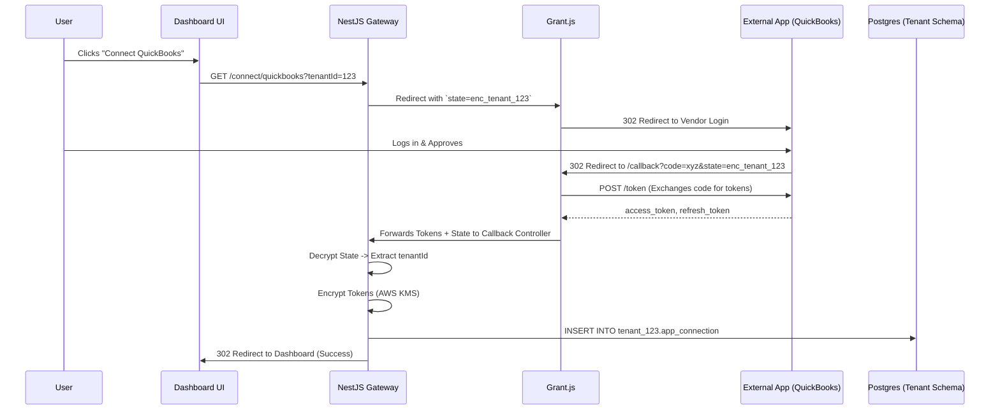
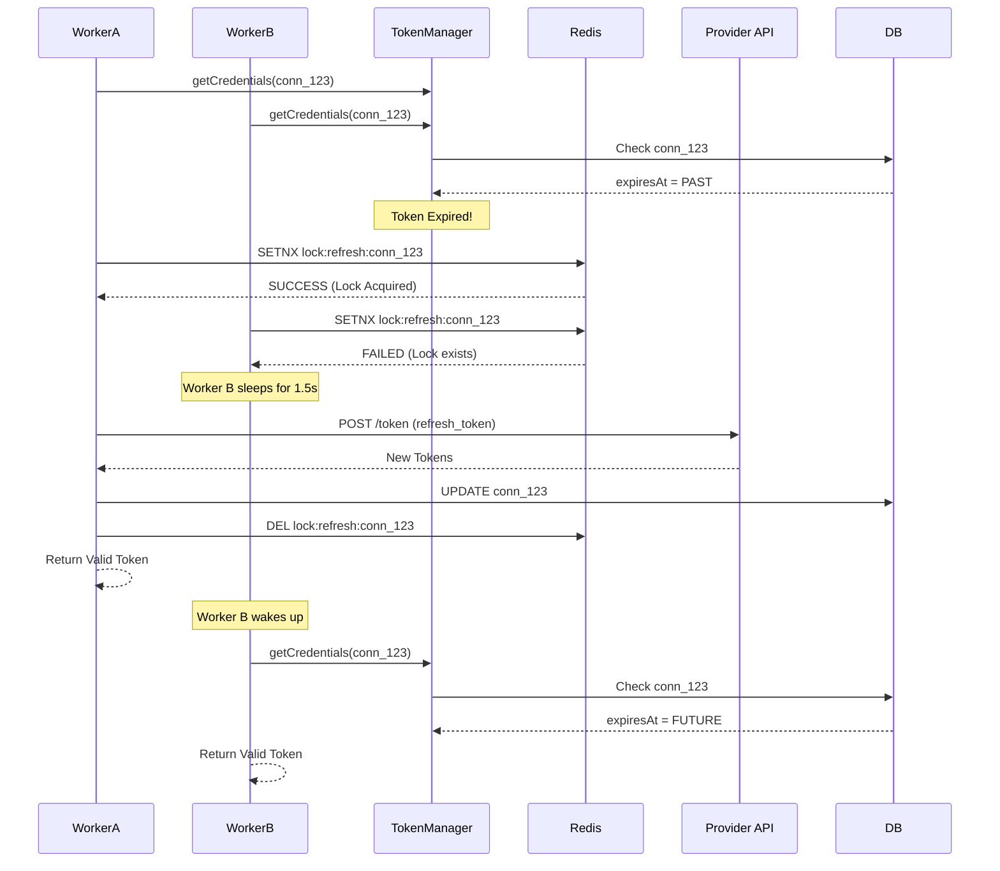

# Detailed Design: Connector Auth Lifecycle

**Target Audience:** Senior Backend Engineers
**Scope:** This document defines the exact data models, sequence flows, and service implementations required to securely authenticate, store, and refresh OAuth2/API credentials for 500+ FluxNex integrations.

**Out of Scope:** Execution logic, data routing, mapping, and API payload construction are explicitly excluded from this document.

## 1. Architectural Overview

The Auth Lifecycle handles everything required to establish and maintain a secure connection to a third-party application on behalf of a Tenant.

It consists of three primary pillars:

1. **Dynamic UI Generation:** The backend telling the frontend exactly what fields (API Key, Subdomain, Password) are required for a specific app so we don't build 500 React forms.

2. **The Auth Handshake:** Managed by **Grant.js** and the API Gateway (User clicks "Connect" -> Gets Token -> Saves to DB).

3. **The Refresh Engine:** A centralized service utilizing distributed locks to guarantee tokens are always valid while strictly preventing external API rate-limit bans.

## 2. The Inspiration: What to "Steal" (Study)

To build a massively scalable authentication layer, we draw direct inspiration from the credential management patterns of the top two open-source automation platforms.

*(Note: We are only looking at their Auth patterns here, not their Execution engines).*

### A. Activepieces (~200+ Apps)

Activepieces is written in modern TypeScript and provides the best architectural reference for isolated credential management.

* **The "Piece" Architecture:** Look at their `packages/pieces` folder on GitHub. Every integration's authentication definition is strictly isolated. The QuickBooks auth code never accidentally pollutes the HubSpot auth code.

* **Dynamic UI Generation:** Study how Activepieces handles user inputs for credentials. They don't hardcode React forms. Their backend defines a JSON schema for the required credentials, and the frontend renders it dynamically.

* **The OAuth2 Refresh Loop:** Study their `oauth2.service.ts`. It handles the complex logic of locking the database, checking if an access token is expired, refreshing it, saving it, and unlocking the database so background workers don't fail.

### B. n8n (700+ Apps)

n8n is the heavyweight champion of integrations. Their backend is Node.js, making their credential abstraction highly relevant.

* **The "Generic" Credential System:** n8n reached 700+ apps by realizing that 80% of APIs use standard OAuth2 or API Keys. Study their `GenericCredentialType` codebase. They abstracted the handshake so developers only have to paste an API's `Authorization URL` and `Token URL`, and the core engine handles the entire OAuth flow automatically. We emulate this using **Grant.js**.

## 3. Database Schema (Drizzle ORM)

Credentials must be stored in the isolated **Tenant Schema** (`tenant_{id}`). We use a unified `app_connection` table to handle OAuth2, Basic, and API Key credentials.

```typescript
// packages/database-schema/src/tenant/app_connection.ts
import { pgTable, uuid, varchar, text, timestamp, jsonb, index } from 'drizzle-orm/pg-core';

export const appConnections = pgTable('app_connection', {
  id: uuid('id').defaultRandom().primaryKey(),
  appName: varchar('app_name', { length: 100 }).notNull(), // e.g., 'quickbooks'
  authType: varchar('auth_type', { length: 50 }).notNull(), // 'OAUTH2', 'API_KEY', 'BASIC'
  
  // Encrypted Payload (Contains access_token, refresh_token, or api_key)
  // Must be encrypted via AWS KMS or AES-256-GCM before insert
  encryptedCredentials: text('encrypted_credentials').notNull(),
  
  // Extracted for fast querying without decryption
  expiresAt: timestamp('expires_at', { withTimezone: true }),
  status: varchar('status', { length: 50 }).default('ACTIVE').notNull(), // ACTIVE, EXPIRED, REVOKED
  
  // Public metadata (e.g., connected account email, realmId)
  metadata: jsonb('metadata').default({}),
  
  createdAt: timestamp('created_at').defaultNow().notNull(),
  updatedAt: timestamp('updated_at').defaultNow().notNull(),
}, (table) => ({
  appNameIdx: index('app_name_idx').on(table.appName),
  statusIdx: index('status_idx').on(table.status)
}));
```

## 4. Dynamic UI Generation Schema

To support 500+ apps without frontend changes, the backend dictates the connection form requirements via a standard JSON schema.

### 4.1 Backend Definition

```typescript
// packages/core-kernel/src/types/connector-auth.ts
export interface ConnectorAuthSchema {
  type: 'object';
  properties: Array<{
    name: string;
    label: string;
    type: 'shortText' | 'secretText' | 'dropdown' | 'oauth2';
    required: boolean;
    description?: string;
    options?: Array<{ label: string; value: string }>; 
  }>;
}

// Example Implementation: Shopify (API Key)
export const shopifyAuthSchema = (): ConnectorAuthSchema => ({
  type: 'object',
  properties: [
    { name: 'shopName', label: 'Shop Subdomain', type: 'shortText', required: true, description: 'e.g., my-store' },
    { name: 'adminToken', label: 'Admin API Token', type: 'secretText', required: true }
  ]
});
```

## 5. The Auth Handshake (Grant.js)

When a user initiates an OAuth connection, FluxNex must maintain the `tenantId` across the redirect boundary. We achieve this by encoding the `tenantId` into the OAuth2 `state` parameter.

### 5.1 Handshake Sequence Diagram



### 5.2 Callback Controller Implementation

```typescript
// apps/api-gateway/src/modules/connections/callback.controller.ts
import { Controller, Get, Req, Res, BadRequestException } from '@nestjs/common';
import { EncryptionService, TenantContext } from '@fluxnex/core-kernel';
import { db } from '@fluxnex/database';
import { appConnections } from '@fluxnex/database-schema/tenant';

@Controller('connect/:provider/callback')
export class OAuthCallbackController {
  constructor(private crypto: EncryptionService) {}

  @Get()
  async handleCallback(@Req() req, @Res() res) {
    // 1. Grant.js populates req.session.grant.response
    const grantResponse = req.session?.grant?.response;
    if (!grantResponse || grantResponse.error) {
      return res.redirect(`/app/connections?error=auth_failed`);
    }

    // 2. Extract and Validate State (Tenant Context)
    const rawState = grantResponse.raw?.state;
    const tenantId = this.crypto.decryptStateParam(rawState);
    if (!tenantId) throw new BadRequestException('Invalid State/Tenant Context');

    // 3. Prepare Encrypted Payload
    const credentials = {
      accessToken: grantResponse.access_token,
      refreshToken: grantResponse.refresh_token,
      rawResponse: grantResponse.raw
    };
    
    const encryptedPayload = await this.crypto.encrypt(JSON.stringify(credentials));

    // 4. Calculate Expiry
    const expiresIn = grantResponse.raw?.expires_in || 3600;
    const expiresAt = new Date(Date.now() + (expiresIn * 1000));

    // 5. Save to Database (Strictly within Tenant Context)
    await TenantContext.run({ tenantId }, async () => {
       await db.insert(appConnections).values({
         appName: req.params.provider,
         authType: 'OAUTH2',
         encryptedCredentials: encryptedPayload,
         expiresAt: expiresAt,
         metadata: { realmId: grantResponse.raw?.realmId } // App-specific metadata extraction
       });
    });

    return res.redirect(`/app/connections?success=true`);
  }
}
```

## 6. Token Refresh Engine (Concurrency Lock)

External integration workers will request tokens. If the token is expired, the Auth Engine must refresh it.
**Constraint:** If 10,000 workers request a token simultaneously and it is expired, only **one** worker should perform the HTTP refresh. The others must wait.

### 6.1 Refresh Lock Sequence



### 6.2 Detailed Service Implementation

```typescript
// packages/core-kernel/src/auth/token-manager.service.ts
import { Injectable, Logger } from '@nestjs/common';
import { db } from '@fluxnex/database';
import { appConnections } from '@fluxnex/database-schema/tenant';
import { eq } from 'drizzle-orm';
import { Redis } from 'ioredis';
import { EncryptionService } from '../security/encryption.service';
import { OAuthRefreshClient } from './oauth-refresh.client';

@Injectable()
export class TokenManagerService {
  private readonly logger = new Logger(TokenManagerService.name);

  constructor(
    private redis: Redis,
    private crypto: EncryptionService,
    private oauthClient: OAuthRefreshClient
  ) {}

  /**
   * Primary Entrypoint for fetching tokens.
   * Guarantees returning a VALID, unexpired token payload.
   */
  async getValidCredentials(connectionId: string): Promise<Record<string, any>> {
    const connection = await db.query.appConnections.findFirst({
      where: eq(appConnections.id, connectionId)
    });

    if (!connection) throw new Error(`Connection ${connectionId} not found`);
    if (connection.status === 'REVOKED') throw new Error(`Connection revoked by user/provider`);

    // 1. Check Expiry (with 5-minute buffer to prevent mid-flight expiration)
    const isExpired = connection.expiresAt && new Date(connection.expiresAt.getTime() - 5 * 60000) < new Date();

    if (isExpired && connection.authType === 'OAUTH2') {
      return await this.refreshWithLock(connection);
    }

    // 2. Return decrypted credentials
    return JSON.parse(await this.crypto.decrypt(connection.encryptedCredentials));
  }

  private async refreshWithLock(connection: any): Promise<Record<string, any>> {
    const lockKey = `lock:refresh:${connection.id}`;
    
    // Acquire Lock (TTL 10 seconds to prevent deadlocks if worker crashes)
    const lockAcquired = await this.redis.set(lockKey, 'locked', 'PX', 10000, 'NX');
    
    if (!lockAcquired) {
      this.logger.debug(`Connection ${connection.id} is currently refreshing. Waiting...`);
      await new Promise(resolve => setTimeout(resolve, 1500)); 
      return this.getValidCredentials(connection.id); // Recursive retry
    }

    try {
      this.logger.log(`Acquired lock. Refreshing OAuth token for ${connection.appName}`);
      
      // 1. Decrypt old payload to get refresh_token
      const oldPayload = JSON.parse(await this.crypto.decrypt(connection.encryptedCredentials));
      if (!oldPayload.refreshToken) throw new Error('No refresh token available');

      // 2. Perform HTTP call to Vendor API
      const newTokens = await this.oauthClient.refresh(connection.appName, oldPayload.refreshToken);
      
      // 3. Preserve the old refresh token if the vendor didn't return a new one (Standard OAuth2 behavior)
      const updatedPayload = {
        ...oldPayload,
        accessToken: newTokens.access_token,
        refreshToken: newTokens.refresh_token || oldPayload.refreshToken,
      };

      // 4. Encrypt & Calculate Expiry
      const encryptedPayload = await this.crypto.encrypt(JSON.stringify(updatedPayload));
      const expiresAt = new Date(Date.now() + (newTokens.expires_in * 1000));

      // 5. Save to DB
      await db.update(appConnections)
        .set({ encryptedCredentials: encryptedPayload, expiresAt, updatedAt: new Date() })
        .where(eq(appConnections.id, connection.id));
      
      return updatedPayload;

    } catch (error) {
      // Handle cases where the user revoked access in the external app
      if (error?.response?.status === 400 || error?.response?.status === 401) {
          await db.update(appConnections).set({ status: 'REVOKED' }).where(eq(appConnections.id, connection.id));
          this.logger.error(`Token refresh rejected. Marked connection as REVOKED.`);
      }
      throw error;
    } finally {
      // Always release lock
      await this.redis.del(lockKey);
    }
  }
}
```
