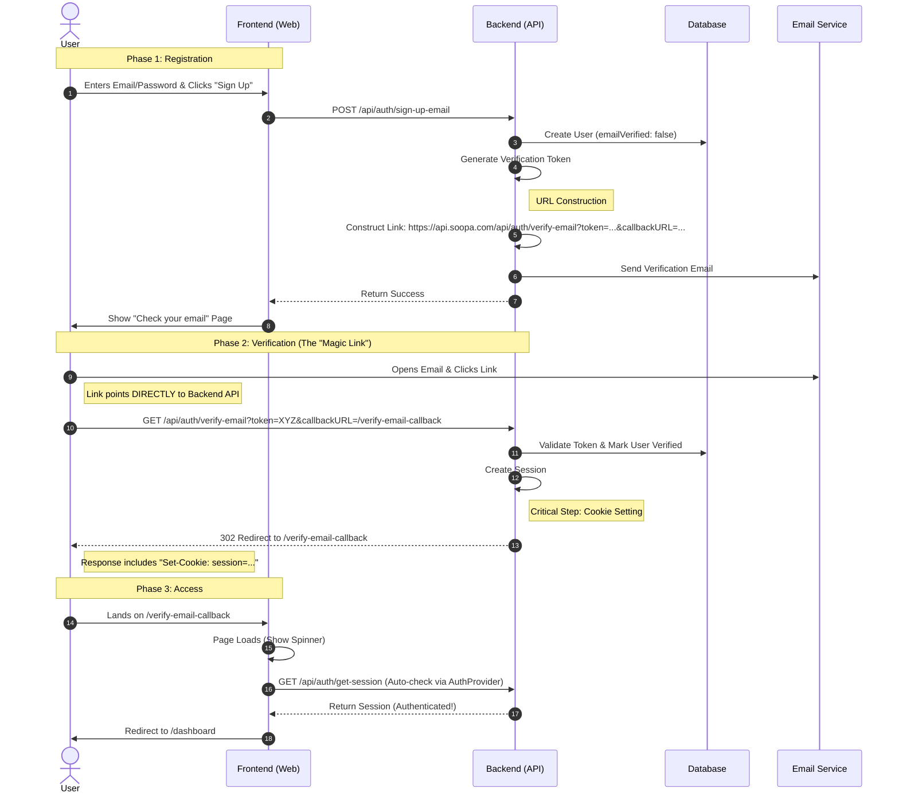

# Email Verification Architecture

## Overview

This document details the end-to-end design of the Email Verification feature in Soopa. It implements an **Enterprise Pattern** that ensures security, seamless user experience (no "flash" of content), and robust session handling.

## Component Interaction

The flow involves three main parties:

1. **Client (Frontend)**: React application (`apps/web`)
2. **Server (API)**: NestJS application with Better Auth (`apps/api`, `packages/identity`)
3. **User/Email**: The end-user and their email inbox.

## High-Level Design Pattern

We use a **Server-Side Verification with Client Redirect** pattern.

### Why this pattern?

- **Security**: The verification token is validated by the server immediately upon click. The frontend never needs to handle the raw token logic.
- **Session Integrity**: The server sets the HTTP-Only Session Cookie **during the redirect**. This means when the user lands on the frontend, they are *already authenticated*.
- **UX**: By using a dedicated "Callback Page" on the frontend, we prevent the "Landing Page Flash" (where a user sees the homepage before being logged in).

## Detailed Sequence Flow



## Key Configuration Details

### 1. URL Construction (`better-auth.adapter.ts`)

We explicitly construct the verification URL to ensure it points to the API and has the correct callback:

```typescript
const baseUrl = url.split("?")[0]; // e.g., http://localhost:3000/api/auth/verify-email
const callbackTarget = `${frontendUrl}/verify-email-callback`;
const verificationUrl = `${baseUrl}?token=${token}&callbackURL=${encodeURIComponent(callbackTarget)}`;
```

### 2. Frontend Handling (`EmailVerificationCallbackPage.tsx`)

This page is "dumb" - it does not verify tokens. It assumes:

1. If the user landed here, the backend redirect happened.
2. If the backend redirect happened, the session cookie is set.
3. Therefore, wait for `useAuth()` to confirm `isAuthenticated` is true, then go to Dashboard.

### 3. API Base URL

The Better Auth `baseURL` is configured to `config.betterAuthUrl` (the API URL). This ensures:

- Verification links hit the API directly (bypassing Client-side routers).
- Cookies are set on the API domain (valid for the app if on same-site/localhost).
