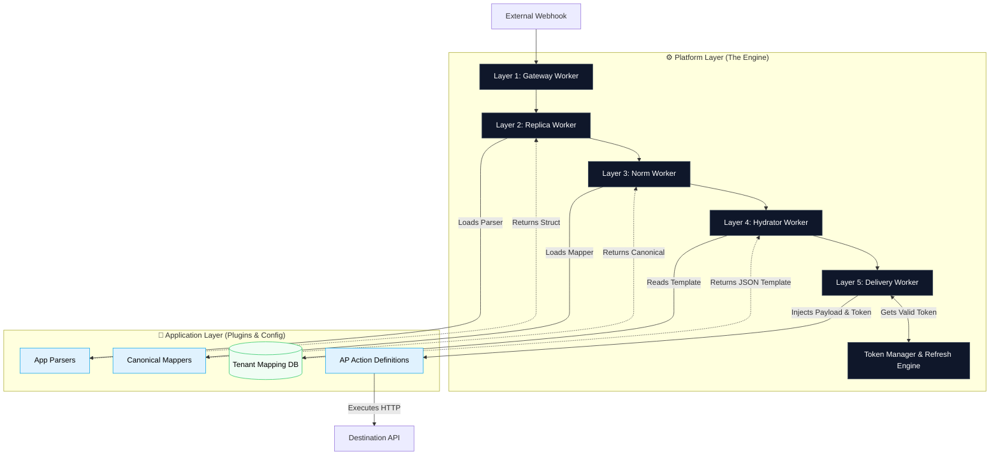

# End-to-End Sync Flow: Platform vs. Application Layer

With the introduction of the Activepieces-inspired Action Engine and Dynamic Customer Mapping, the boundary between the Platform Layer (The Engine) and the Application Layer (The Plugins/Logic) is strictly defined.

## 1. The Layer Definitions

### The Platform Layer (The "Dumb" Engine)

- **Location:** `packages/engine`, `packages/connectors/auth`, `packages/database`
- **Role:** It moves data, manages queues, handles distributed locks for OAuth tokens, hydrates JSON templates, and executes HTTP requests. It does not know what an "Invoice" or "Salesforce" is.

### The Application Layer (The "Smart" Plugins & User Config)

- **Location:** `packages/connectors/apps`, `packages/domain`, and the Tenant Database.
- **Role:** It defines what the data looks like (Canonical Models), how to interact with a specific API (Action Definitions borrowed from Activepieces), and how fields map to each other (Dynamic Customer Mapping UI).

## 2. End-to-End Scenario: Revenova Invoice -> QuickBooks Invoice

**Scenario:** A webhook arrives from Revenova containing a new "Vendor Invoice". The customer has configured the UI to map this Invoice to a "QuickBooks Invoice".

### Step 1: Ingestion (Layer 1 - Gateway)

- **Actor:** Platform Layer
- **Flow:**
  1. A webhook hits `POST /webhooks/revenova/envoy-us` (following the `POST /webhooks/{app}/{workspace_slug}` pattern).
  2. The Platform extracts the `workspace_slug` from the path and injects it into `AsyncLocalStorage`.
  3. The Platform saves the raw, unparsed JSON directly to the DB.
  4. Pushes job to `Inbound_Queue`.

### Step 2: Source Parsing (Layer 2 - Replica)

- **Actor:** Platform Layer orchestrating Application Layer
- **Flow:**
  1. Worker pulls from `Inbound_Queue`.
  2. Looks at the source app (`revenova`).
  3. **Application Context:** The Platform dynamically loads the Revenova Parser. The parser extracts the specific `rtms__vendor_invoice` data.
  4. The Platform saves this parsed data to the `rtms__vendor_invoice` replica table.
  5. Pushes job to `Replica_Queue`.

### Step 3: Normalization (Layer 3 - Canonical)

- **Actor:** Platform Layer orchestrating Application Layer
- **Flow:**
  1. Worker pulls from `Replica_Queue`.
  2. **Application Context:** The router identifies this as a "Vendor Invoice" and maps it to the generic Canonical Model: `TMS_INVOICE`.
  3. The Platform saves this clean, standardized data to the `Normalized_Entity` table.
  4. Pushes job to `Normalised_Queue`.

### Step 4: The Hydrator (Layer 4 - Outbound Prep)

- **Actor:** Platform Layer reading Customer Configuration
- **Flow:**
  1. Worker pulls the `TMS_INVOICE` record.
  2. The Platform queries the `field_mappings` database table to ask: "Did Envoy Logistics map `TMS_INVOICE` to anything?"
  3. **Application Context:** The DB returns the customer's JSON template for `quickbooks.create_invoice` (e.g., `{"CustomerRef": "{{customerId}}", "TotalAmt": "{{totalAmount}}"}`).
  4. The Platform's Hydrator merges the Canonical Data into this JSON template.
  5. Pushes the exact API payload to `Outbound_Queue` along with the target Action and Connection ID.

### Step 5: Execution (Layer 5 - Delivery)

- **Actor:** Platform Layer executing Activepieces Actions
- **Flow:**
  1. Worker pulls the job: `{ targetApp: 'quickbooks', targetAction: 'create_invoice', connectionId: 'uuid', propsValue: {...} }`.
  2. **Auth Lock:** Platform calls `TokenManagerService.getValidCredentials(connectionId)`. (If expired, Platform acquires Redis lock, refreshes OAuth token, and saves it).
  3. **Application Context:** Platform loads the `create_invoice` Action definition (borrowed from Activepieces).
  4. Platform calls `action.run({ auth: token, propsValue: mappedPayload })`.
  5. The HTTP request fires.
  6. Platform saves the result to `Global_Entity_Map`.

## 3. Visualizing the Architecture

## 4. Why this Separation Wins

- **Zero Downtime Updates:** If QuickBooks changes their API endpoint, you update the `packages/connectors/apps/quickbooks` code (Application Layer). The Platform Engine (queues, retries, auth) never needs to be touched or restarted.
- **Infinite Scale:** To add Hubspot, you don't write queue logic or OAuth refresh loops. You just drop the HubSpot Action Definition into the Application Layer, and the Platform Engine instantly knows how to execute it.
- **No Hardcoded Mappings:** Layer 4 no longer holds code like `if (app === 'qb') return { ... }`. It uses the Hydrator to dynamically build payloads based entirely on what the customer clicked in the React UI.
