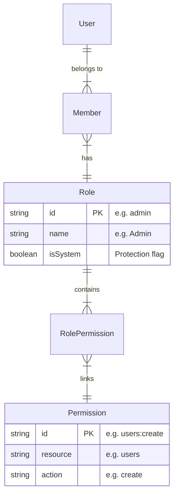

# Identity Access Control Architecture (PBAC)

**Version:** 1.0 (Final)
**Status:** Approved
**Last Updated:** 2026-01-28

## 1. Executive Summary

Soopa utilizes a **Policy-Based Access Control (PBAC)** model. Unlike traditional Role-Based Access Control (RBAC) where code checks for specific role names (e.g., `is_admin`), PBAC checks for specific **capabilities** (e.g., `can_manage_users`).

This decoupling allows us to create custom roles and modify permissions without changing a single line of application code.

## 2. The Unified Contract

The entire system relies on a single, consistent question asked at every layer:

```typescript
can(user, action, resource, context?) -> boolean
```

* **User:** The actor performing the operation.
* **Action:** What they want to do (`create`, `read`, `update`, `delete`, `manage`).
* **Resource:** The domain entity (`users`, `tenants`, `billing`).
* **Context:** Scope, such as `tenantId`.

## 3. Database Schema

We use a relational schema to construct the permissions graph dynamically.



## 4. Backend Implementation

The `@soopa/identity` package explicitly defines the provider contract.

### 4.1. IPermissionProvider

```typescript
// packages/identity/src/interfaces/permission-provider.interface.ts
export interface IPermissionProvider {
  can(user: User, action: string, resource: string, tenantId?: string): Promise<boolean>;
  getPermissions(user: User, tenantId?: string): Promise<string[]>;
}
```

### 4.2. Session Enrichment (Transport)

To optimize performance, permissions are calculated **once** during session validation/refresh and attached to the user object. The frontend never calculates permissions; it only consumes this list.

**Flow:**

1. `AuthService.getEnrichedSession` calls `PermissionProvider.getPermissions`.
2. Permissions are flattened to strings: `['users:read', 'billing:*']`.
3. Client receives: `user.permissions = [...]`.

## 5. Frontend Implementation

The Frontend uses the `accessControlProvider` to integrate with Refine, using the pre-calculated permissions from the user session.

### 5.1. Access Control Provider

Located at `apps/web/src/providers/access-control-provider.ts`.

**Key Features:**

* **Resource Normalization:** Maps `admin/users` -> `users`.
* **Action Normalization:** Maps `list` -> `read`, `edit` -> `update`.
* **Optimization:** Uses hoisted `RESOURCE_MAP` and `ACTION_MAP` to avoid per-call allocation.

```typescript
export const accessControlProvider = {
  can: async ({ resource, action }) => {
    // 1. Normalize Resource & Action
    // 2. Check user.permissions array
    // 3. Return boolean
  }
}
```

### 5.2. Component Usage

**Gate Component:**

```tsx
<CanAccess resource="users" action="delete">
  <DeleteButton />
</CanAccess>
```

**Hook:**

```tsx
const { data } = useCan({ resource: 'users', action: 'update' });
if (data.can) { /* Render Form */ }
```

## 6. Standard Roles & Permissions (Seed)

The system is seeded with foundational roles. `packages/identity/src/scripts/seed-rbac.ts` is the source of truth.

| Role | Permissions |
| :--- | :--- |
| **Owner** | Full Access (`*:*`) |
| **Admin** | Manage Users, Settings, API Keys. Read Billing. |
| **Member** | Read Users, Read Tenants. |

## 7. Security & Best Practices

1. **Never Check Roles:** Do not use `if (user.role === 'admin')`. Always check capabilities.
2. **API Guards:** The `PermissionGuard` in NestJS is the real security barrier. UI hiding is just UX.
3. **Consistency:** Ensure `ACTION_MAP` in frontend aligns with backend `Seed` data.
