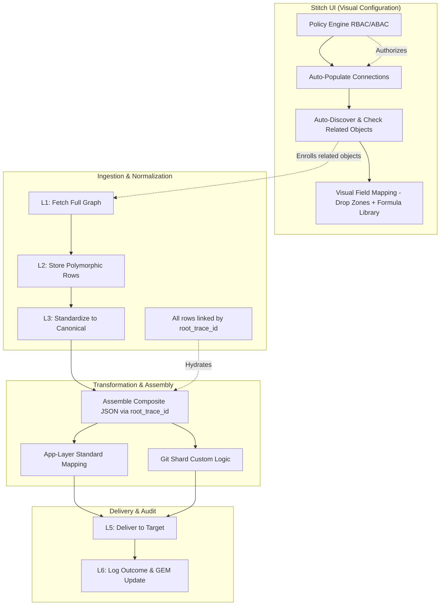
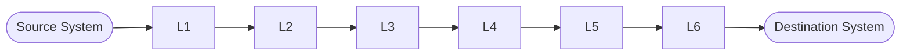

# Architecture: Relationship-Aware Polymorphic Sync

<!-- markdownlint-disable-file MD060 -->

This document defines the Nexiom approach to handling complex business graphs
(e.g., Invoices with related Loads, Stops, and Vendors). The architecture
ensures data completeness by automatically discovering and syncing related
entities into a single physical silo based on policy-driven access, followed
by a composite assembly for transformation.

---

## 0. Monorepo Architecture: Engine vs. Infrastructure

Before describing the sync strategy, it is essential to understand where each
concern lives in the monorepo. This boundary is the foundational architectural
decision for Nexiom.

### The Core Principle

> **The Sync Engine is the product.** It is Nexiom's core IP.
> `packages/` is commodity infrastructure that enables the engine to run.
> These two concerns must never be conflated.

### Directory Layout

> [!IMPORTANT]
> The `engine/` directory is the **target architecture** being established via **T055**.
> It does not fully exist yet. `packages/engine`, `packages/pieces`, `packages/connectors`,
> and `packages/piece-framework` are the current locations — they migrate incrementally.
> All **net-new** engine code must be written directly in `engine/` from this point forward.

```text
nexiom/
│
├── apps/            Thin executable services (orchestrate the engine)
│   ├── api/         Control plane — HTTP gateway, scheduling, webhook ingestion
│   ├── worker/      Data plane — runs the 6-layer pipeline
│   ├── web/         Frontend
│   └── mock-gateway/
│
├── engine/          THE SYNC ENGINE — Nexiom's core IP          [TARGET — T055]
│   │
│   ├── platform/    HOW sync works (generic execution machinery)
│   │   ├── core/                                                [TARGET — T055]
│   │   │   ├── compositor/        Currently: fanout.service.ts (L4 inline)
│   │   │   ├── evaluator/         Currently: packages/engine/src/evaluator.ts ✓
│   │   │   ├── enricher/          Currently: normalization.service.ts (L3 inline)
│   │   │   ├── cursor-manager/    Currently: packages/engine/src/state/ ✓
│   │   │   ├── storage-resolver/  Currently: packages/engine/src/storage-resolver/ ✓
│   │   │   ├── formula-registry/  Currently: packages/engine/src/hydrator.ts ✓
│   │   │   └── path-utils/        Currently: packages/engine/src/hydrator.ts ✓
│   │   └── piece-framework/           Currently: packages/piece-framework/ [T055 Ph2]
│   │
│   └── application/ WHAT gets synced (integration domain logic)
│       ├── pieces/                    Currently: packages/pieces/          [T055 Ph3]
│       ├── parsers/                   Currently: inline in normalization    [T055 Ph3]
│       ├── canonical/                 Currently: inline in normalization    [T055 Ph3]
│       ├── connectors/                Currently: packages/connectors/      [T055 Ph3]
│       └── mapping/                   NEW — T022B writes here first        [T022B]
│
└── packages/        COMMODITY INFRASTRUCTURE — not the product   [EXISTS TODAY]
    ├── queue/        SQS messaging
    ├── database/     Schema + migrations
    ├── cache/        Redis client
    ├── infra/        KMS decryption, crypto
    ├── auth/         JWT, sessions
    ├── identity/     Tenant / org management
    ├── dbmanager/    Schema provisioner (ws_{id} plans)
    └── eslint-config/ Tooling
```

### Strict Dependency Rule

```text
packages/   ────────────────────────────►  never imports from engine/
    ▲
engine/platform/  ──────────────────────►  never imports from engine/application/
    ▲
engine/application/  ───────────────────►  imports from engine/platform/ and packages/
    ▲
apps/  ─────────────────────────────────►  imports from engine/ and packages/
```

This rule is enforced via `eslint-plugin-import/no-restricted-paths`.

### Migration Status

Four packages currently live in `packages/` but belong in `engine/`
and will migrate incrementally via **T055**:

| Current location | Target location | Status |
| :--- | :--- | :--- |
| `packages/engine/` | `engine/platform/core/` | Migrating (T055 Phase 1) |
| `packages/piece-framework/` | `engine/platform/piece-framework/` | Migrating (T055 Phase 2) |
| `packages/connectors/` | `engine/application/connectors/` | Migrating (T055 Phase 3) |
| `packages/pieces/` | `engine/application/pieces/` | Migrating (T055 Phase 3) |

All **net-new** engine code must go directly in `engine/` — never in `packages/`.

---

## 1. Discovery: Automatic Access & Graph Selection

### A. Policy-Driven Connection Access (RBAC/ABAC)

Nexiom eliminates the manual "assignment" of connections to workspaces. Instead,
connection availability is governed by a central **Policy Engine**.

- **Identity Context:** When a user enters a workspace, the UI queries the
  platform's IAM service.
- **Automatic Visibility:** Connections appear in the Source/Target selectors
  automatically if the user's roles (RBAC) or attributes (ABAC) satisfy the
  connection's access policy (e.g., `resource.region == user.workspace_region`).
- **Governance:** This ensures that sensitive connections (like Production
  Payroll) are only visible to authorised personnel without requiring manual
  folder management.

### B. The Dependency Discovery Service

When a user selects a **Source Object** (e.g., `Salesforce:rtms__Load__c`),
the platform performs a **Deep Schema Inspection** to identify the
"Business Universe":

- **Metadata Probe:** The Discovery Service identifies all Mandatory Related
  Objects:
  - *Direct Parents (1:1):* Account (Vendor), Currency, User (Owner).
  - *Child Arrays (1:N):* Stops, Accessorials, Tax Lines.
- **Automated Sync Enrollment:** The UI displays these related objects as
  **pre-checked, immutable dependencies**. They are synchronised to the
  normalised layer by default because they provide the required context for a
  successful sync to the destination.

---

## 2. Storage: The Polymorphic Warehouse

All objects in the graph are stored as individual rows in a **Single Polymorphic
Table** per workspace schema (`ws_{id}`). This preserves relational context via
`root_trace_id` while maintaining a lean database catalog.

| Column          | Type   | Description                                                      |
| :-------------- | :----- | :--------------------------------------------------------------- |
| `id`            | UUID   | Primary Key (Nexiom Internal).                                   |
| `root_trace_id` | UUID   | **The Glue:** Links all objects in a single business transaction. |
| `entity_type`   | String | Discriminator (e.g., `INVOICE`, `LOAD`, `STOP`).                |
| `source_id`     | String | The external ID from the source system (e.g., `sf-123`).        |
| `data`          | JSONB  | The actual attributes (GIN Indexed).                             |

---

## 3. Transformation: The Composite Assembly

Mapping a record to a destination like QuickBooks often requires data points
scattered across the graph (e.g., the `TaxId` from the Account and the
`TotalWeight` from the Load). Transformation happens in three sequential steps.

### A. The Assembly Step (Layer 4)

Before any mapping logic runs, the Kernel performs a **Contextual Rehydration**.
It queries all rows sharing the same `root_trace_id` and assembles them into a
**Canonical Composite JSON** — a single "Fat Object" containing the root entity
plus every related entity (Stops, Account, Currency, etc.), keyed by
`entity_type`. This Fat Object is the **sole input** to all mapping logic below.

### B. Tier 1 — Standard Execution Engine (Application Layer)

The **visual mapping canvas** (see §4) produces a **Mapping Configuration** —
a JSON spec describing which source JSON path maps to which target field, and
which Formula Library function (if any) to apply.

At runtime, the **Standard Execution Engine** — common platform code written
and maintained by the Nexiom Application Team — reads this configuration and
constructs the target JSON automatically. This engine is:

- **Written once** — generic, not per-customer
- **Shipped as a pre-compiled platform asset** in the Nexiom codebase
- **The 80% solution** — handles all integrations fully expressible via the canvas

```text
Canonical Composite JSON
  + Mapping Config  (which field → which field, from canvas)
  + Stitch Config   (behavioral flags, from configuration panel)
                │
                ▼
  Standard Execution Engine  (Application Layer TypeScript)
                │
                ▼
       Target JSON → Delivery (L5)
```

### C. Tier 2 — Custom Logic (Git Shard Fleet)

For the **20%** of customers whose requirements exceed what the visual canvas can
express (complex conditional math, proprietary business rules, multi-field
derived calculations), Nexiom engineers write **custom TypeScript** and maintain
it in **Git Shard Fleet repositories** inside this monorepo.

- **The Input:** The custom script receives the fully hydrated Canonical
  Composite JSON — identical to what the Standard Engine receives. It **never**
  needs to perform independent database lookups.
- **The Output:** The script produces the target JSON (or a partial override
  merged by the Standard Engine).
- **Version-controlled:** Every line of custom logic goes through peer review
  and automated testing in the normal Git workflow before reaching production.
- **No UI involvement:** Customers cannot write or upload code. All custom logic
  is authored by Nexiom engineers and deployed via CI/CD.

---

## 3.5 Stitch Configuration: Per-Customer Behavioral Flags

**Field mapping** defines *which* fields to sync. **Stitch configuration**
defines *how* the sync behaves for a specific customer's stitch.

### Why Configuration is Separate from Mapping

Two customers can use the same Salesforce → QuickBooks stitch template and
map the exact same fields, yet have completely different business requirements:

| Scenario | Customer A | Customer B |
| :--- | :--- | :--- |
| Tax Code | Apply QB Tax Code `TAX-001` on every invoice | Skip Tax Code entirely — invoices are tax-exempt |
| Currency | Always override to `USD` | Pass through source currency |
| Date Format | `MM/DD/YYYY` (US) | `DD/MM/YYYY` (EU) |
| Duplicate Check | Reject duplicates strictly | Allow re-sync on update |

These are **not** field mapping decisions. They are **behavioral flags** that
change how the Standard Execution Engine constructs the target JSON.

### Where Configuration Lives

Each stitch has a `config` JSONB column on `integration_stitch`:

```json
{
  "useTaxCode": true,
  "taxCodeDefault": "TAX-001",
  "currencyOverride": "USD",
  "dateFormat": "MM/DD/YYYY",
  "duplicateStrategy": "reject"
}
```

The Standard Execution Engine reads **both** the Mapping Config and the Stitch
Config when constructing the target JSON. Config flags gate or override
specific steps in the engine:

```text
if (stitchConfig.useTaxCode) {
  targetJson.TxnTaxDetail = { TaxCode: stitchConfig.taxCodeDefault }
}
```

### How Users Set Configuration

The Stitch wizard (T023 Step 3) has a **"Configuration" tab** alongside the
Field Mapping canvas. Each config option is presented as:

- A **toggle** (on/off) for boolean flags (`useTaxCode`, `strictDuplicateCheck`)
- A **dropdown** for enumerated choices (`currency`, `dateFormat`)
- A **text input** for value defaults (`taxCodeDefault`)

No free-form values or expressions — all options are defined by the piece itself
via a `describeConfig()` method (parallel to `describeFields`), so the UI is
always authoritative and validated.

### Config vs. Custom Logic

| Requirement | Solution |
| :--- | :--- |
| Toggle a standard behaviour (Tax Code on/off) | Stitch Config flag |
| Choose a value from a known list (currency, date format) | Stitch Config dropdown |
| Derive a value from complex business logic | Git Shard Custom Logic |

---

## 4. UI Constraint: The "No-Code" Policy

To maintain system integrity, security, and version control, **no code or scripts
are ever written in the UI**.

### A. Field-First Mapping Canvas

Users always see **human-readable field labels**, never raw JSON paths.

- The **Metadata Discovery Service** (`describeFields`) returns the display name
  for every field on every object (e.g., `"Tax ID"`, `"Total Weight"`, `"Owner"`).
- The canvas presents fields grouped by entity:

  ```text
  Source Panel                     Target Panel
  ──────────────────────           ──────────────────────
  ▼ Load                           ▼ QuickBooks Invoice
    Total Weight          →  [Drop Zone] ← Total Amount
    Reference Number      →  [Drop Zone] ← Memo
  ▼ Account (Vendor)
    Tax ID                →  [Drop Zone] ← Vendor Tax ID
  ▼ Stop (Child)
    Delivery Date         →  [Drop Zone] ← Service Date
  ```

- Internally, when a user drops `"Tax ID"` onto a target field, the platform
  records the **JSON path** (`data.Account.TaxId`) in the Mapping Config — the
  user never sees or types it.

### B. Drop Zones

Each target field in the canvas has a **Drop Zone**. The user drags a source
field label into it — no typing, no expressions, no code.

### C. Formula Library

When a value needs a transform before mapping (e.g., converting a date format,
concatenating two fields), the user selects a **platform-verified function** from
a dropdown on that mapping row. Parameters for the function are filled in via
simple inputs (text boxes, dropdowns) — never free-form code.

### D. Complex Logic Enforcement

If a customer's requirement **cannot** be expressed through the canvas + Formula
Library, it **must** be implemented in the Git Shard Fleet by a Nexiom engineer.
This ensures every line of transformation logic passes peer review and automated
testing before reaching production.

---

## 5. Flow Diagram: Policy to Delivery



---

## 6. Key Design Decisions

| Decision                                      | Rationale                                                                                    |
| :-------------------------------------------- | :------------------------------------------------------------------------------------------- |
| Policy Engine over manual assignment          | Eliminates organisational overhead; access is always up-to-date with IAM                     |
| Single polymorphic table per workspace        | Lean catalog; relational graph preserved via `root_trace_id` without foreign key sprawl       |
| Fat-object assembly at L4                     | Mapping scripts require zero additional DB lookups; deterministic, testable inputs            |
| No-code canvas + Git Shard for complex logic  | Guarantees all production logic is peer-reviewed; UI stays auditable and non-executable       |
| Pre-checked immutable related objects         | Prevents accidental partial syncs that would produce incomplete Composite JSON at L4          |

---

## 7. End-to-End Execution Flow

This section defines the division of labor between the **Platform Kernel**
and the **Application Layer** as data moves through each of the 6 pipeline
layers. The Platform Kernel knows *how* to move and store data. The
Application Layer knows *what* the data means.



---

### Layer 1 — Source Gateway (The Ingestor)

> **Location:** `apps/api` orchestrates · `engine/` executes

| Concern | Code | Responsibility |
| :--- | :--- | :--- |
| **Platform** | `apps/api` + `packages/queue` | Manages the Fastify/NestJS webhook endpoint, generates `requestTraceId`, performs the "Shallow Persist" to `inbound_gateway`, enqueues SQS message |
| **Application** | `engine/application/pieces/{vendor}/trigger.ts` | Piece Trigger logic: validates the incoming webhook signature, determines whether the payload is a single record or a batch |

---

### Layer 2 — Universal Replica (The State Mirror)

> **Location:** `apps/worker` orchestrates · `engine/` executes

| Concern | Code | Responsibility |
| :--- | :--- | :--- |
| **Platform** | `engine/platform/core/storage-resolver` | Sets `search_path` to the correct tenant silo, handles `UPSERT` into the polymorphic `replica_entity` table, manages SQS/BullMQ message fan-out to L3 |
| **Application** | `engine/application/parsers/{vendor}-parser.ts` | App Parser (Zod-based): extracts structured fields from the raw inbound JSON and attaches versioning metadata (`schemaVersion`, `parsedAt`) |

---

### Layer 3 — Normalization (The Contextual Enricher)

> **Location:** `apps/worker` orchestrates · `engine/` executes

| Concern | Code | Responsibility |
| :--- | :--- | :--- |
| **Platform** | `engine/platform/core/relational-enricher` | Executes "Relational Enrichment": detects missing parent IDs (e.g., an Invoice missing an Account), triggers Layer 5 (Fetcher) to resolve dependencies, assembles the enriched graph |
| **Application** | `engine/application/canonical/{model}.schema.ts` | Maps the source-specific schema to the Canonical Model (e.g., `TMS_VENDOR`, `CONTACT`). This is the **single source of truth** for what fields mean in Nexiom's domain |

---

### Layer 4 — Outbound Prep (The Composite Assembler)

> **Location:** `apps/worker` orchestrates · `engine/` + `engine/application/mapping/` executes

| Concern | Code | Responsibility |
| :--- | :--- | :--- |
| **Platform** | `engine/platform/core/composite-assembler` | Queries all rows sharing the same `root_trace_id`, nests them into a single **Canonical Composite JSON** (Fat Object). Evaluates Sync Conditions (filters) via `engine/platform/core/condition-evaluator` |
| **Application (Standard)** | `engine/application/mapping/mapping-engine.ts` | `MappingEngine.build()`: reads the Mapping Config + Stitch Config and produces the target JSON. Handles the **80%** of field transformations via the Formula Library and Config Applicator |
| **Application (Custom)** | `engine/application/pieces/{vendor}/custom/` | Git Shard tenant-specific TypeScript overrides executed in a secure Node.js VM sandbox to handle complex proprietary logic. Receives the same Canonical Composite JSON as input. Handles the **20%** edge cases |

---

### Layer 5 — Delivery Engine (The Executor)

> **Location:** `apps/worker` orchestrates · `engine/` + `engine/application/pieces/` executes

| Concern | Code | Responsibility |
| :--- | :--- | :--- |
| **Platform** | `engine/platform/core/` + `packages/infra` + `packages/cache` | Manages AWS KMS decryption of tenant credentials, acquires the Redis Distributed Refresh Lock, hosts the Activepieces runtime environment that runs piece actions |
| **Application** | `engine/application/pieces/{vendor}/actions/{action}.ts` | The Activepieces `run()` function for the specific target action (e.g., `quickbooks.create_invoice`): constructs and fires the final HTTP request to the destination API |

---

### Layer 6 — Destination Gateway (The Closer)

> **Location:** `apps/worker` orchestrates · `engine/platform/` executes

| Concern | Code | Responsibility |
| :--- | :--- | :--- |
| **Platform** | `engine/platform/core/` + `packages/database` | Logs the final API response to `outbound_gateway` in the target silo, updates the Global Entity Map (GEM) with the new `destId` → `sourceId` mapping |
| **Application** | — | **N/A.** Outcome logging is fully standardised at the platform level. No application-specific logic required |

---

### Summary Table

| Layer | Name | Platform (HOW) | Application (WHAT) |
| :---: | :--- | :--- | :--- |
| L1 | Source Gateway | Endpoint, trace ID, `inbound_gateway` write | Piece Trigger: signature validation, batch detection |
| L2 | Universal Replica | Silo routing, `replica_entity` UPSERT, fan-out | App Parser: Zod extraction, versioning metadata |
| L3 | Normalization | Relational Enrichment, dependency fetch | Canonical Model mapping (`TMS_VENDOR`, etc.) |
| L4 | Outbound Prep | Fat JSON assembly, Sync Condition evaluation | MappingEngine (80%) + Git Shard VM (20%) |
| L5 | Delivery Engine | KMS decrypt, Redis lock, Activepieces runtime | `run()` → HTTP request to destination API |
| L6 | Destination Gateway | `outbound_gateway` log, GEM update | — (standardised) |