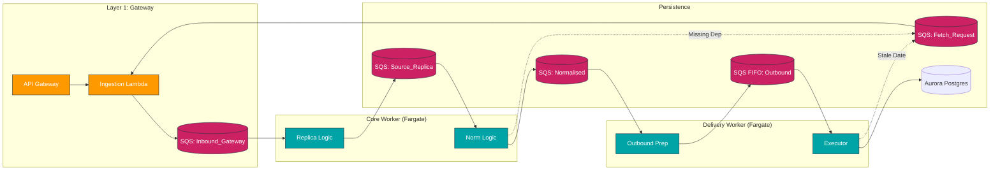

# Deployment Strategy & AI-Native CI/CD

We utilize a "Shift-Left" quality strategy where AI and Automated Tests intervene *before* code reaches the main branch.

## 0. AWS Infrastructure Blueprint
*Physical mapping of the Architecture to AWS Services.*



---

## 1. The CI/CD Pipeline (GitHub Actions)

Our pipeline uses **GitHub Actions** for orchestration, split into three distinct phases: **Verification (CI)**, **Delivery (CD)**, and **Observability**.

### Phase 1: Verification (On Pull Request)
Before any code merges, it must pass a gauntlet of automated checks.

| Step | Tool | Description | AI Integration 🤖 |
| :--- | :--- | :--- | :--- |
| **1. Lint & Format** | `Biome` / `ESLint` | Enforces code style and cleanliness. | |
| **2. Unit Tests** | `Jest` | Runs all unit tests. **Fails if coverage < 80%**. | |
| **3. AI Code Review** | **CodeRabbit** | Scans the PR diff. Provides conversational feedback, catches bugs, and suggests refactors. | **Core AI Tool** |
| **4. Security Scan** | **Snyk** (or GH Advanced Security) | Scans dependencies and code for vulnerabilities (CVEs). | **AI Analysis** |
| **5. Build Check** | `turborepo` | Ensures the app compiles (Typescript check) without emitting artifacts. | |

### Phase 2: Delivery (On Merge to `main`)
Once merged, the rigorous "Safe to Ship" pipeline begins.

| Step | Tool | Description |
| :--- | :--- | :--- |
| **1. Versioning** | `Semantic Release` | Auto-calculates version (v1.1.0) based on commit messages. |
| **2. Containerize** | **Docker** | Builds optimized multi-stage images for `api`, `web`, and `worker`. |
| **3. Registry** | **AWS ECR** | Pushes labeled images to Elastic Container Registry. |
| **4. Infrastructure** | **Terraform (or Pulumi)** | Applies "Infrastructure as Code" changes to AWS. |
| **5. Deployment** | **AWS ECS (Fargate)** | Performs a **Rolling Update** (Zero Downtime) of containers. |

---

## 2. Infrastructure as Code (Modern Stack)

We avoid "ClickOps" (manual AWS console work). All infrastructure is defined in code.

*   **Tool**: **Terraform** (Industry Standard) or **Pulumi** (TypeScript-native, preferred for Node teams).
*   **State**: Stored in **AWS S3** with **DynamoDB** locking.
*   **Modules**:
    *   `vpc`: Networking, NAT Gateways, Security Groups.
    *   `rds`: Aurora Serverless v2 (Postgres).
    *   `ecs`: Fargate Services and Task Definitions.
    *   `redis`: ElastiCache.

### Why AWS ECS Fargate?
*   **Serverless**: No EC2 instances to patch.
*   **Scalable**: Auto-scales based on CPU/Memory usage.
*   **Native**: Deep integration with AWS IAM and Secrets Manager.

---

## 3. The "AI-Native" Dev Experience

We integrate AI at multiple touchpoints to accelerate the SDLC:

1.  **Coding Co-Pilot**: **GitHub Copilot** (IDE) for boilerplate, tests, and refactoring.
2.  **Review Agent**: **CodeRabbit** (GitHub) for reviewing logic flaws and suggesting optimizations in PRs.
3.  **Test Generation**: **CodiumAI** (IDE) to auto-generate edge-case tests for complex logic.
4.  **Security Agent**: **Snyk** (CI/CD) uses AI to trace data flow through the application to find zero-day vulnerabilities.

---

## 4. GitHub Actions Workflow (Example Structure)

Create `.github/workflows/main.yml`:

```yaml
name: Production Pipeline

on:
  push:
    branches: [ "main" ]
  pull_request:
    types: [opened, synchronize]

jobs:
  # 🤖 AI Review & Quality Gate
  quality:
    runs-on: ubuntu-latest
    steps:
      - uses: actions/checkout@v4
      - uses: pnpm/action-setup@v2
      - run: pnpm install
      - run: pnpm test:cov # Fail if < 80%
      - name: AI Code Review
        uses: coderabbitai/ai-pr-reviewer@latest
        if: github.event_name == 'pull_request'
        with:
           openai_api_key: ${{ secrets.OPENAI_API_KEY }}

  # 🚀 Build & Deploy
  deploy:
    needs: quality
    if: github.ref == 'refs/heads/main'
    runs-on: ubuntu-latest
    steps:
      - name: Configure AWS Credentials
        uses: aws-actions/configure-aws-credentials@v4
        with:
          role-to-assume: arn:aws:iam::1234567890:role/GitHubActionRole
          aws-region: us-east-1
      
      - name: Login to ECR
        id: login-ecr
        uses: aws-actions/amazon-ecr-login@v2

      - name: Build & Push
        uses: docker/build-push-action@v5
        with:
          context: .
          push: true
          tags: ${{ steps.login-ecr.outputs.registry }}/nexiom-api:${{ github.sha }}
      
      - name: Deploy to ECS
        run: |
          aws ecs update-service --cluster nexiom-prod --service api --force-new-deployment
```

## 5. AI Code Review Configuration

We generally support two methods for AI Review. Currently, we are using **Method A**.

### Method A: Self-Hosted Action (Current)
*   **Mechanism**: Runs as a step inside `ci.yml`.
*   **Reviewer**: `coderabbitai/ai-pr-reviewer` (or open-source alternatives like `anc95`).
*   **Cost**: You pay the AI Provider (OpenAI/Google) directly via API Key.
*   **Pros**: Full control over prompts, models, and filtering in the YAML.
*   **Cons**: Requires managing Secrets (`OPENAI_API_KEY`).

### Method B: GitHub App (SaaS)
*   **Mechanism**: Runs externally via Webhooks (No YAML config).
*   **Reviewer**: CodeRabbit App (installed from Marketplace).
*   **Cost**: Free for Public Repos; Subscription for Private.
*   **Pros**: Zero configuration, polished UI, free for Open Source.
*   **Cons**: Less granular control for free tier.

To switch to Method B, simply delete the `ai-review` job from `ci.yml` and install the App.

### "Is it Free?"
*   **Public Open Source Repo**: YES. Method B (The App) is completely free for public repos.
*   **Private Repo**: NO. You must pay (~$15/dev/month) OR use Method A (Self-Hosted) which costs pennies in API tokens.
