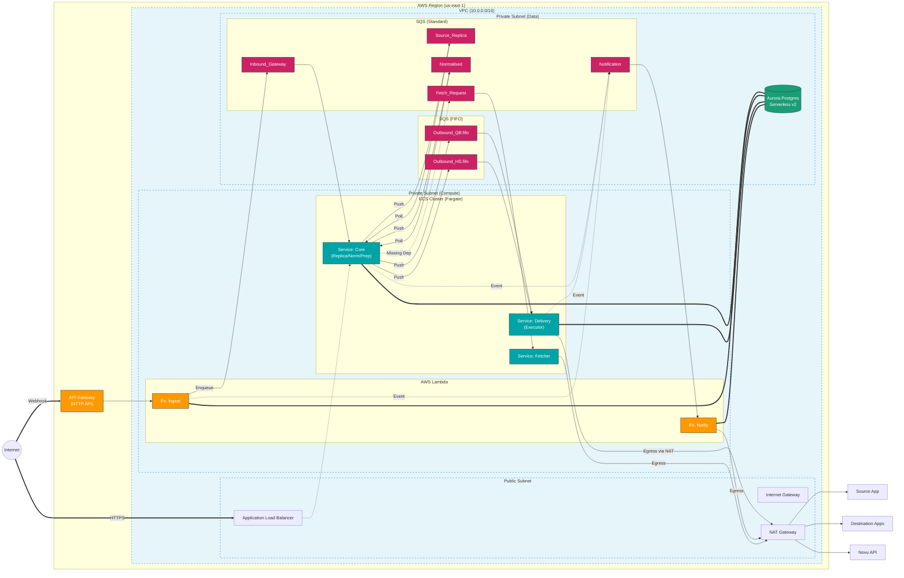

# AWS Infrastructure Diagram (Detailed)
*Physical Resource Map based on System Architecture*

```mermaid
graph LR
    %% --- EXTERNAL ---
    Internet((Internet))
    Novu[Novu API]
    SourceApp[Source App]
    DestApps[Destination Apps]

    %% --- AWS REGION ---
    subgraph Region["AWS Region (us-east-1)"]
        
        %% Managed Ingress
        APIGW["API Gateway<br/>(HTTP API)"]

        %% --- VPC ---
        subgraph VPC["VPC (10.0.0.0/16)"]
            
            %% DMZ
            subgraph PublicSubnet["Public Subnet"]
                IGW[Internet Gateway]
                ALB[Application Load Balancer]
                NAT[NAT Gateway]
            end

            %% APP LAYER
            subgraph PrivateSubnetApp["Private Subnet (Compute)"]
                
                %% Lambda Functions
                subgraph Serverless["AWS Lambda"]
                    Lm_Ingest["Fn: Ingest"]
                    Lm_Notify["Fn: Notify"]
                end

                %% Container Services
                subgraph Fargate["ECS Cluster (Fargate)"]
                    Svc_Core["Service: Core<br/>(Replica/Norm/Prep)"]
                    Svc_Deliver["Service: Delivery<br/>(Executor)"]
                    Svc_Fetch["Service: Fetcher"]
                end
            end

            %% DATA LAYER
            subgraph PrivateSubnetData["Private Subnet (Data)"]
                
                %% Database
                Aurora[("Aurora Postgres<br/>Serverless v2")]
                
                %% Message Bus
                subgraph SQS_Std["SQS (Standard)"]
                    Q_Ingest[Inbound_Gateway]
                    Q_Replica[Source_Replica]
                    Q_Norm[Normalised]
                    Q_Fetch[Fetch_Request]
                    Q_Notify[Notification]
                end

                subgraph SQS_FIFO["SQS (FIFO)"]
                    Q_QB[Outbound_QB.fifo]
                    Q_HS[Outbound_HS.fifo]
                end
            end
        end
    end

    %% --- NETWORK TRAFFIC ---

    %% Ingress
    Internet == "HTTPS" ==> ALB
    Internet == "Webhook" ==> APIGW
    
    %% Dashboard Access
    ALB -.-> Svc_Core 
    %% (Assuming Dashboard API served by Core or separate API service, usually Core in monoliths)

    %% Serverless Flow
    APIGW --> Lm_Ingest
    Lm_Ingest --"Enqueue"--> Q_Ingest
    
    %% Core Loop (Read/Write Queues)
    Q_Ingest --> Svc_Core
    Svc_Core --"Push"--> Q_Replica & Q_Norm
    Q_Replica & Q_Norm --"Poll"--> Svc_Core
    Svc_Core --"Push"--> Q_QB & Q_HS

    %% Delivery Flow
    Q_QB & Q_HS --> Svc_Deliver
    Svc_Deliver --"Egress via NAT"--> NAT

    %% Notification Flow (Sidecar)
    Lm_Ingest & Svc_Core & Svc_Deliver -.->|"Event"| Q_Notify
    Q_Notify --> Lm_Notify
    Lm_Notify --"Egress"--> NAT

    %% Self Healing
    Svc_Core -.->|"Missing Dep"| Q_Fetch
    Q_Fetch --> Svc_Fetch
    Svc_Fetch --"Egress"--> NAT

    %% Database Access (VPC Endpoints)
    Lm_Ingest & Svc_Core & Svc_Deliver & Lm_Notify === Aurora

    %% External Egress
    NAT --> SourceApp
    NAT --> DestApps
    NAT --> Novu

    %% Styling
    classDef net fill:#E6F5FA,stroke:#0073BB,stroke-dasharray: 5 5;
    classDef comp fill:#FF9900,stroke:#232F3E,color:white;
    classDef ecs fill:#00A4A6,stroke:#232F3E,color:white;
    classDef db fill:#1B9E77,stroke:#232F3E,color:white;
    classDef q fill:#CC2264,stroke:#232F3E,color:white;

    class VPC,PublicSubnet,PrivateSubnetApp,PrivateSubnetData net;
    class Lm_Ingest,Lm_Notify,APIGW comp;
    class Svc_Core,Svc_Deliver,Svc_Fetch ecs;
    class Aurora db;
    class Q_Ingest,Q_Replica,Q_Norm,Q_Fetch,Q_Notify,Q_QB,Q_HS q;
```
