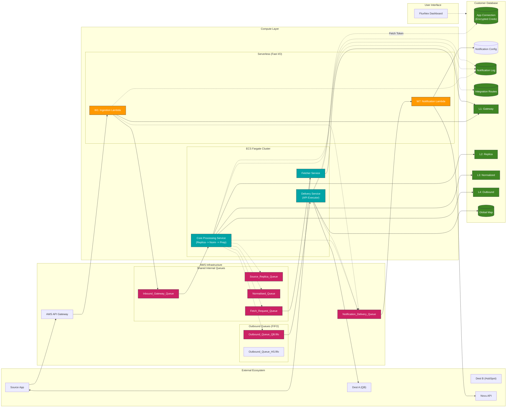

# System Architecture Diagram (Detailed)
*Component View (Detailed Hybrid)*

```mermaid
graph LR
    %% --- UI LAYER ---
    subgraph UI["User Interface"]
        Dashboard["FluxNex Dashboard"]
    end

    %% --- EXTERNAL ACTORS ---
    subgraph External["External Ecosystem"]
        Source["Source App"]
        DestA["Dest A (QB)"]
        DestB["Dest B (HubSpot)"]
        NovuAPI["Novu API"]
    end

    %% --- INFRASTRUCTURE LAYER ---
    subgraph Infra["AWS Infrastructure"]
        APIGW["AWS API Gateway"]
        
        subgraph SharedQueues["Shared Internal Queues"]
            Q_Ingest["Inbound_Gateway_Queue"]
            Q_Replica["Source_Replica_Queue"]
            Q_Norm["Normalised_Queue"]
            Q_Fetch["Fetch_Request_Queue"]
        end

        subgraph OutQueues["Outbound Queues (FIFO)"]
            Q_Out_QB["Outbound_Queue_QB.fifo"]
            Q_Out_HS["Outbound_Queue_HS.fifo"]
        end

        %% Notification
        Q_Notify["Notification_Delivery_Queue"]
    end

    %% --- COMPUTE LAYER (HYBRID) ---
    subgraph Compute["Compute Layer"]
        
        %% SERVERLESS
        subgraph Serverless["Serverless (Fast I/O)"]
            W_Ingest["W1: Ingestion Lambda"]
            W_Notify["W7: Notification Lambda"]
        end
        
        %% CONTAINERS
        subgraph Containers["ECS Fargate Cluster"]
            direction TB
            W_Core["Core Processing Service<br/>(Replica -> Norm -> Prep)"]
            W_Deliver["Delivery Service<br/>(API Executor)"]
            W_Fetch["Fetcher Service"]
        end
    end

    %% --- DATA LAYER ---
    subgraph CustomerDB["Customer Database"]
        direction TB
        AppConn[("App Connection<br/>(Encrypted Creds)")]
        NotifConfig[("Notification Config")]
        NotifLog[("Notification Log")]
        RouteTable[("Integration Routes")]
        
        L1["L1: Gateway"]
        L2["L2: Replica"]
        L3["L3: Normalized"]
        L4["L4: Outbound"]
        GEM[("Global Map")]
    end

    %% --- FLOWS ---
    
    %% 1. Ingestion
    Source --> APIGW --> W_Ingest
    W_Ingest --> L1
    W_Ingest --> Q_Ingest
    
    %% 2. Core Processing
    Q_Ingest --> W_Core
    W_Core --> L2 & L3 & L4
    W_Core -.-> Q_Replica & Q_Norm & Q_Out_QB
    W_Core -.-> RouteTable

    %% 3. Delivery
    Q_Out_QB --> W_Deliver
    W_Deliver -.->|"Fetch Token"| AppConn
    W_Deliver --> DestA
    W_Deliver --> GEM

    %% 4. Notification
    W_Ingest & W_Core & W_Deliver -.-> NotifLog
    W_Ingest & W_Core & W_Deliver -.-> Q_Notify
    Q_Notify --> W_Notify
    W_Notify --> NotifConfig
    W_Notify --> NovuAPI

    %% 5. Self-Healing
    W_Core -.-> Q_Fetch
    Q_Fetch --> W_Fetch
    W_Fetch --> Source
    W_Fetch --> L1

    %% Dashboard
    Dashboard -.-> CustomerDB
    
    %% Styling
    classDef lambda fill:#FF9900,stroke:#232F3E,color:white;
    classDef container fill:#00A4A6,stroke:#232F3E,color:white;
    classDef storage fill:#3F8624,stroke:#232F3E,color:white;
    classDef queue fill:#CC2264,stroke:#232F3E,color:white;

    class W_Ingest,W_Notify lambda;
    class W_Core,W_Deliver,W_Fetch container;
    class L1,L2,L3,L4,GEM,NotifLog,AppConn,RouteTable storage;
    class Q_Ingest,Q_Replica,Q_Norm,Q_Out_QB,Q_Fetch,Q_Notify queue;
```
