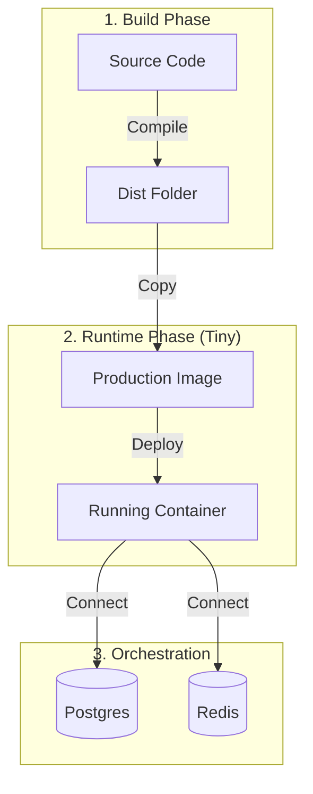

# Docker Infrastructure Explained 🐳

This document explains the "Magic" inside our Dockerfiles and Compose configuration.

---

## 1. The Strategy: "Multi-Stage Builds" representing Production
We don't just "copy files and run". We use **Multi-Stage Builds** to keep our images tiny and secure.

### 📄 `apps/api/Dockerfile` (The Backend)
This file has two distinct phases:

#### Phase 1: `builder` (The Kitchen) 🍳
*   **Goal**: Compile TypeScript to JavaScript.
*   **What happens**: we install *everything* (DevDependencies like ESLint, TypeScript, NestCLI). This layer is heavy (500MB+).
*   **Code**:
    ```dockerfile
    FROM node:20-alpine AS builder
    RUN pnpm install   # Installs heavy tools
    RUN pnpm build     # Creates 'dist/' folder
    ```

#### Phase 2: `runner` (The Waiter) 🍽️
*   **Goal**: Serve the app efficiently.
*   **What happens**: We take a fresh, empty Alpine Linux image. We copy **ONLY the `dist/` folder** from the Kitchen. We throw away the heavy tools.
*   **Result**: A tiny, secure image (approx 100MB) that starts strictly faster.
*   **Code**:
    ```dockerfile
    FROM node:20-alpine AS runner
    COPY --from=builder /app/dist ./dist  # Only take the cooked food
    CMD ["node", "dist/main"]             # Serve it
    ```

---

## 2. The Frontend: "Static Serving"
### 📄 `apps/web/Dockerfile`
This is different because browsers don't run Node.js. They read HTML/CSS.

#### Phase 1: `builder`
*   Compiles React code (`.tsx`) into static bundles (`.js`, `.css`) in a `dist/` folder.

#### Phase 2: `nginx`
*   **Why Nginx?**: Node.js is bad at serving static files. Nginx is a dedicated, lightning-fast web server.
*   We copy the `dist/` folder to Nginx's public directory.
*   **Config (`nginx.conf`)**:
    *   `try_files $uri /index.html`: Required for React Router (Single Page App).
    *   `proxy_pass http://api:3000`: Forwards `/api/...` calls to the Backend container.

---

## 3. The Orchestrator: "Docker Compose"
### 📄 `docker-compose.yml`
This file is the "Manager" that hires the workers.

*   **`services`**: The 4 "Computers" that will run.
    *   **postgres & redis**: We use official images (we don't build these).
    *   **api & web**: We build these using the Dockerfiles above.
*   **`depends_on`**: ensures the Database wakes up *before* the API tries to connect.
*   **`networks`**: Creates a private Wifi (`nexiom-network`) connecting these 4 computers.
    *   *Note*: The `web` container can talk to `api` via the hostname `http://api:3000` because they are on this network.
*   **`volumes`**:
    *   `postgres_data:/var/lib/postgresql/data`
    *   **Concept**: If you delete a container, its files are gone. A Volume is a "USB Stick" plugged into the container. Even if you destroy the `postgres` computer, the data on the "USB Stick" (Volume) survives.

---

### 4. Understanding Ports (`3001:3000`)
You will see this line in `docker-compose.yml`:
```yaml
ports:
  - "3001:3000"
```
**Syntax:** `"HOST_PORT : CONTAINER_PORT"`

*   **Left Side (3001)**: The port on **Your Mac**.
    *   We changed this to `3001` so it doesn't crash into your local `pnpm dev` (which uses `3000`).
*   **Right Side (3000)**: The port inside the **Linux Container**.
    *   The NestJS app inside Docker still thinks it's listening on `3000`.

**Result**:
*   Open `localhost:3001` -> Docker forwards it -> Container port `3000`.

---

## 5. Visualizing AWS Production ☁️

In AWS, we don't run `docker-compose`. We replace each piece with a Cloud Service.

| Local Concept (Docker) | AWS Production Service | How it works |
| :--- | :--- | :--- |
| **`docker-compose.yml`** | **ECS Task Definition** | Defines "Run this Image with 1GB RAM". |
| **`ports: "3001:3000"`** | **Application Load Balancer (ALB)** | The ALB listens on `https://api.nexiom.com` (Port 443) and forwards traffic to the Container's `Port 3000` inside the VPC. |
| **`networks: nexiom-net`** | **VPC (Virtual Private Cloud)** | A private network where containers talk securely. |
| **`postgres` container** | **AWS Aurora (RDS)** | Managed Database (Backups, Scaling). |
| **`redis` container** | **AWS ElastiCache** | Managed Redis Cluster. |

**The Key Takeaway**:
Locally, your laptop acts as the "Load Balancer" (mapping port 3001).
In Production, a real **AWS ALB** does that job, giving you a nice URL (`https://...`) instead of `localhost:3001`.


