# My Complete Understanding of Nexiom Platform

**Created:** 2026-01-22  
**Purpose:** Plain-English explanation of what Nexiom is, what exists today, and what we're building

---

## Executive Summary: What Is Nexiom?

**Nexiom is a B2B Integration Platform (iPaaS)** - think of it as a "data highway" that connects different business applications and keeps their data in sync.

### The Real-World Problem It Solves

Imagine a trucking company (like Envoy Logistics) that uses:

- **Revenova** (TMS system) to manage shipments and customers
- **QuickBooks** to handle accounting and invoices
- **HubSpot** for sales and CRM

Today, they manually copy data between these systems or pay expensive consultants. **Nexiom automates this** - when they create a customer "Acme Trucking" in Revenova, it automatically appears in QuickBooks and HubSpot.

### The Business Model

- **Multi-Tenant SaaS:** One Nexiom instance serves many companies (tenants)
- **Self-Hosted Option:** Companies can run their own Nexiom
- **Connector Marketplace:** Pre-built integrations for popular apps
- **Custom Integrations:** Flexible framework for custom connections

---

## Part 1: What EXISTS Today (Current State)

### ✅ Phase 1: Platform Foundation (COMPLETED)

We have built the **"control plane"** - the foundation that manages users, tenants, and permissions. Think of this as the **building's foundation and security system** before we add the actual integration machinery.

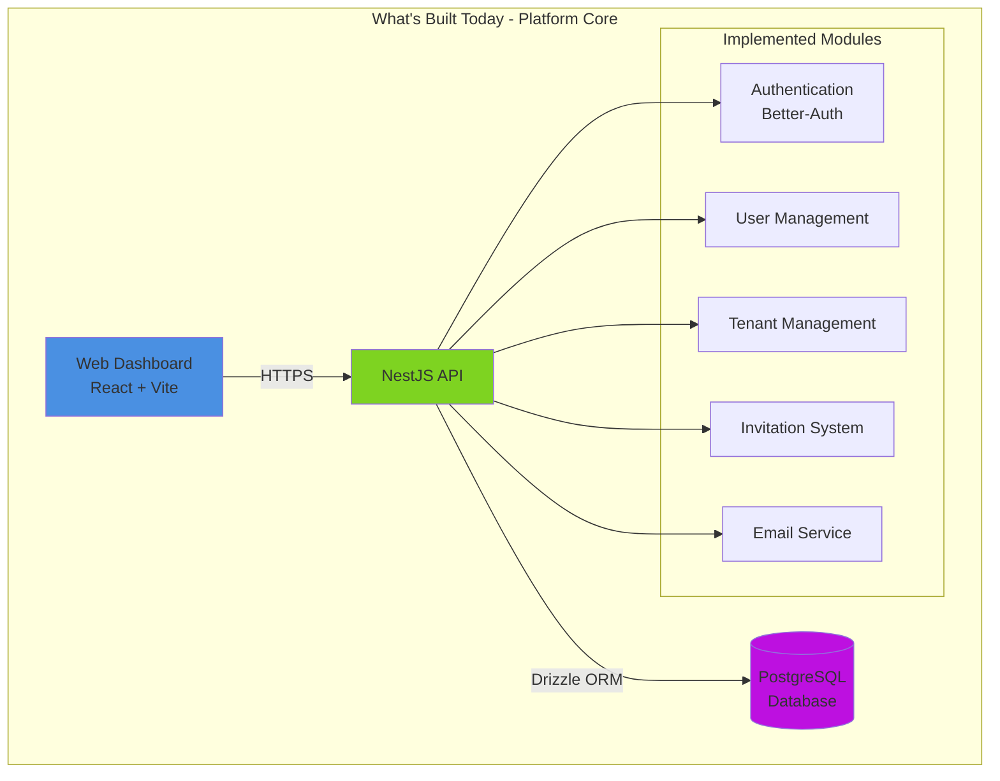

### Current Capabilities

| Feature | Status | What It Does |
|---------|--------|--------------|
| **User Authentication** | ✅ Working | Users can sign up, log in, get invited |
| **Multi-Tenancy** | ✅ Working | Multiple companies (tenants) isolated from each other |
| **Role-Based Access** | ✅ Working | platform_admin, platform_user, tenant_admin, tenant_user |
| **Admin Dashboard** | ✅ Working | Web UI to manage users and tenants |
| **Email Notifications** | ✅ Working | Send invitations and notifications |

### The Data Model (What's in the Database Today)

```mermaid
erDiagram
    USER ||--o{ MEMBER : "belongs to orgs"
    USER ||--o{ INVITATION : "sends invites"
    ORGANIZATION ||--o{ MEMBER : "has members"
    ORGANIZATION ||--o{ INVITATION : "has invites"
    
    USER {
        text id PK
        text email UK
        text name
        text systemRole "platform_admin or platform_user"
        boolean emailVerified
        timestamp createdAt
    }
    
    ORGANIZATION {
        text id PK
        text name
        text slug UK
        text status "active, suspended, disabled"
        timestamp createdAt
    }
    
    MEMBER {
        text id PK
        text userId FK
        text organizationId FK
        text role "admin or user"
    }
    
    INVITATION {
        text id PK
        text email
        text organizationId FK
        text inviterId FK
        text status
        timestamp expiresAt
    }
```

**In Plain English:**

- **Users** are people who log into Nexiom
- **Organizations** are companies (tenants) - each gets isolated data
- **Members** link users to organizations with roles
- **Invitations** let admins invite new users

---

## Part 2: What We're BUILDING (The Vision)

### The 6-Layer Integration Pipeline

This is the **core innovation** of Nexiom - a systematic way to move data from Source App → Nexiom → Destination App(s).

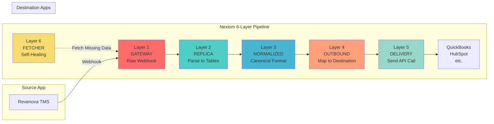

### Layer-by-Layer Explanation

#### Layer 1: GATEWAY (The Front Door)

**Purpose:** Catch incoming webhooks and save them immediately

**Real Example:**

```
Revenova sends: "Customer 'Acme Trucking' was created"
↓
Nexiom receives at: POST /webhooks/tms/revenova/envoylogistics
↓
Saves raw JSON to database table: revenova_gateway
↓
Pushes message to queue: "Process gateway record #12345"
↓
Returns HTTP 200 to Revenova (done in <100ms)
```

**Why This Matters:**

- **Fast response** - Revenova won't timeout
- **Never lose data** - Saved to database first
- **Async processing** - Queue handles the heavy work later

#### Layer 2: REPLICA (The Parser)

**Purpose:** Convert messy webhook JSON into clean database tables

**Real Example:**

```
Raw webhook has nested XML/JSON mess
↓
Parser extracts: 
  - Account ID: "ACC-001"
  - Name: "Acme Trucking"
  - Phone: "555-1234"
↓
Saves to table: sf_account (Salesforce Account replica)
↓
Pushes to next queue: "Normalize sf_account #ACC-001"
```

**Why This Matters:**

- **Clean data** - Structured tables instead of JSON blobs
- **Queryable** - Can run SQL on source data
- **Audit trail** - See exactly what source system sent

#### Layer 3: NORMALIZED (The Translator)

**Purpose:** Convert source-specific data to Nexiom's universal format

**Real Example:**

```
Revenova calls it: sf_account
Salesforce calls it: Account
QuickBooks calls it: Customer
↓
Nexiom normalizes to: tms_vendor (universal format)
↓
Saves to table: tms_vendor with standard fields
↓
Pushes to queue: "Send tms_vendor #V-001 to destinations"
```

**Why This Matters:**

- **One format** - Don't need to know every app's quirks
- **Flexible** - Add new sources without changing destinations
- **Business logic** - Apply rules in one place

#### Layer 4: OUTBOUND (The Gatekeeper)

**Purpose:** Convert universal format to destination-specific format

**Real Example:**

```
tms_vendor has: name, phone, email
↓
For QuickBooks, map to:
  - DisplayName = name
  - PrimaryPhone = phone
  - PrimaryEmailAddr = email
↓
For HubSpot, map to:
  - company_name = name
  - phone_number = phone
  - email = email
↓
Validate: "Does QuickBooks require a billing address?" → Add default
↓
Pushes to queue: "Deliver to QuickBooks US" and "Deliver to HubSpot"
```

**Why This Matters:**

- **Strict validation** - Catch errors before sending
- **Multi-destination** - One source → many destinations
- **Business rules** - Apply tenant-specific logic

#### Layer 5: DELIVERY (The Messenger)

**Purpose:** Actually call the destination API

**Real Example:**

```
Get message: "Send Customer to QuickBooks US"
↓
Look up connection: "QuickBooks US" → OAuth token for Envoy Logistics
↓
Make API call: POST https://quickbooks.api.intuit.com/v3/customer
↓
QuickBooks returns: {"Id": "12345", "SyncToken": "0"}
↓
Save result: delivery_log (success, QB ID = 12345)
```

**Why This Matters:**

- **Just-in-time auth** - Fetch OAuth tokens when needed
- **Error handling** - Retry failed API calls
- **Logging** - Track every API call for debugging

#### Layer 6: FETCHER (The Self-Healer)

**Purpose:** Fetch missing data that wasn't sent via webhook

**Real Example:**

```
QuickBooks requires: Customer must have a parent account
↓
But webhook only sent: Customer data (no parent)
↓
Fetcher detects: "Parent account missing"
↓
Calls Revenova API: GET /accounts/parent-123
↓
Injects back to Layer 1: As if webhook arrived
↓
Pipeline processes parent first, then customer
```

**Why This Matters:**

- **Dependencies** - Handle relationships between records
- **Backfill** - Fetch historical data
- **Resilience** - Fix missing data automatically

---

## Part 3: The Architecture Principles

### 1. Schema-Per-Tenant Isolation

**The Problem:** How do we keep Company A's data separate from Company B's?

**The Solution:** Each tenant gets their own PostgreSQL schema

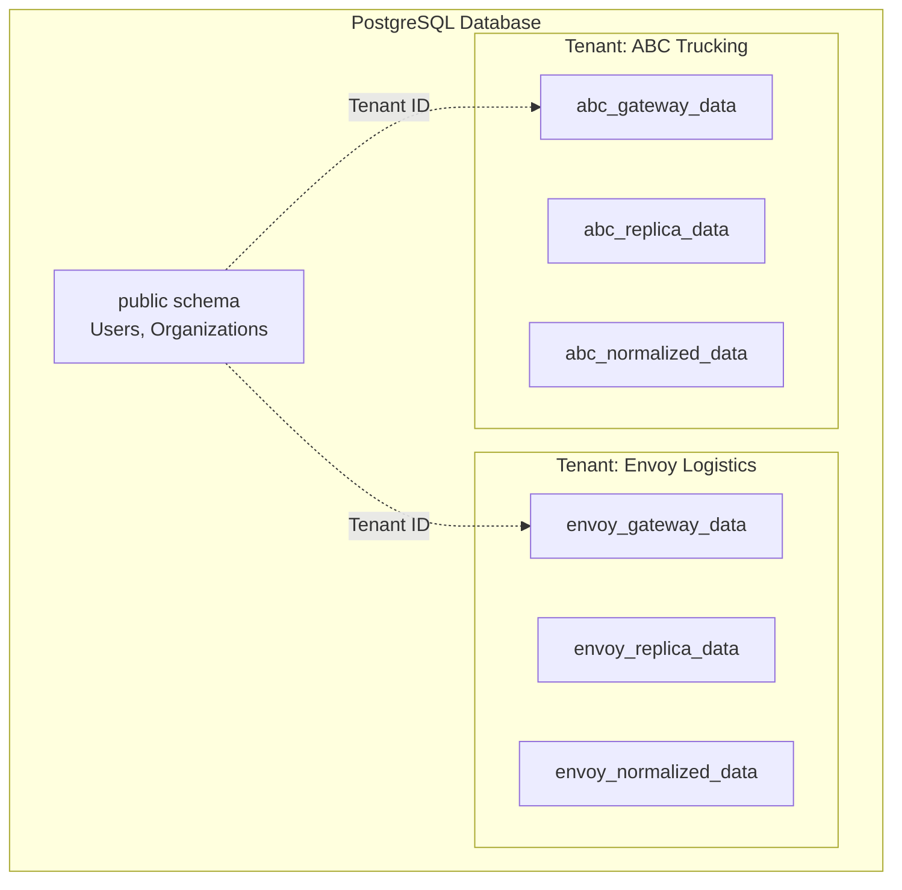

**In Plain English:**

- **Public schema** = Shared stuff (users, org list)
- **Tenant schema** = Each company's integration data
- **Automatic routing** = Code uses AsyncLocalStorage to pick the right schema
- **Security** = Impossible to accidentally query another tenant's data

### 2. Consumer-Centric Design

**The Problem:** Who controls the integration logic?

**The Solution:** The **destination app** (consumer) defines what it needs

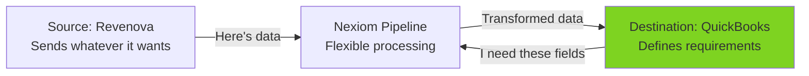

**Why This Matters:**

- **Flexibility** - Source can change without breaking destinations
- **Validation** - Destination requirements enforced
- **Scalability** - Add new destinations easily

### 3. Store-First Notification

**The Problem:** What if notification service is down?

**The Solution:** Save to database first, then queue notification

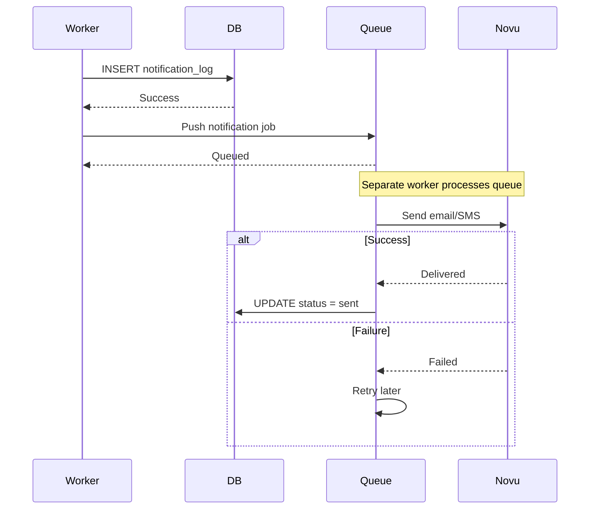

**Why This Matters:**

- **Never lose notifications** - Saved to DB first
- **Resilience** - Can retry if Novu is down
- **Audit trail** - See all notification attempts

### 4. Router Pattern (No If/Else Chains)

**The Problem:** How to handle 100+ different object types?

**Bad Approach:**

```typescript
if (objectType === 'account') { handleAccount() }
else if (objectType === 'contact') { handleContact() }
else if (objectType === 'invoice') { handleInvoice() }
// ... 97 more else-ifs
```

**Good Approach (Router):**

```typescript
// router.ts
const handler = await import(`./handlers/${objectType}.ts`);
await handler.process(data);
```

**Why This Matters:**

- **Scalable** - Add new types without touching router
- **Maintainable** - Each handler in its own file
- **Testable** - Test handlers independently

---

## Part 4: Technology Stack Explained

### Frontend Stack

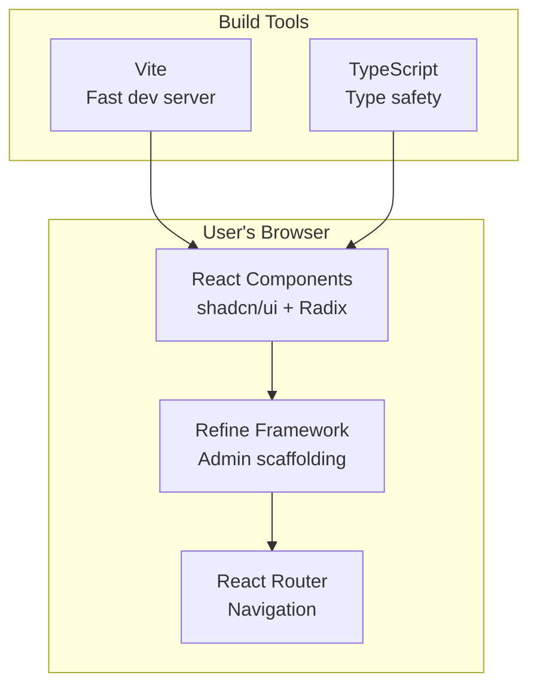

**In Plain English:**

- **React** = UI library (industry standard)
- **Refine** = Pre-built admin components (tables, forms, auth)
- **Vite** = Super fast development server
- **shadcn/ui** = Beautiful, accessible components
- **TypeScript** = Catch bugs before runtime

### Backend Stack

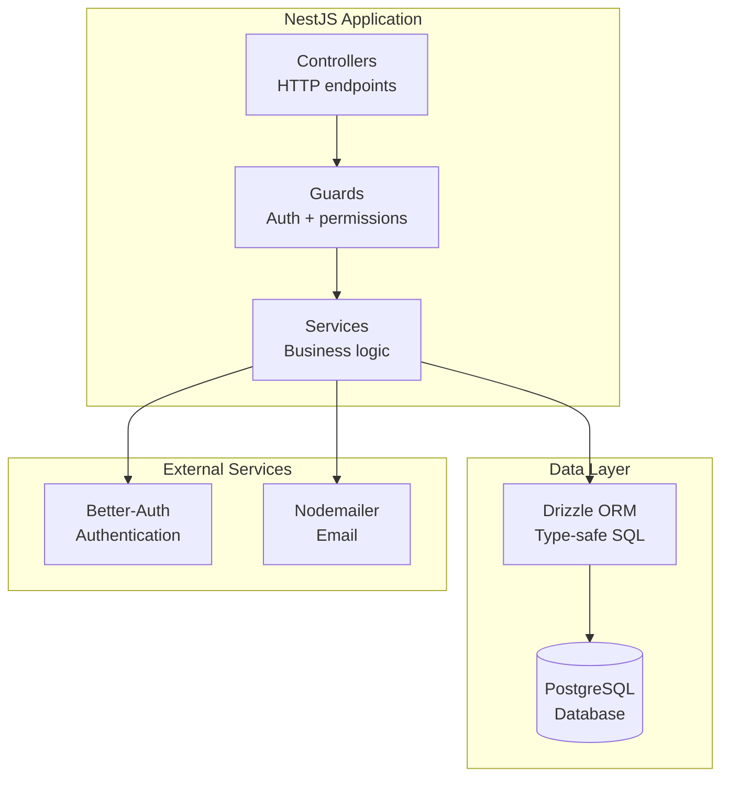

**In Plain English:**

- **NestJS** = Enterprise Node.js framework (like Spring Boot for Java)
- **Drizzle ORM** = Type-safe database queries (no SQL injection)
- **PostgreSQL** = Rock-solid relational database
- **Better-Auth** = Self-hosted auth (no vendor lock-in)
- **Nodemailer** = Send emails reliably

### Infrastructure (Planned)

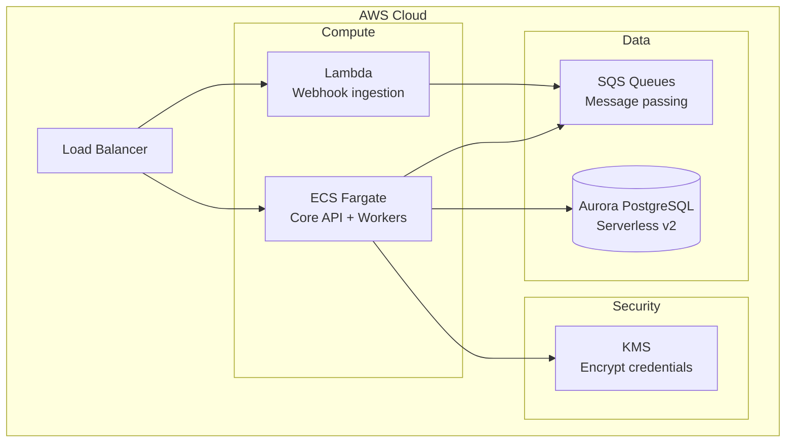

**In Plain English:**

- **Lambda** = Serverless functions for webhooks (scales automatically)
- **ECS Fargate** = Containers for main API (predictable performance)
- **Aurora Serverless** = Auto-scaling database
- **SQS** = Message queues (reliable async processing)
- **KMS** = Encrypt OAuth tokens and API keys

---

## Part 5: How It All Fits Together

### Complete Data Flow Example

**Scenario:** Customer "Acme Trucking" created in Revenova → Sync to QuickBooks

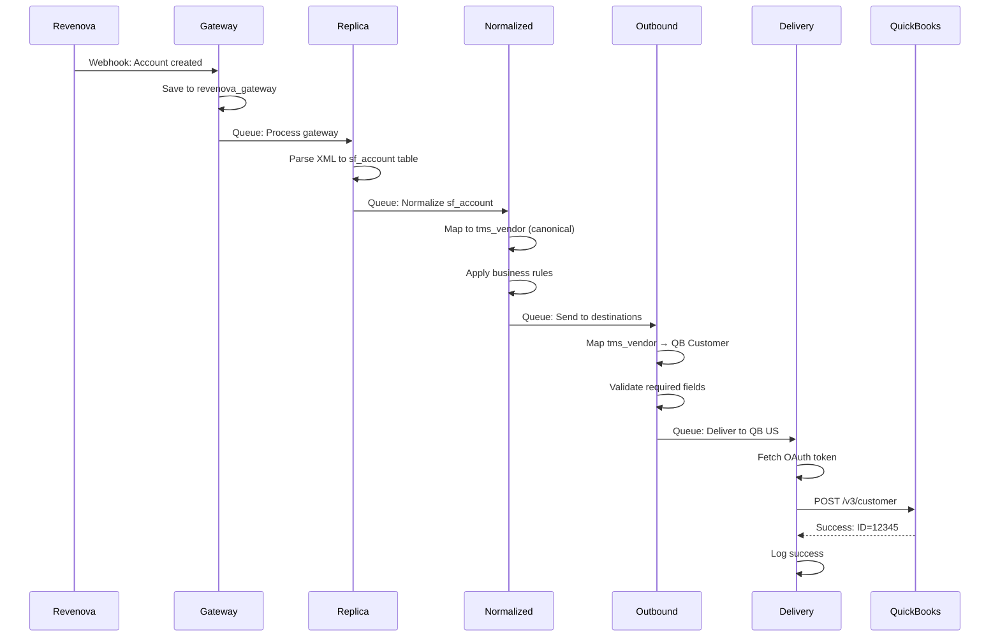

### User Journey

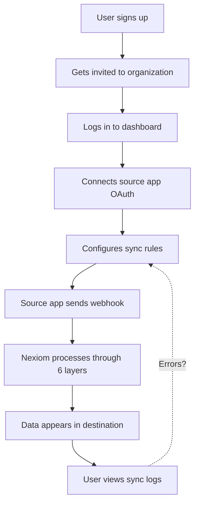

---

## Part 6: What's Missing (The Gap)

### Current State vs. Vision

| Component | Status | Notes |
|-----------|--------|-------|
| **Platform Core** | ✅ Complete | Users, tenants, auth, invites |
| **Admin Dashboard** | ✅ Complete | Web UI for management |
| **6-Layer Pipeline** | ❌ Not Started | Core integration engine |
| **Connector Framework** | ❌ Not Started | Plugin system for apps |
| **OAuth Management** | ❌ Not Started | Connect to external apps |
| **Queue System** | ❌ Not Started | SQS or BullMQ |
| **Worker Processes** | ❌ Not Started | Background job processing |
| **Monitoring** | ❌ Not Started | Logs, metrics, alerts |
| **Billing** | ❌ Not Started | Usage tracking, payments |

### The Roadmap

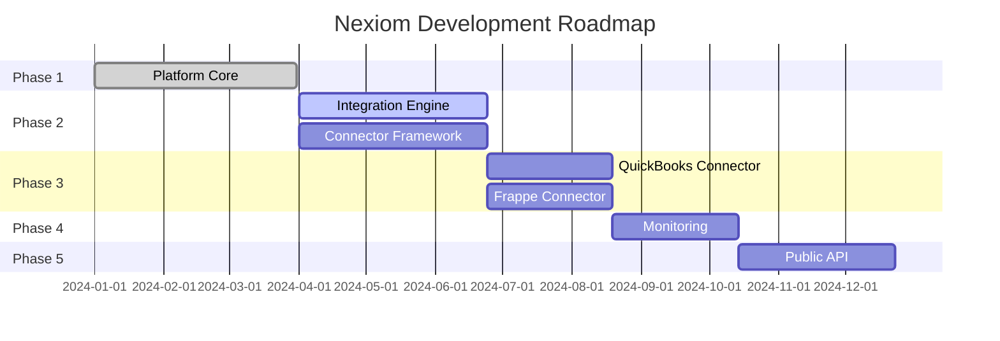

---

## Part 7: Critical Architectural Decisions

### Decision 1: Schema-per-Tenant vs. Row-Level Security

**Context:** How to isolate tenant data?

**Options:**

1. **Row-Level Security (RLS):** Single schema, filter by tenant_id
2. **Schema-per-Tenant:** Separate PostgreSQL schema per tenant
3. **Database-per-Tenant:** Separate database per tenant

**Decision:** Schema-per-Tenant

**Rationale:**

- ✅ **Strong isolation:** Impossible to accidentally query wrong tenant
- ✅ **Performance:** No RLS overhead on every query
- ✅ **Flexibility:** Can customize schema per tenant if needed
- ❌ **Complexity:** More complex schema management
- ❌ **Migrations:** Must run on all tenant schemas

### Decision 2: Monolith vs. Microservices

**Decision:** Start with Monolith, extract services later

**Rationale:**

- ✅ **Faster development:** One codebase, one deployment
- ✅ **Easier debugging:** All logs in one place
- ✅ **Lower costs:** One server instead of many
- ✅ **Future-proof:** Can extract to microservices when needed
- ❌ **Scaling limits:** Must scale entire app, not individual services

### Decision 3: Queue Technology

**Decision:** Adapter pattern (SQS for cloud, BullMQ for self-hosted)

**Rationale:**

- ✅ **Flexibility:** Support both cloud and self-hosted
- ✅ **Best of both:** SQS for scale, BullMQ for features
- ✅ **No lock-in:** Can switch implementations
- ❌ **Complexity:** Must maintain two implementations

---

## Part 8: My Assessment

### What's Strong

1. **✅ Solid Foundation:** Phase 1 is production-ready
2. **✅ Clear Architecture:** 6-layer pipeline is well-designed
3. **✅ Modern Stack:** TypeScript, NestJS, React are industry standard
4. **✅ Security First:** Multi-tenancy, RBAC, encrypted credentials
5. **✅ Quality Standards:** 80%+ test coverage, strict linting

### What Needs Work

1. **❌ Integration Engine:** Core pipeline not implemented yet
2. **❌ Connector Framework:** No plugin system exists
3. **❌ Documentation:** Architecture docs exist but scattered
4. **❌ Monitoring:** No observability platform
5. **❌ DevOps:** No CI/CD, deployment automation

### Critical Risks

| Risk | Impact | Mitigation |
|------|--------|------------|
| **QuickBooks Complexity** | High | Prototype early, hire expert |
| **Schema-per-Tenant Scale** | Medium | Load test with 1000+ schemas |
| **OAuth Token Management** | High | Use KMS, implement refresh logic |
| **Queue Reliability** | High | Dead letter queues, monitoring |
| **Team Knowledge** | Medium | Documentation, pair programming |

---

## Part 9: Production Expansion Features (Post-MVP)

After the core 6-layer pipeline is built and working, we'll add two major features that make Nexiom even more powerful.

### Expansion Feature 1: The Merge Layer (Multi-Source Magic)

**The Problem in Plain English:**

Right now, each sync is **one source → one destination**. But real companies have data scattered across multiple apps:

- **Revenova** has: Customer name, shipping address, phone
- **HubSpot** has: Contact person, email, marketing notes  
- **Internal System** has: Credit limit, payment terms

They want **all of this combined** into one complete customer record in QuickBooks.

**The Solution: Layer 3.5 (Merge Layer)**

We add a new layer between "Normalized" and "Outbound" that combines data from multiple sources into one unified record.

**Important:** Each source must first go through its own pipeline (Gateway → Replica → Normalized) before merging!

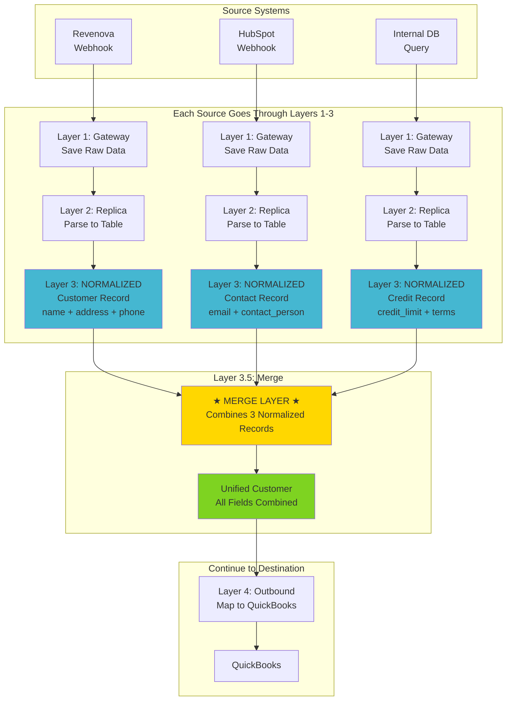

**Critical Concept:** The Merge Layer receives **normalized data** (from Layer 3), not raw source data.

**Complete Flow:**

1. **Revenova** → Gateway → Replica → **Normalized Customer Record**
2. **HubSpot** → Gateway → Replica → **Normalized Contact Record**  
3. **Internal DB** → Gateway → Replica → **Normalized Credit Record**
4. **Three Normalized Records** → **Merge Layer** → **One Unified Record**
5. **Unified Record** → Outbound → Delivery → QuickBooks

**How It Works (Simple Example):**

**Envoy Logistics Configuration:**

```
For "Customer" entity:
  Priority 1: Revenova (trust this most)
    - Take: name, address, phone
  
  Priority 2: HubSpot (use as backup)
    - Take: email, contact_person
  
  Priority 3: Internal System (additional data)
    - Take: credit_limit, payment_terms

Matching Rule: Match by email address
Conflict Rule: If phone number exists in both, use Revenova (higher priority)
```

**Result:**

```
Customer "Acme Trucking" =
  name: "Acme Trucking" (from Revenova)
  address: "123 Main St" (from Revenova)
  phone: "555-1234" (from Revenova)
  email: "bob@acme.com" (from HubSpot)
  contact_person: "Bob Smith" (from HubSpot)
  credit_limit: "$50,000" (from Internal System)
  payment_terms: "Net 30" (from Internal System)
```

**The Updated 7-Layer Pipeline:**

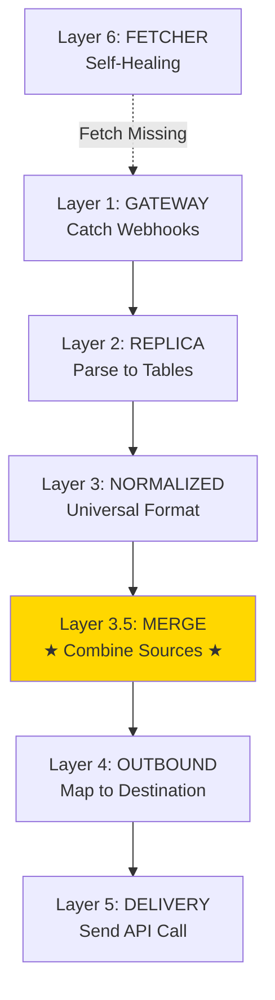

**What Happens When There's a Conflict?**

Imagine Revenova says phone is "555-1234" but HubSpot says "555-5678". What do we do?

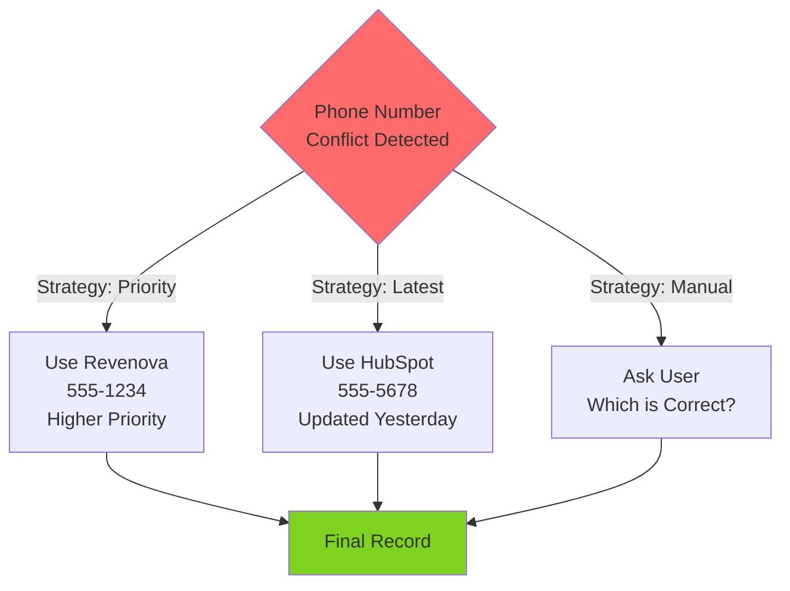

**Different Companies, Different Rules:**

- **Envoy:** "Always trust Revenova over HubSpot"
- **Edlewis:** "Use whichever was updated most recently"
- **ABC Corp:** "Ask me when there's a conflict"

Each company configures their own merge rules!

---

### Expansion Feature 2: AI Assistant (Talk to Your Data)

**The Problem in Plain English:**

Today, if you want to know "What happened to invoice #1234?", you have to:

1. Open the dashboard
2. Navigate to sync logs
3. Filter by invoice number
4. Click through multiple pages
5. Piece together the story yourself

**Wouldn't it be easier to just ask: "What happened to invoice #1234?"**

**The Solution: AI Assistant**

An AI-powered chat that understands your questions and queries all the sync data to give you instant answers in plain English.

```mermaid
graph LR
    subgraph "You Ask"
        USER[👤 User<br/>"What happened to<br/>invoice #1234?"]
    end
    
    subgraph "AI Brain"
        AI[🤖 AI Assistant<br/>GPT-4 / Claude]
        SEARCH[🔍 Smart Search<br/>All Pipeline Data]
    end
    
    subgraph "Your Data"
        DATA[📊 Sync Logs<br/>Gateway, Replica,<br/>Delivery Records]
    end
    
    subgraph "You Get Answer"
        ANSWER[💬 Plain English<br/>"Invoice #1234 was<br/>synced on Jan 20<br/>at 3:45 PM..."]
    end
    
    USER --> AI
    AI --> SEARCH
    SEARCH --> DATA
    DATA --> SEARCH
    SEARCH --> AI
    AI --> ANSWER
    
    style AI fill:#9B59B6
    style ANSWER fill:#7ED321
```

**Real Example Conversations:**

**Question 1: Track a Specific Invoice**

```
👤 You: "What happened to invoice #1234?"

🤖 AI: "Invoice #1234 was created in Revenova on January 20 at 2:30 PM.

Timeline:
• Jan 20, 2:30 PM - Received from Revenova
• Jan 20, 2:31 PM - Parsed and stored
• Jan 20, 3:45 PM - Sent to QuickBooks (success)
• Jan 20, 3:46 PM - QuickBooks confirmed (ID: INV-5678)
• Jan 21, 10:00 AM - Marked as paid in QuickBooks

Current Status: ✅ Synced and Paid"
```

**Question 2: Debug a Failure**

```
👤 You: "Why did customer Acme Trucking fail to sync?"

🤖 AI: "Customer 'Acme Trucking' failed to sync to QuickBooks.

❌ Error: BillingAddr is required but was not provided

Details:
• Source: Revenova (billing address field is empty)
• Last Attempt: Jan 22 at 5:00 PM
• Retry Count: 3 attempts

💡 Suggested Fix: 
Add the billing address in Revenova, then I can automatically retry the sync."
```

**Question 3: See All Problems**

```
👤 You: "Show me all failed syncs today"

🤖 AI: "You have 3 failed syncs today:

1. 📄 Invoice #1234 (3:45 PM)
   Error: Customer reference not found in QuickBooks
   
2. 👤 Customer ABC Corp (4:20 PM)
   Error: Phone number format invalid (needs area code)
   
3. 📄 Invoice #5678 (5:10 PM)
   Error: QuickBooks API timeout (auto-retrying in 5 min)

Would you like me to retry the first two manually?"
```

**How It Works Behind the Scenes:**

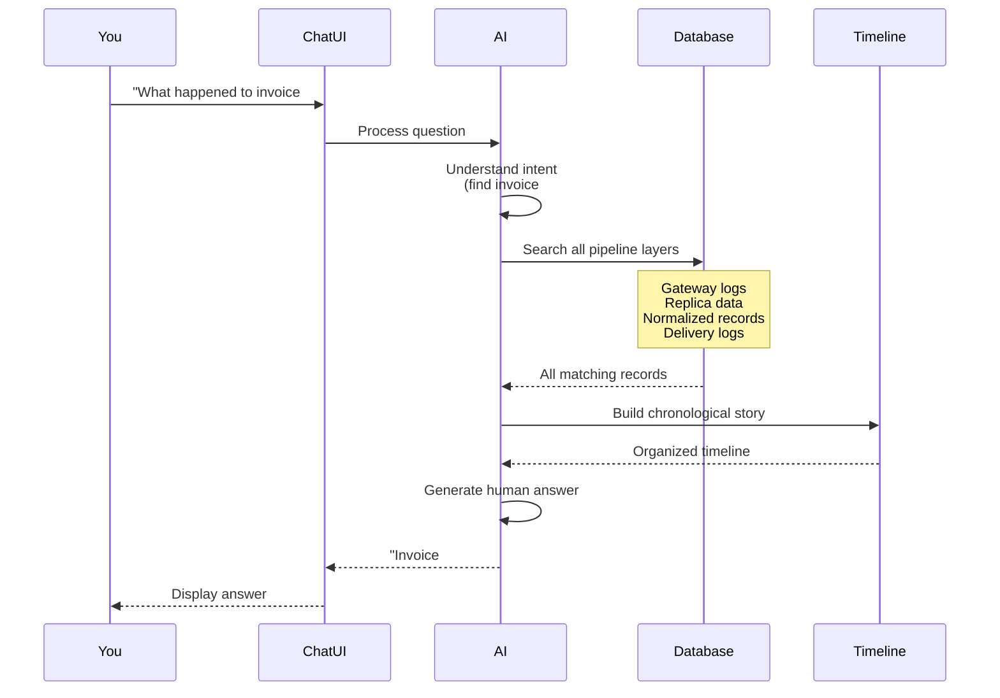

**Smart Search Examples:**

The AI understands variations and finds the right data:

```
You type:           AI finds:
"invoice 1234"   →  ID: 1234, #1234, INV-1234
"acme trucking"  →  Acme Trucking, ACME TRUCKING, Acme-Trucking
"yesterday"      →  Syncs from Jan 21, 2024
"last week"      →  Syncs from Jan 15-22, 2024
```

**Proactive AI (Future Enhancement):**

The AI doesn't just answer questions - it warns you about problems:

```
🤖 AI Alert: "I noticed 5 customers failed to sync today with the same error. 
Would you like me to investigate the pattern?"

🤖 AI Suggestion: "Customer XYZ Corp is missing a billing address. 
Based on their shipping address, should I use that as the billing address too?"

🤖 AI Insight: "Your sync failure rate increased 30% this week. 
The main cause is QuickBooks API timeouts during peak hours (2-4 PM)."
```

---

### Why These Features Matter

**Merge Layer Solves:**

- ✅ Data scattered across multiple systems
- ✅ Incomplete records in any single source
- ✅ Manual data entry across apps
- ✅ Inconsistent information

**AI Assistant Solves:**

- ✅ Complex UI navigation
- ✅ Slow debugging of sync issues
- ✅ No visibility into sync history
- ✅ Requires technical knowledge to troubleshoot

**Together They Make Nexiom:**

- 🎯 More powerful (merge multiple sources)
- 🚀 Easier to use (just ask questions)
- 🔍 Self-service debugging (AI explains problems)
- 📈 Proactive monitoring (AI alerts you to issues)

---

### Implementation Timeline

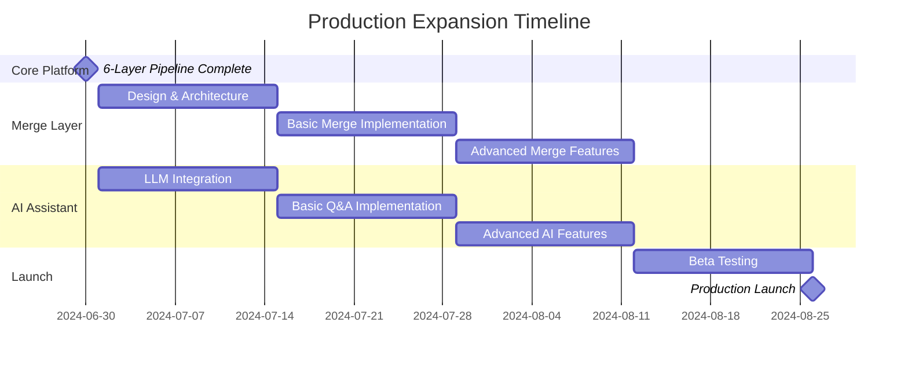

**Total Time:** 12 weeks after core pipeline complete

---

## Conclusion: Do I Understand Nexiom?

### Yes, I understand

1. **The Vision:** B2B integration platform connecting business apps
2. **Current State:** Platform core (users, tenants, auth) is complete
3. **The Gap:** Integration engine (6-layer pipeline) not built yet
4. **The Architecture:** Schema-per-tenant, consumer-centric, queue-based
5. **The Technology:** Modern TypeScript stack (NestJS, React, PostgreSQL)
6. **The Roadmap:** 5 phases over ~46 weeks to full platform

### What I need clarity on

1. **Priority:** Is QuickBooks Desktop or QuickBooks Online first?
2. **Deployment:** AWS or self-hosted for initial launch?
3. **Timeline:** When does Phase 2 (integration engine) start?
4. **Team:** How many developers for Phase 2?
5. **Customers:** Do we have pilot customers lined up?

### My Recommendation

**Build the integration engine incrementally:**

1. **Week 1-2:** Implement Layer 1 (Gateway) only
2. **Week 3-4:** Add Layer 2 (Replica)
3. **Week 5-6:** Add Layer 3 (Normalized)
4. **Week 7-8:** Add Layers 4-5 (Outbound + Delivery)
5. **Week 9-10:** Add Layer 6 (Fetcher)
6. **Week 11-12:** End-to-end testing with one connector

**This de-risks the architecture** - we validate each layer works before building the next.

---

**I'm ready to build a robust system. Let me know what you'd like me to clarify or expand on.**
