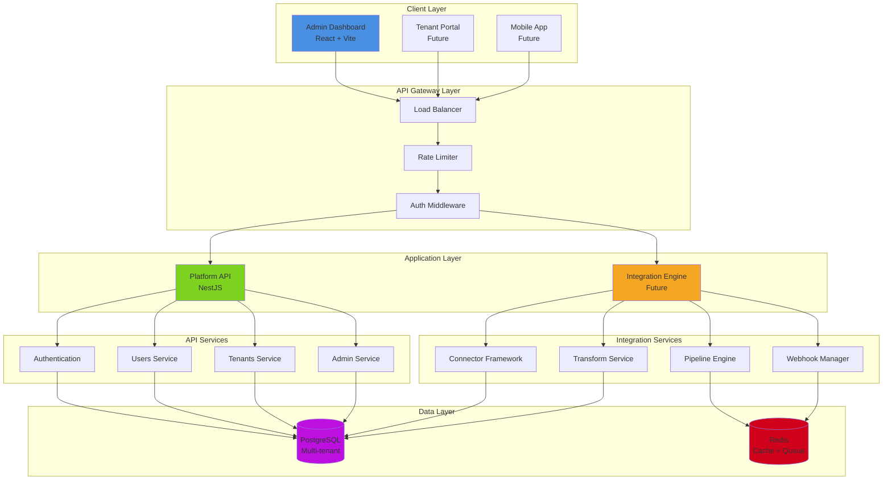
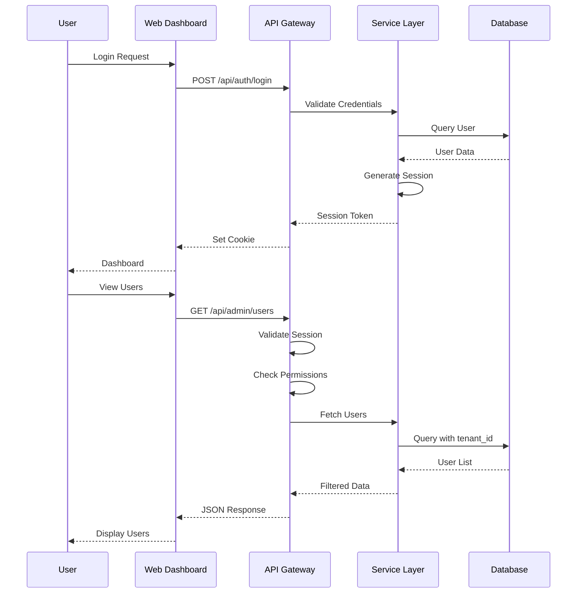
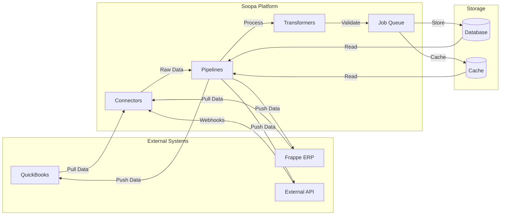
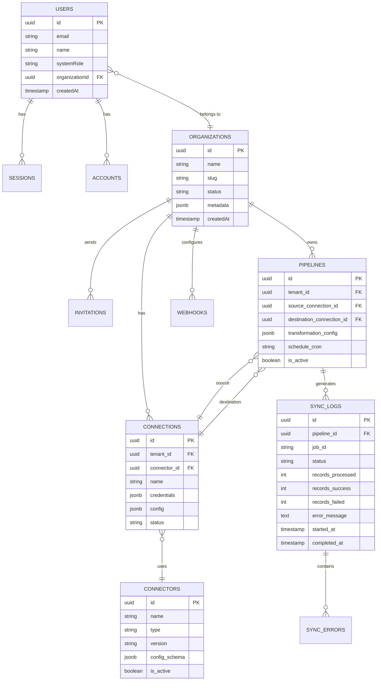
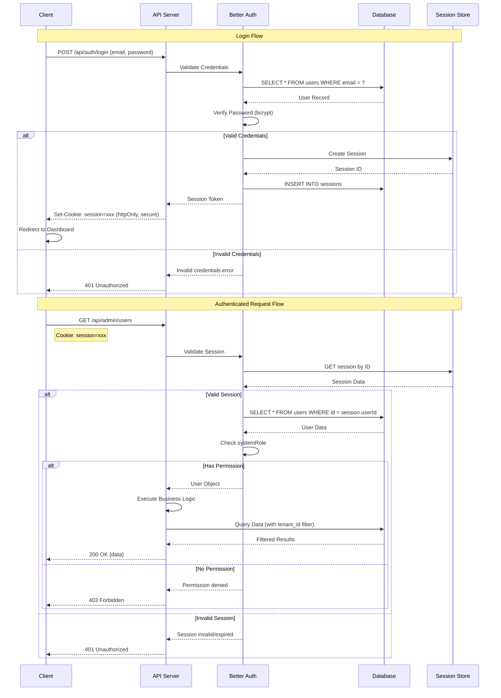
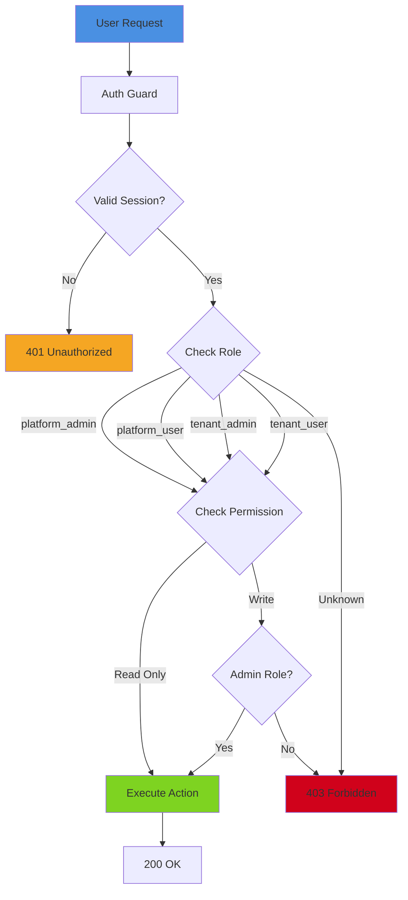

# Soopa Platform - Product Architecture

**Document Status:** DRAFT
**Version:** 1.0
**Last Updated:** 2026-01-22
**Author:** Platform Architecture Team

---

## Executive Summary

Soopa is a **B2B Integration Platform (iPaaS)** that enables seamless data exchange between business applications. The platform separates the **Infrastructure** (The Engine) from **Integration Logic** (The Connectors), providing a scalable, secure, and maintainable solution for modern business connectivity.

### Vision

To become the leading self-hosted iPaaS solution for mid-market and enterprise companies, providing QuickBooks Desktop integration and extensible connector framework for any business application.

### Mission

Deliver a production-grade platform that:

- **Simplifies** B2B data integration
- **Scales** from 10 to 10,000+ tenants
- **Secures** multi-tenant data isolation
- **Enables** rapid connector development

---

## System Overview

### Core Capabilities

| Capability | Description | Status |
|------------|-------------|--------|
| **Multi-Tenancy** | Isolated data and execution per tenant | ✅ Implemented |
| **Authentication** | Self-hosted auth with role-based access | ✅ Implemented |
| **User Management** | Platform and tenant-level user management | ✅ Implemented |
| **Admin Dashboard** | Platform administration interface | ✅ Implemented |
| **Connector Framework** | Pluggable connector architecture | 🔄 In Design |
| **Pipeline Engine** | Data transformation and routing | 🔄 In Design |
| **Monitoring** | Real-time sync monitoring and alerts | 📋 Planned |
| **API Gateway** | RESTful API for integrations | 📋 Planned |

---

## Architecture Principles

### 1. **Separation of Concerns**

- **Platform Layer:** Multi-tenancy, auth, user management
- **Integration Layer:** Connectors, pipelines, transformations
- **Data Layer:** Tenant isolation, schema management

### 2. **Scalability First**

- Horizontal scaling for API and workers
- Database connection pooling
- Queue-based async processing
- Distributed caching (future)

### 3. **Security by Design**

- Row-level security for multi-tenancy
- Encrypted credentials storage
- RBAC with granular permissions
- Audit logging

### 4. **Developer Experience**

- Type-safe APIs (TypeScript)
- Auto-generated documentation
- Hot reload in development
- Comprehensive testing

### 5. **Operational Excellence**

- Infrastructure as Code
- Automated deployments
- Health checks and monitoring
- Disaster recovery

---

## System Architecture

### High-Level Architecture Diagram



### Component Interaction Flow



### Data Flow Architecture



### Technology Stack

**Frontend:**

- React 19 + TypeScript
- Vite (Build tool)
- Refine (Admin framework)
- shadcn/ui + Radix UI
- Tailwind CSS

**Backend:**

- NestJS 11 + TypeScript
- Drizzle ORM
- PostgreSQL 14+
- Better Auth (Self-hosted)
- Nodemailer (Email)

**Infrastructure:**

- Docker + Docker Compose
- pnpm + Turborepo (Monorepo)
- GitHub Actions (CI/CD - planned)
- AWS/DigitalOcean (Deployment - planned)

---

## Module Breakdown

### 1. Platform Core (✅ Implemented)

**Purpose:** Foundation layer providing multi-tenancy, authentication, and user management

**Components:**

- Authentication & Authorization
- User Management
- Tenant Management  
- System Administration
- Email Service

**Status:** Production-ready with platform_admin and platform_user roles

---

### 2. Integration Engine (🔄 In Design)

**Purpose:** Core engine for data synchronization and transformation

**Components:**

- Connector Framework
- Pipeline Engine
- Transformation Service
- Webhook Manager
- Job Queue

**Status:** Architecture design phase

---

### 3. Connectors (📋 Planned)

**Purpose:** Pre-built integrations for business applications

**Priority Connectors:**

1. QuickBooks Desktop (Web Connector)
2. QuickBooks Online (OAuth)
3. Frappe ERPNext
4. Generic EDI
5. Custom CSV/Excel
6. REST API Generic

**Status:** Awaiting integration engine

---

### 4. Monitoring & Observability (📋 Planned)

**Purpose:** Real-time insights into platform health and sync operations

**Components:**

- Metrics Collection (Prometheus)
- Log Aggregation (Winston/Pino)
- Error Tracking (Sentry)
- Usage Analytics
- Audit Trails

**Status:** Not started

---

### 5. API Gateway (📋 Planned)

**Purpose:** Public-facing API for third-party integrations

**Components:**

- REST API
- GraphQL (optional)
- Webhook Endpoints
- API Key Management
- Rate Limiting

**Status:** Not started

---

## Data Architecture

### Multi-Tenancy Model

**Approach:** Shared schema with tenant_id foreign keys

**Benefits:**

- Simplified maintenance
- Cost-effective
- Easy backups

**Security:**

- Row-Level Security (RLS) policies
- Application-level tenant isolation
- Encrypted tenant credentials

### Database Schema Organization



---

## Security Architecture

### Authentication Flow Diagram



### Authorization Model Diagram



### Authorization Model

**System Roles:**

- `platform_admin` - Full platform access
- `platform_user` - Read-only platform access
- `tenant_admin` - Full tenant access
- `tenant_user` - Tenant read/write access

**Permission System (Planned):**

- Resource-level permissions
- Action-level permissions (read, create, update, delete)
- Dynamic role assignment

---

## Deployment Architecture

### Development

- Local Docker containers
- Hot reload (Vite + NestJS watch)
- In-memory message queue

### Staging

- Docker Compose on single VM
- PostgreSQL container
- Nginx reverse proxy
- SSL with Let's Encrypt

### Production (Planned)

- Kubernetes cluster (AWS EKS or DigitalOcean)
- RDS PostgreSQL (Multi-AZ)
- Redis for caching and queues
- CloudWatch/Datadog monitoring
- Auto-scaling workers

---

## API Design

### RESTful Conventions

```
GET    /api/admin/users           # List users
POST   /api/admin/users           # Create user
GET    /api/admin/users/:id       # Get user details
PATCH  /api/admin/users/:id       # Update user
DELETE /api/admin/users/:id       # Delete user
POST   /api/admin/users/:id/invite # Send invitation
```

### Response Format

```json
{
  "data": { /* Resource data */ },
  "meta": {
    "total": 100,
    "page": 1,
    "pageSize": 20
  },
  "error": null
}
```

---

## Performance Targets

| Metric | Target | Current |
|--------|--------|---------|
| API Response Time (p95) | < 200ms | TBD |
| Page Load Time | < 2s | ~1.5s |
| Concurrent Users | 1000+ | TBD |
| Database Connections | < 100 | ~10 |
| Test Coverage | > 80% | 84% API, 95% Web |

---

## Scalability Roadmap

### Phase 1: Single Server (Current)

- 1-50 tenants
- 100-500 users
- Single API instance
- Single database

### Phase 2: Horizontal Scaling

- 50-500 tenants
- 500-5000 users
- Multiple API instances
- Read replicas
- Redis caching

### Phase 3: Distributed System

- 500+ tenants
- 5000+ users
- Kubernetes cluster
- Distributed queue
- Multi-region (optional)

---

## Risk & Mitigation

| Risk | Impact | Mitigation |
|------|--------|------------|
| **Data Loss** | Critical | Daily backups, point-in-time recovery |
| **Security Breach** | Critical | Penetration testing, security audits |
| **Performance Degradation** | High | Load testing, auto-scaling |
| **Vendor Lock-in** | Medium | Use open-source stack, avoid cloud-specific features |
| **Team Knowledge** | Medium | Documentation, pair programming |

---

## Success Metrics

### Technical Metrics

- ✅ Test coverage > 80%
- ✅ Build time < 30s
- ✅ Zero production errors
- ✅ API uptime > 99.9%

### Product Metrics

- Tenant onboarding time < 5 minutes
- Connector setup time < 10 minutes  
- Data sync success rate > 99%
- User satisfaction > 4.5/5

---

## Next Steps

1. **Immediate (Week 1-2)**
   - ✅ Platform user access implemented
   - ✅ Technical debt documented
   - Review and approve this architecture

2. **Short-term (Month 1-2)**
   - Design integration engine architecture
   - Define connector interface
   - Prototype QuickBooks Desktop connector

3. **Medium-term (Month 3-6)**
   - Implement integration engine
   - Build first 3 connectors
   - Deploy to staging environment

4. **Long-term (Month 6-12)**
   - Public API launch
   - Monitoring and observability
   - Multi-region deployment (if needed)

---

## References

- [Technology Stack](/Users/apple/.gemini/antigravity/brain/fd86219d-7e6d-4738-8aaf-19625d98804c/technology_stack.md)
- [Architecture Technical Debt](/Users/apple/.gemini/antigravity/brain/fd86219d-7e6d-4738-8aaf-19625d98804c/architecture_technical_debt.md)
- [Permission Architecture Analysis](/Users/apple/.gemini/antigravity/brain/fd86219d-7e6d-4738-8aaf-19625d98804c/permission_architecture_analysis.md)
- Old Documentation: `/docs/old/`
