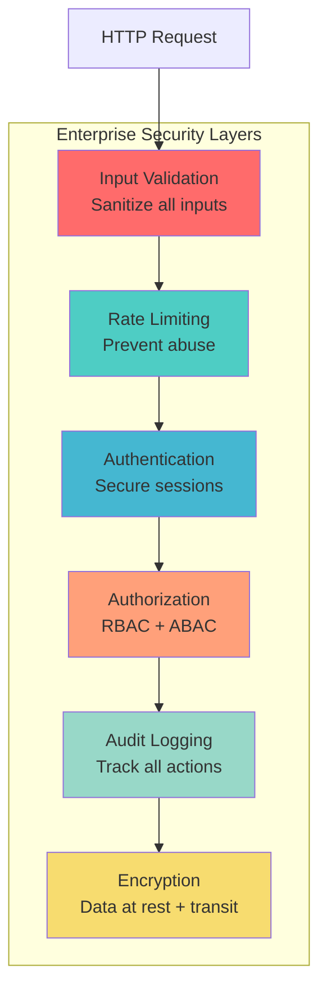
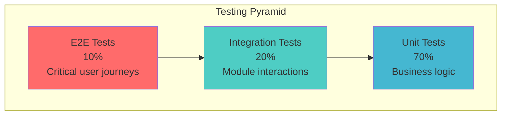
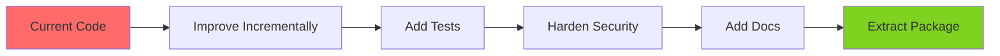

# Enterprise Refactor Plan: Identity Module (@soopa/identity)

**Status:** Refactor Specification  
**Target:** Transform existing code to enterprise-grade, open source standard  
**Timeline:** 6-8 weeks  
**Created:** 2026-01-22

---

## Executive Summary

**Current State:**  
We have working auth, user management, tenant management, and dashboards. Code is functional but not enterprise-grade.

**Goal:**  
Refactor into production-ready `@soopa/identity` package that meets:

- Enterprise security standards
- Open source quality benchmarks
- Industry best practices
- 90%+ test coverage
- Comprehensive documentation

**Impact:**  

- **Developers:** Install & use in minutes
- **Enterprises:** Trust for production workloads
- **Open Source:** High adoption & community contributions

---

## Part 1: Current State Assessment

### What Exists Today

```
apps/api/src/modules/
├── auth/              ← Authentication logic (Better-Auth integration)
├── users/             ← User CRUD operations
├── tenants/           ← Tenant/Organization management
├── invitations/       ← Invitation system
├── email/             ← Email notifications
└── system-admin/      ← System-level operations

apps/web/src/
├── modules/
│   └── tenants/       ← Tenant list/management UI
├── pages/
│   ├── admin/         ← Admin dashboard
│   │   └── users/     ← User management UI
│   └── public/        ← Public pages (login, signup, accept invite)
├── components/        ← Shared UI components
└── providers/         ← Auth provider, data provider
```

### Strengths

✅ **Functional Core**

- Authentication works (Better-Auth)
- Multi-tenancy works (organizations)
- RBAC implemented (platform_admin, platform_user)
- Invitation flow works
- Admin and tenant dashboards exist

✅ **Modern Stack**

- TypeScript throughout
- NestJS backend
- React frontend
- Drizzle ORM

✅ **Test Coverage Started**

- Some unit tests exist
- Test infrastructure in place

### Gaps (Not Enterprise-Grade)

❌ **Security**

- No rate limiting
- No audit logging
- No input sanitization layer
- No CSRF protection
- No content security policy
- Session management not hardened

❌ **Code Quality**

- TODOs in production code
- Inconsistent error handling
- No validation layer
- Magic strings instead of enums
- No centralized configuration

❌ **Testing**

- Coverage < 60% in places
- No integration tests
- No E2E tests
- No load tests
- No security tests

❌ **Documentation**

- No API documentation
- No architecture decision records
- No deployment guides
- No developer onboarding docs

❌ **Observability**

- No structured logging
- No metrics/monitoring
- No error tracking
- No performance monitoring

❌ **Open Source Readiness**

- No CONTRIBUTING.md
- No CODE_OF_CONDUCT.md
- No clear LICENSE
- No CHANGELOG
- No release process

---

## Part 2: Enterprise Standards

### Security Standards



#### 1. **Input Validation & Sanitization**

**Current:** Basic validation with class-validator decorators  
**Required:** Multi-layer validation

```typescript
// BAD - Current
@Post('signup')
async signup(@Body() dto: SignUpDto) {
  return this.authService.signup(dto);
}

// GOOD - Enterprise Standard
@Post('signup')
@UsePipes(new ValidationPipe({ whitelist: true, forbidNonWhitelisted: true }))
@UseInterceptors(SanitizationInterceptor)
async signup(@Body() dto: SignUpDto) {
  // Validation happens automatically
  // Sanitization happens automatically
  return this.authService.signup(dto);
}
```

**Implementation:**

- ✅ Schema validation (class-validator)
- ✅ SQL injection prevention (Drizzle parameterized queries)
- ⚠️ **ADD:** XSS sanitization
- ⚠️ **ADD:** Path traversal protection
- ⚠️ **ADD:** File upload validation
- ⚠️ **ADD:** Request size limits

#### 2. **Rate Limiting**

**Current:** None  
**Required:** Multi-tier rate limiting

```typescript
// Tier 1: Global rate limit
@UseGuards(ThrottlerGuard)
@Throttle({ default: { limit: 100, ttl: 60000 } }) // 100 req/min

// Tier 2: Endpoint-specific limits
@Post('signup')
@Throttle({ signup: { limit: 5, ttl: 3600000 } }) // 5 signups/hour

// Tier 3: User-specific limits (after auth)
@Post('invite')
@Throttle({ invite: { limit: 20, ttl: 3600000 } }) // 20 invites/hour per user
```

**Implementation:**

- **ADD:** `@nestjs/throttler` for rate limiting
- **ADD:** Redis for distributed rate limiting
- **ADD:** Custom limits per endpoint type
- **ADD:** IP-based limiting
- **ADD:** User-based limiting (after auth)

#### 3. **Audit Logging**

**Current:** None  
**Required:** Comprehensive audit trail

```typescript
interface AuditLog {
  id: string;
  timestamp: Date;
  userId?: string;
  tenantId?: string;
  action: AuditAction; // Enum: CREATE_USER, UPDATE_USER, DELETE_USER, etc.
  resource: string; // 'user', 'tenant', 'invitation'
  resourceId: string;
  changes?: Record<string, { old: any; new: any }>;
  ipAddress: string;
  userAgent: string;
  status: 'success' | 'failure';
  errorMessage?: string;
}
```

**Track These Events:**

- User signup, login, logout
- Password changes, resets
- User CRUD operations
- Tenant CRUD operations
- Role changes
- Invitation sent, accepted, revoked
- Failed authentication attempts
- Permission denied attempts

#### 4. **Session Security**

**Current:** Better-Auth default session handling  
**Required:** Hardened session management

```typescript
// Session configuration
{
  session: {
    // Use secure, httpOnly cookies
    cookie: {
      httpOnly: true,
      secure: true, // HTTPS only
      sameSite: 'strict',
      maxAge: 24 * 60 * 60 * 1000, // 24 hours
    },
    
    // Rotate session ID on privilege escalation
    regenerateOnLogin: true,
    
    // Idle timeout
    idleTimeout: 30 * 60 * 1000, // 30 minutes
    
    // Absolute timeout
    absoluteTimeout: 24 * 60 * 60 * 1000, // 24 hours
  },
  
  // CSRF protection
  csrf: {
    enabled: true,
    tokenLength: 32,
  },
}
```

#### 5. **Password Security**

**Current:** Better-Auth handles password hashing  
**Required:** Enhanced password policy

```typescript
const PASSWORD_POLICY = {
  minLength: 12, // Industry standard
  requireUppercase: true,
  requireLowercase: true,
  requireNumbers: true,
  requireSpecialChars: true,
  rejectCommonPasswords: true, // Check against common password list
  rejectUserInfo: true, // Can't contain email, name
  maxAge: 90 * 24 * 60 * 60 * 1000, // Force change after 90 days (optional)
  preventReuse: 5, // Can't reuse last 5 passwords
};
```

### Code Quality Standards

#### 1. **Error Handling**

**Current:** Inconsistent error handling  
**Required:** Centralized, typed error handling

```typescript
// Define all error types
export class ApplicationError extends Error {
  constructor(
    public code: string,
    public statusCode: number,
    message: string,
    public metadata?: Record<string, any>
  ) {
    super(message);
  }
}

export class ValidationError extends ApplicationError {
  constructor(message: string, metadata?: Record<string, any>) {
    super('VALIDATION_ERROR', 400, message, metadata);
  }
}

export class UnauthorizedError extends ApplicationError {
  constructor(message = 'Unauthorized') {
    super('UNAUTHORIZED', 401, message);
  }
}

export class ForbiddenError extends ApplicationError {
  constructor(message = 'Forbidden') {
    super('FORBIDDEN', 403, message);
  }
}

// Use in services
throw new ValidationError('Email already exists', { email: dto.email });

// Global exception filter catches and formats
{
  "error": {
    "code": "VALIDATION_ERROR",
    "message": "Email already exists",
    "metadata": { "email": "user@example.com" }
  }
}
```

#### 2. **Configuration Management**

**Current:** Environment variables scattered  
**Required:** Type-safe configuration module

```typescript
// config/configuration.ts
export default () => ({
  app: {
    port: parseInt(process.env.PORT, 10) || 3000,
    environment: process.env.NODE_ENV || 'development',
  },
  database: {
    url: process.env.DATABASE_URL,
    ssl: process.env.DATABASE_SSL === 'true',
    maxConnections: parseInt(process.env.DB_MAX_CONNECTIONS, 10) || 20,
  },
  auth: {
    sessionSecret: process.env.SESSION_SECRET,
    sessionMaxAge: parseInt(process.env.SESSION_MAX_AGE, 10) || 86400000,
    passwordPolicy: {
      minLength: parseInt(process.env.PASSWORD_MIN_LENGTH, 10) || 12,
    },
  },
  email: {
    host: process.env.SMTP_HOST,
    port: parseInt(process.env.SMTP_PORT, 10) || 587,
    user: process.env.SMTP_USER,
    password: process.env.SMTP_PASSWORD,
  },
  rateLimit: {
    global: {
      limit: parseInt(process.env.RATE_LIMIT_GLOBAL, 10) || 100,
      ttl: 60000,
    },
  },
});

// Validate on startup
const configSchema = z.object({
  app: z.object({
    port: z.number().min(1).max(65535),
    environment: z.enum(['development', 'staging', 'production']),
  }),
  database: z.object({
    url: z.string().url(),
  }),
  auth: z.object({
    sessionSecret: z.string().min(32),
  }),
  // ... more validation
});
```

#### 3. **Logging**

**Current:** console.log statements  
**Required:** Structured logging with levels

```typescript
// Use Pino or Winston
import { PinoLogger } from 'nestjs-pino';

export class UsersService {
  constructor(private logger: PinoLogger) {
    this.logger.setContext(UsersService.name);
  }

  async create(dto: CreateUserDto) {
    this.logger.info({ dto }, 'Creating new user');
    
    try {
      const user = await this.repository.create(dto);
      this.logger.info({ userId: user.id }, 'User created successfully');
      return user;
    } catch (error) {
      this.logger.error({ error, dto }, 'Failed to create user');
      throw error;
    }
  }
}

// Log output (JSON format)
{
  "level": "info",
  "time": "2024-01-22T10:15:30.123Z",
  "context": "UsersService",
  "msg": "Creating new user",
  "dto": { "email": "user@example.com" }
}
```

### Testing Standards

#### Target: 90%+ Coverage



#### 1. **Unit Tests** (70% of tests)

**Coverage Requirements:**

- All services: 95%+
- All controllers: 90%+
- All guards: 100%
- All pipes/interceptors: 100%
- All utils: 100%

```typescript
// Example: users.service.spec.ts
describe('UsersService', () => {
  let service: UsersService;
  let repository: MockRepository;
  
  beforeEach(async () => {
    const module = await Test.createTestingModule({
      providers: [
        UsersService,
        { provide: UsersRepository, useValue: createMockRepository() },
      ],
    }).compile();
    
    service = module.get<UsersService>(UsersService);
    repository = module.get(UsersRepository);
  });
  
  describe('create', () => {
    it('should create a user successfully', async () => {
      const dto = { email: 'test@example.com', name: 'Test User' };
      const expected = { id: '1', ...dto };
      
      repository.create.mockResolvedValue(expected);
      
      const result = await service.create(dto);
      
      expect(result).toEqual(expected);
      expect(repository.create).toHaveBeenCalledWith(dto);
    });
    
    it('should throw ValidationError if email exists', async () => {
      const dto = { email: 'existing@example.com', name: 'Test' };
      
      repository.create.mockRejectedValue(new Error('UNIQUE constraint'));
      
      await expect(service.create(dto)).rejects.toThrow(ValidationError);
    });
    
    it('should sanitize user input', async () => {
      const dto = { 
        email: 'test@example.com', 
        name: '<script>alert("xss")</script>' 
      };
      
      await service.create(dto);
      
      expect(repository.create).toHaveBeenCalledWith({
        email: 'test@example.com',
        name: 'alert("xss")', // Sanitized
      });
    });
  });
});
```

#### 2. **Integration Tests** (20% of tests)

Test module interactions, database, external services

```typescript
// users.integration.spec.ts
describe('UsersModule (integration)', () => {
  let app: INestApplication;
  let db: Database;
  
  beforeAll(async () => {
    const module = await Test.createTestingModule({
      imports: [UsersModule, DatabaseModule.forTest()],
    }).compile();
    
    app = module.createNestApplication();
    await app.init();
    
    db = module.get(Database);
  });
  
  afterEach(async () => {
    await db.truncate('users');
  });
  
  describe('POST /users', () => {
    it('should create user in database', async () => {
      const dto = { email: 'test@example.com', name: 'Test User' };
      
      const response = await request(app.getHttpServer())
        .post('/users')
        .send(dto)
        .expect(201);
      
      expect(response.body).toMatchObject({
        id: expect.any(String),
        email: dto.email,
        name: dto.name,
      });
      
      // Verify in database
      const user = await db.users.findOne({ email: dto.email });
      expect(user).toBeTruthy();
      expect(user.email).toBe(dto.email);
    });
  });
});
```

#### 3. **E2E Tests** (10% of tests)

Test critical user journeys end-to-end

```typescript
// auth.e2e.spec.ts
describe('Authentication Flow (e2e)', () => {
  it('should complete full signup → login → logout flow', async () => {
    const email = `test-${Date.now()}@example.com`;
    const password = 'SecurePassword123!';
    
    // 1. Signup
    const signupRes = await request(app.getHttpServer())
      .post('/auth/signup')
      .send({ email, password, name: 'Test User' })
      .expect(201);
    
    expect(signupRes.body.user.email).toBe(email);
    
    // 2. Login
    const loginRes = await request(app.getHttpServer()
      .post('/auth/login')
      .send({ email, password })
      .expect(200);
    
    const sessionCookie = loginRes.headers['set-cookie'];
    expect(sessionCookie).toBeDefined();
    
    // 3. Access protected route
    await request(app.getHttpServer())
      .get('/users/me')
      .set('Cookie', sessionCookie)
      .expect(200);
    
    // 4. Logout
    await request(app.getHttpServer())
      .post('/auth/logout')
      .set('Cookie', sessionCookie)
      .expect(200);
    
    // 5. Verify session is invalidated
    await request(app.getHttpServer())
      .get('/users/me')
      .set('Cookie', sessionCookie)
      .expect(401);
  });
});
```

#### 4. **Security Tests**

```typescript
describe('Security', () => {
  describe('SQL Injection Protection', () => {
    it('should prevent SQL injection in email field', async () => {
      const maliciousEmail = "admin'--";
      
      await request(app.getHttpServer())
        .post('/auth/login')
        .send({ email: maliciousEmail, password: 'test' })
        .expect(401); // Should fail authentication, not execute SQL
    });
  });
  
  describe('XSS Protection', () => {
    it('should sanitize script tags in name field', async () => {
      const xssName = '<script>alert("xss")</script>';
      
      const res = await request(app.getHttpServer())
        .post('/users')
        .send({ email: 'test@example.com', name: xssName })
        .expect(201);
      
      expect(res.body.name).not.toContain('<script>');
      expect(res.body.name).not.toContain('</script>');
    });
  });
  
  describe('Rate Limiting', () => {
    it('should enforce rate limits on signup', async () => {
      const requests = Array(10).fill(null).map((_, i) =>
        request(app.getHttpServer())
          .post('/auth/signup')
          .send({ email: `test${i}@example.com`, password: 'pass' })
      );
      
      const responses = await Promise.all(requests);
      const tooManyRequests = responses.filter(r => r.status === 429);
      
      expect(tooManyRequests.length).toBeGreaterThan(0);
    });
  });
});
```

---

## Part 3: Refactor Plan

### Phase 1: Security Hardening (Week 1-2)

**Priority: CRITICAL**

#### 1.1 Input Validation & Sanitization

```typescript
// Install dependencies
npm install class-validator class-transformer helmet express-validator

// Create sanitization interceptor
@Injectable()
export class SanitizationInterceptor implements NestInterceptor {
  intercept(context: ExecutionContext, next: CallHandler) {
    const request = context.switchToHttp().getRequest();
    
    // Sanitize body
    if (request.body) {
      request.body = this.sanitize(request.body);
    }
    
    // Sanitize query params
    if (request.query) {
      request.query = this.sanitize(request.query);
    }
    
    return next.handle();
  }
  
  private sanitize(obj: any): any {
    if (typeof obj === 'string') {
      // Remove HTML tags, script tags, etc.
      return obj.replace(/<[^>]*>/g, '');
    }
    if (Array.isArray(obj)) {
      return obj.map(item => this.sanitize(item));
    }
    if (typeof obj === 'object' && obj !== null) {
      const sanitized = {};
      for (const [key, value] of Object.entries(obj)) {
        sanitized[key] = this.sanitize(value);
      }
      return sanitized;
    }
    return obj;
  }
}
```

**Tasks:**

- [ ] Add SanitizationInterceptor globally
- [ ] Add Helmet middleware for security headers
- [ ] Add request size limits
- [ ] Add file upload validation (if applicable)
- [ ] Audit all DTOs for validation rules
- [ ] Test XSS, SQL injection, path traversal

#### 1.2 Rate Limiting

```typescript
// Install
npm install @nestjs/throttler

// Configure in app.module.ts
ThrottlerModule.forRoot({
  throttlers: [
    {
      name: 'short',
      ttl: 1000, // 1 second
      limit: 3,
    },
    {
      name: 'medium',
      ttl: 60000, // 1 minute
      limit: 20,
    },
    {
      name: 'long',
      ttl: 3600000, // 1 hour
      limit: 100,
    },
  ],
  storage: new ThrottlerStorageRedisService(redisClient),
}),

// Apply to controllers
@UseGuards(ThrottlerGuard)
@Throttle({ short: { limit: 5, ttl: 60000 } })
@Post('signup')
async signup() {
  // ...
}
```

**Tasks:**

- [ ] Install @nestjs/throttler
- [ ] Configure Redis for distributed rate limiting
- [ ] Define rate limits per endpoint type
- [ ] Add rate limit headers to responses
- [ ] Test rate limiting

#### 1.3 Audit Logging

```typescript
// Create audit log schema
export const auditLog = pgTable('audit_log', {
  id: text('id').primaryKey(),
  timestamp: timestamp('timestamp').notNull().defaultNow(),
  userId: text('user_id'),
  tenantId: text('tenant_id'),
  action: text('action').notNull(), // 'CREATE_USER', 'UPDATE_USER', etc.
  resource: text('resource').notNull(), // 'user', 'tenant', etc.
  resourceId: text('resource_id').notNull(),
  changes: text('changes'), // JSON string of changes
  ipAddress: text('ip_address').notNull(),
  userAgent: text('user_agent'),
  status: text('status').notNull(), // 'success' | 'failure'
  errorMessage: text('error_message'),
});

// Create audit service
@Injectable()
export class AuditService {
  async log(entry: AuditLogEntry) {
    await this.db.insert(auditLog).values(entry);
  }
}

// Create audit interceptor
@Injectable()
export class AuditInterceptor implements NestInterceptor {
  constructor(private audit: AuditService) {}
  
  intercept(context: ExecutionContext, next: CallHandler) {
    const request = context.switchToHttp().getRequest();
    const action = this.getAction(context);
    
    return next.handle().pipe(
      tap(() => {
        this.audit.log({
          userId: request.user?.id,
          action,
          resource: this.getResource(context),
          resourceId: this.getResourceId(context),
          ipAddress: request.ip,
          userAgent: request.headers['user-agent'],
          status: 'success',
        });
      }),
      catchError(error => {
        this.audit.log({
          userId: request.user?.id,
          action,
          resource: this.getResource(context),
          resourceId: this.getResourceId(context),
          ipAddress: request.ip,
          userAgent: request.headers['user-agent'],
          status: 'failure',
          errorMessage: error.message,
        });
        throw error;
      }),
    );
  }
}
```

**Tasks:**

- [ ] Create audit_log table
- [ ] Create AuditService
- [ ] Create AuditInterceptor
- [ ] Apply to sensitive operations
- [ ] Test audit logging

### Phase 2: Code Quality (Week 3-4)

#### 2.1 Error Handling Standardization

**Tasks:**

- [ ] Create custom exception classes
- [ ] Create global exception filter
- [ ] Replace all throw new Error() with typed exceptions
- [ ] Add error codes to all errors
- [ ] Test error responses

#### 2.2 Configuration Management

**Tasks:**

- [ ] Create config module with validation
- [ ] Move all env vars to config
- [ ] Add config schema validation (Zod)
- [ ] Fail fast on invalid config
- [ ] Document all config options

#### 2.3 Logging Implementation

**Tasks:**

- [ ] Install Pino or Winston
- [ ] Configure structured logging
- [ ] Replace all console.log
- [ ] Add context to all logs
- [ ] Configure log rotation
- [ ] Test log output

### Phase 3: Testing (Week 5-6)

#### 3.1 Unit Tests

**Tasks:**

- [ ] Set coverage threshold to 90%
- [ ] Write tests for all services (target 95%+)
- [ ] Write tests for all controllers (target 90%+)
- [ ] Write tests for all guards (target 100%)
- [ ] Write tests for all pipes/interceptors (target 100%)
- [ ] Configure coverage reports

#### 3.2 Integration Tests

**Tasks:**

- [ ] Set up test database
- [ ] Write integration tests for each module
- [ ] Test database interactions
- [ ] Test module interactions
- [ ] Configure CI to run integration tests

#### 3.3 E2E Tests

**Tasks:**

- [ ] Write E2E tests for critical flows
- [ ] Test complete user journeys
- [ ] Test error scenarios
- [ ] Add to CI pipeline

#### 3.4 Security Tests

**Tasks:**

- [ ] Write SQL injection tests
- [ ] Write XSS tests
- [ ] Write CSRF tests
- [ ] Write rate limiting tests
- [ ] Add security scanning to CI

### Phase 4: Documentation (Week 7)

#### 4.1 API Documentation

**Tasks:**

- [ ] Install Swagger/OpenAPI
- [ ] Document all endpoints
- [ ] Add request/response examples
- [ ] Add error code documentation
- [ ] Generate interactive API docs

#### 4.2 Architecture Documentation

**Tasks:**

- [ ] Create ARCHITECTURE.md
- [ ] Document module structure
- [ ] Create sequence diagrams
- [ ] Document security measures
- [ ] Document testing strategy

#### 4.3 Developer Documentation

**Tasks:**

- [ ] Create CONTRIBUTING.md
- [ ] Create development setup guide
- [ ] Create testing guide
- [ ] Create deployment guide
- [ ] Add code examples

### Phase 5: Open Source Preparation (Week 8)

#### 5.1 Repository Setup

**Tasks:**

- [ ] Add LICENSE file (MIT recommended)
- [ ] Add CODE_OF_CONDUCT.md
- [ ] Add CONTRIBUTING.md
- [ ] Add SECURITY.md (vulnerability reporting)
- [ ] Add issue templates
- [ ] Add PR templates

#### 5.2 CI/CD Pipeline

**Tasks:**

- [ ] Set up GitHub Actions
- [ ] Add lint check
- [ ] Add test check
- [ ] Add coverage check
- [ ] Add security scan
- [ ] Add automatic releases

#### 5.3 Package Preparation

**Tasks:**

- [ ] Configure package.json for npm
- [ ] Add build scripts
- [ ] Configure TypeScript for package distribution
- [ ] Add README.md with usage examples
- [ ] Test npm install locally

---

## Part 4: Quality Checklist

### Before Marking "Enterprise-Ready"

#### Security ✅

- [ ] All inputs validated and sanitized
- [ ] Rate limiting on all endpoints
- [ ] Audit logging for sensitive operations
- [ ] Session security hardened
- [ ] CSRF protection enabled
- [ ] Security headers configured (Helmet)
- [ ] SQL injection protection verified
- [ ] XSS protection verified
- [ ] No secrets in code
- [ ] Environment variables validated

#### Code Quality ✅

- [ ] No console.log in production code
- [ ] No TODO/FIXME in production code
- [ ] All errors have error codes
- [ ] All config centralized and validated
- [ ] Structured logging everywhere
- [ ] TypeScript strict mode enabled
- [ ] ESLint passing with no warnings
- [ ] Prettier formatting applied

#### Testing ✅

- [ ] Unit test coverage ≥ 90%
- [ ] Integration tests cover all modules
- [ ] E2E tests cover critical journeys
- [ ] Security tests passing
- [ ] CI running all tests
- [ ] Test coverage reported
- [ ] Flaky tests fixed

#### Documentation ✅

- [ ] API documentation complete (Swagger)
- [ ] README with quick start
- [ ] Architecture documentation
- [ ] Contributing guide
- [ ] Code of conduct
- [ ] License file
- [ ] Security policy
- [ ] Deployment guide

#### Performance ✅

- [ ] Load testing completed
- [ ] Performance benchmarks documented
- [ ] Database queries optimized
- [ ] Response times < 200ms (p95)
- [ ] Memory leaks tested
- [ ] Connection pooling configured

#### Observability ✅

- [ ] Structured logging configured
- [ ] Error tracking setup (Sentry)
- [ ] Metrics/monitoring setup
- [ ] Health check endpoints
- [ ] Graceful shutdown implemented

---

## Part 5: Migration Strategy

### Approach: Incremental Refactor (No Big Bang)



### Week-by-Week Plan

**Week 1:** Security - Phase 1 (Critical)

- Add rate limiting
- Add input sanitization
- Add audit logging
- **Deliverable:** Security hardened code

**Week 2:** Security - Phase 1 (Continued)

- Add CSRF protection
- Harden session management
- Security testing
- **Deliverable:** Security tests passing

**Week 3:** Code Quality - Phase 2

- Standardize error handling
- Centralize configuration
- Implement structured logging
- **Deliverable:** Clean, maintainable code

**Week 4:** Code Quality - Phase 2 (Continued)

- Remove all TODOs
- Fix all linter warnings
- Code review cleanup
- **Deliverable:** Production-quality code

**Week 5:** Testing - Phase 3

- Write unit tests (target 90%)
- Write integration tests
- Configure coverage reporting
- **Deliverable:** 90%+ test coverage

**Week 6:** Testing - Phase 3 (Continued)

- Write E2E tests
- Write security tests
- Fix flaky tests
- **Deliverable:** Comprehensive test suite

**Week 7:** Documentation - Phase 4

- API documentation (Swagger)
- Architecture docs
- Developer guides
- **Deliverable:** Complete documentation

**Week 8:** Open Source Prep - Phase 5

- Add LICENSE, CODE_OF_CONDUCT
- Configure CI/CD
- Package for npm
- **Deliverable:** Ready for open source release

---

## Part 6: Success Metrics

### Technical Metrics

| Metric | Current | Target | How to Measure |
|--------|---------|--------|----------------|
| **Test Coverage** | ~60% | ≥ 90% | Jest coverage report |
| **Security Score** | Unknown | A+ | Mozilla Observatory, Snyk |
| **Performance (p95)** | Unknown | < 200ms | Load testing, APM |
| **Error Rate** | Unknown | < 0.1% | Error tracking (Sentry) |
| **Documentation** | Minimal | Complete | Manual review |
| **TypeScript Strict** | Partial | 100% | TypeScript compiler |
| **Linter Warnings** | Some | 0 | ESLint report |

### Quality Metrics

- **Code duplication:** < 3%
- **Cyclomatic complexity:** < 10 per function
- **Maintainability index:** > 80
- **Technical debt ratio:** < 5%

### Open Source Metrics

- **GitHub stars:** Target 1000+ in first 6 months
- **npm downloads:** Target 1000+/week
- **Contributors:** Target 10+ contributors
- **Issues closed:** Target 80%+ within 7 days

---

## Next Steps

1. **Get Stakeholder Approval** on refactor plan
2. **Allocate Resources** (1-2 developers full-time)
3. **Set Up Project Board** to track progress
4. **Start Phase 1** (Security hardening)
5. **Weekly Reviews** to ensure on track
6. **Celebrate Milestones** as phases complete

---

**Status:** Plan ready for review  
**Next:** Stakeholder approval → Begin Phase 1
