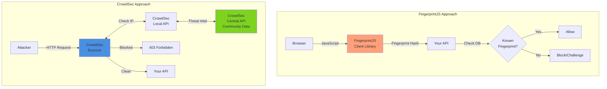

# CrowdSec vs FingerprintJS - Bot Protection Comparison

**Decision:** Bot protection strategy for Soopa API  
**Date:** 2026-01-22  
**Requirement:** 100% open source, production-grade bot protection

---

## TL;DR: CrowdSec Wins for Backend APIs ⭐

**Recommendation:** Use **CrowdSec** for Soopa

**Why:**

- ✅ **Built for APIs** (not just browsers)
- ✅ **Collaborative threat intelligence** (community-driven blocklists)
- ✅ **Self-hostable** (100% open source, MIT)
- ✅ **Multi-layered protection** (IPs, behaviors, scenarios)
- ✅ **Works at infrastructure level** (before hitting your app)
- ✅ **Active community** (10,000+ users sharing threat data)

---

## Detailed Comparison

### Architecture Difference



**Key Difference:**

- **FingerprintJS:** Client-side, browser-focused, requires JavaScript
- **CrowdSec:** Server-side, API-focused, works for all traffic (mobile apps, APIs, bots)

---

## CrowdSec Deep Dive

### What is CrowdSec?

**CrowdSec = "Fail2ban on steroids" + Collaborative threat intelligence**

- Started: 2020 (French company)
- License: **MIT** (fully open source)
- Architecture: Agent + Bouncer + Central API
- Community: 10,000+ installations sharing threat data
- GitHub Stars: 8,000+

### How It Works

```
                    ┌─────────────────────┐
                    │  CrowdSec Central   │
                    │  (Threat Intel DB)  │
                    │  Community Blocklist│
                    └──────────┬──────────┘
                               │
                     ┌─────────▼─────────┐
                     │  CrowdSec Agent   │
                     │  (Log Parser)     │
                     │  Detects Patterns │
                     └─────────┬─────────┘
                               │
                     ┌─────────▼─────────┐
                     │  Local API        │
                     │  (Decision Engine)│
                     └─────────┬─────────┘
                               │
                     ┌─────────▼─────────┐
                     │  Bouncer          │
                     │  (Enforcement)    │
                     │  Blocks Bad IPs   │
                     └─────────┬─────────┘
                               │
                     ┌─────────▼─────────┐
                     │  Your NestJS API  │
                     └───────────────────┘
```

### Installation for NestJS

```bash
# 1. Install CrowdSec agent
curl -s https://packagecloud.io/install/repositories/crowdsec/crowdsec/script.deb.sh | sudo bash
sudo apt install crowdsec

# 2. Install Node.js bouncer
npm install @crowdsec/express-bouncer

# 3. Register bouncer with agent
sudo cscli bouncers add nestjs-bouncer
```

### NestJS Integration

```typescript
import { Module, NestModule, MiddlewareConsumer } from '@nestjs/common';
import { ExpressCrowdSeccMiddleware } from '@crowdsec/express-bouncer';

@Module({})
export class AppModule implements NestModule {
  configure(consumer: MiddlewareConsumer) {
    // Apply CrowdSec bouncer globally
    consumer
      .apply(
        ExpressCrowdsecMiddleware({
          url: 'http://localhost:8080', // CrowdSec Local API
          apiKey: process.env.CROWDSEC_BOUNCER_KEY,
          updateIntervalMs: 10000, // Sync blocklist every 10s
          fallbackRemediation: 'captcha', // Or 'ban'
        })
      )
      .forRoutes('*');
  }
}
```

### What CrowdSec Detects

**Built-in Scenarios:**

- Brute force attacks (SSH, HTTP auth, etc.)
- Web scanning (Nmap, Nikto, etc.)
- Vulnerability exploitation attempts
- Known bad IPs (botnets, tor exit nodes, proxies)
- DDoS patterns
- Credential stuffing
- SQL injection attempts
- XSS attempts

**Custom Scenarios (You Define):**

```yaml
# crowdsec/scenarios/signup-abuse.yaml
type: leaky
name: myapp/signup-abuse
description: "Detect signup spam"
filter: "evt.Meta.log_type == 'signup'"
groupby: evt.Meta.source_ip
leakspeed: "10s"
capacity: 3
blackhole: 1m
labels:
  service: api
  type: signup_abuse
```

### Collaborative Intelligence

**The Killer Feature:** Community-shared blocklists

When a CrowdSec user in France detects an attack from IP `1.2.3.4`, that IP gets shared globally. Your instance in the US automatically blocks it **before** it even attacks you.

**Stats:**

- 10M+ IPs in community blocklist
- 100K+ attack scenarios shared
- Real-time updates (10-second sync)

---

## FingerprintJS Deep Dive

### What is FingerprintJS?

**FingerprintJS = Browser fingerprinting library**

- Started: 2012
- License: **MIT** (core), Commercial (Pro)
- Focus: Identify unique browsers
- GitHub Stars: 20,000+

### How It Works

```javascript
// Client-side (browser)
import FingerprintJS from '@fingerprintjs/fingerprintjs';

const fp = await FingerprintJS.load();
const result = await fp.get();

const fingerprint = result.visitorId; // e.g., "Xkdj49dhU8fkd"

// Send to backend
await fetch('/api/signup', {
  method: 'POST',
  body: JSON.stringify({
    email: 'user@example.com',
    fingerprint: fingerprint,
  }),
});
```

```typescript
// Server-side (NestJS)
@Post('signup')
async signup(@Body() dto: SignupDto) {
  // Check if fingerprint is blacklisted
  const blocked = await this.db.blockedFingerprints.findOne({
    fingerprint: dto.fingerprint,
  });
  
  if (blocked) {
    throw new ForbiddenException('Device blocked');
  }
  
  // Continue...
}
```

### What FingerprintJS Detects

- Browser type & version
- OS & version
- Screen resolution
- Timezone
- Language
- Installed fonts
- WebGL capabilities
- Canvas fingerprint
- Audio fingerprint

**Accuracy:** 99.5% unique identification

### Limitations

❌ **Requires JavaScript** - Doesn't work for:

- Mobile apps (native)
- API clients (Postman, curl)
- Backend-to-backend traffic
- Bots that don't execute JavaScript

❌ **Client-side** - Can be bypassed:

- Disable JavaScript
- Spoof browser fingerprint
- Use headless browsers with randomized fingerprints

❌ **Privacy concerns:**

- GDPR implications (tracking unique users)
- May require consent banner

---

## Side-by-Side Comparison

| Criteria | CrowdSec ⭐ | FingerprintJS |
|----------|------------|---------------|
| **Open Source** | ✅ 100% (MIT) | ✅ Core (MIT), ❌ Pro (Commercial) |
| **Use Case** | Backend APIs, Services | Browser-based apps |
| **Protection Layer** | Server-side | Client-side |
| **Works Without JS** | ✅ Yes | ❌ Requires JavaScript |
| **Mobile App Support** | ✅ Yes | ❌ No |
| **API Client Support** | ✅ Yes | ❌ No |
| **Bot Detection** | ✅ ML + Behavioral | ⚠️ Limited (just fingerprint) |
| **Threat Intelligence** | ✅ Community (10M+ IPs) | ❌ None |
| **DDoS Protection** | ✅ Built-in | ❌ No |
| **Brute Force Protection** | ✅ Built-in | ❌ Manual |
| **Self-Hostable** | ✅ Fully | ✅ Core only |
| **Learning Curve** | Medium | Easy |
| **GitHub Stars** | 8,000+ | 20,000+ |
| **Production Ready** | ✅ Yes | ✅ Yes |
| **GDPR Friendly** | ✅ Yes (IP-based) | ⚠️ May require consent |

---

## Use Case: Soopa Platform

### Why CrowdSec is Better for Soopa

**Soopa's Requirements:**

1. ✅ Protect **API endpoints** (not just browser UI)
2. ✅ Support **mobile apps** (future)
3. ✅ Protect **webhook endpoints** (source apps → Soopa)
4. ✅ Detect **brute force** on login/signup
5. ✅ Block **known bad actors** (botnets, proxies)
6. ✅ **Self-hostable** (open source requirement)
7. ✅ **Privacy-friendly** (GDPR compliant)

**CrowdSec Satisfies:** ✅ All 7 requirements  
**FingerprintJS Satisfies:** ⚠️ Only #6

### Real Attackvector Protection

**Attack: Credential stuffing on login endpoint**

```
CrowdSec:
1. Attacker tries 100 logins from IP 1.2.3.4
2. CrowdSec detects pattern (scenario: HTTP brute force)
3. IP 1.2.3.4 blocked for 4 hours
4. Block shared to community (other users protected)
✅ Automatic, no code changes

FingerprintJS:
1. Attacker tries 100 logins from different browsers
2. Each browser = different fingerprint
3. You must manually implement rate limiting per fingerprint
4. Attacker can spoof fingerprints
❌ Requires custom code, easily bypassed
```

---

## Recommendation for Soopa

### **Use CrowdSec** ⭐

**Architecture:**

```
┌─────────────────────────────────────┐
│          Infrastructure              │
│  ┌──────────────────────────┐       │
│  │   CrowdSec Agent         │       │
│  │   (Log Parser)           │       │
│  └────────────┬─────────────┘       │
│               │                      │
│  ┌────────────▼─────────────┐       │
│  │   CrowdSec Local API     │       │
│  │   (Decision Engine)      │       │
│  └────────────┬─────────────┘       │
│               │                      │
│  ┌────────────▼─────────────┐       │
│  │   Node.js Bouncer        │       │
│  │   (Middleware)           │       │
│  └────────────┬─────────────┘       │
└───────────────┼─────────────────────┘
                │
      ┌─────────▼──────────┐
      │   NestJS API       │
      │   (Your App)       │
      └────────────────────┘
```

### Implementation Steps

**1. Install CrowdSec on server**

```bash
# On Ubuntu/Debian
curl -s https://packagecloud.io/install/repositories/crowdsec/crowdsec/script.deb.sh | sudo bash
sudo apt install crowdsec
```

**2. Install Node.js bouncer**

```bash
npm install @crowdsec/express-bouncer
```

**3. Register bouncer**

```bash
sudo cscli bouncers add nestjs-api
# Save the API key
```

**4. Configure in NestJS**

```typescript
// main.ts
import { ExpressCrowdsecMiddleware } from '@crowdsec/express-bouncer';

async function bootstrap() {
  const app = await NestFactory.create(AppModule);
  
  // Add CrowdSec middleware
  app.use(
    ExpressCrowdsecMiddleware({
      url: process.env.CROWDSEC_LAPI_URL || 'http://localhost:8080',
      apiKey: process.env.CROWDSEC_BOUNCER_KEY,
      updateIntervalMs: 10000,
      timeout: 2000,
      fallbackRemediation: 'captcha',
    })
  );
  
  await app.listen(3000);
}
```

**5. Configure scenarios**

```bash
# Enable built-in scenarios
sudo cscli scenarios install crowdsecurity/http-bf
sudo cscli scenarios install crowdsecurity/http-probing
sudo cscli scenarios install crowdsecurity/http-crawl-non_statics

# Restart
sudo systemctl reload crowdsec
```

**6. Monitor**

```bash
# View blocked IPs
sudo cscli decisions list

# View alerts
sudo cscli alerts list

# View metrics
sudo cscli metrics
```

---

## Bonus: Use Both?

**Yes, You Can Combine Them!**

**Strategy:**

- **CrowdSec:** Primary defense (API protection, brute force, DDoS)
- **FingerprintJS:** Secondary (UI fraud detection, account sharing)

**Use FingerprintJS Only For:**

- Detecting multiple account signups from same device
- Preventing account sharing (if business requirement)
- Fraud detection in payment flows

**Architecture:**

```
HTTP Request
    ↓
CrowdSec Bouncer (blocks known bad IPs)
    ↓
NestJS API
    ↓
(If sensitive operation like payment)
    ↓
Check FingerprintJS (additional fraud check)
```

---

## Final Verdict

### **Primary: CrowdSec** ⭐⭐⭐⭐⭐

- Essential for **all APIs**
- 100% open source
- Community threat intelligence
- Production-ready
- Self-hostable

### **Optional: FingerprintJS**

- Only if you need **device/fraud detection**
- Use open source core (not Pro)
- Secondary defense layer

---

## Updated Stack Recommendation

```
Rate Limiting:      rate-limiter-flexible
Bot Protection:     CrowdSec ⭐⭐⭐ (PRIMARY)
Device Tracking:    FingerprintJS (optional, fraud detection)
Email Validation:   validator + disposable-email-domains
```

**All 100% open source, MIT licensed, production-ready!**
