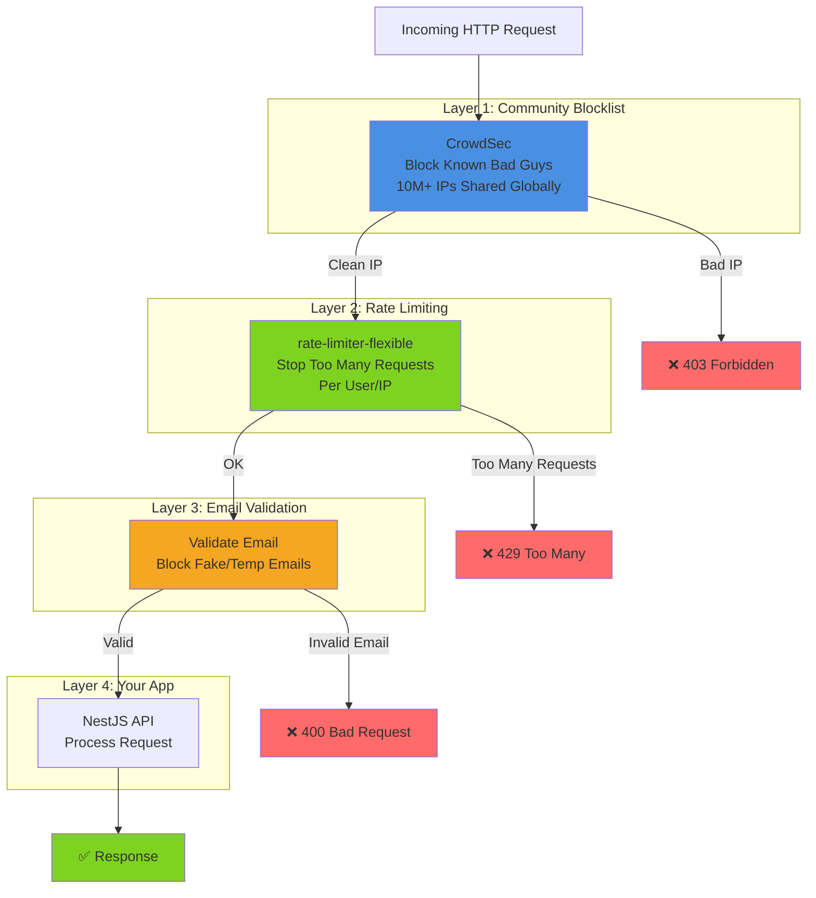
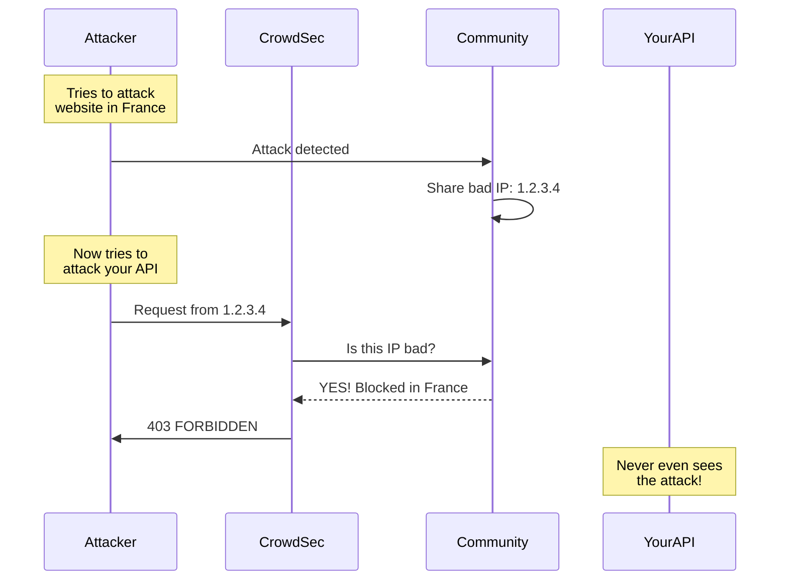
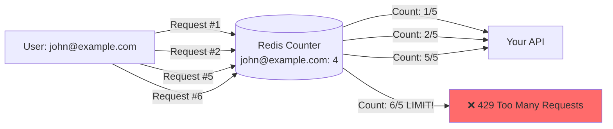
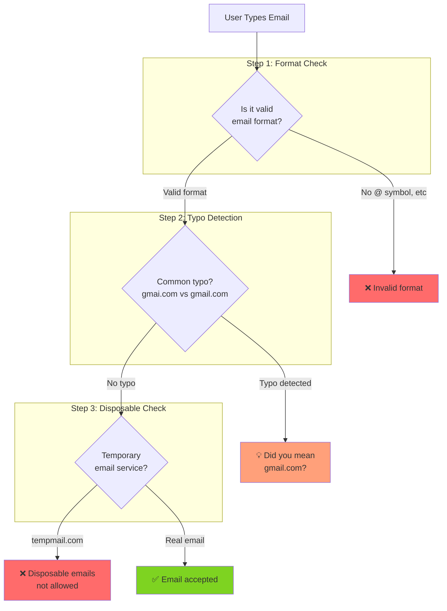
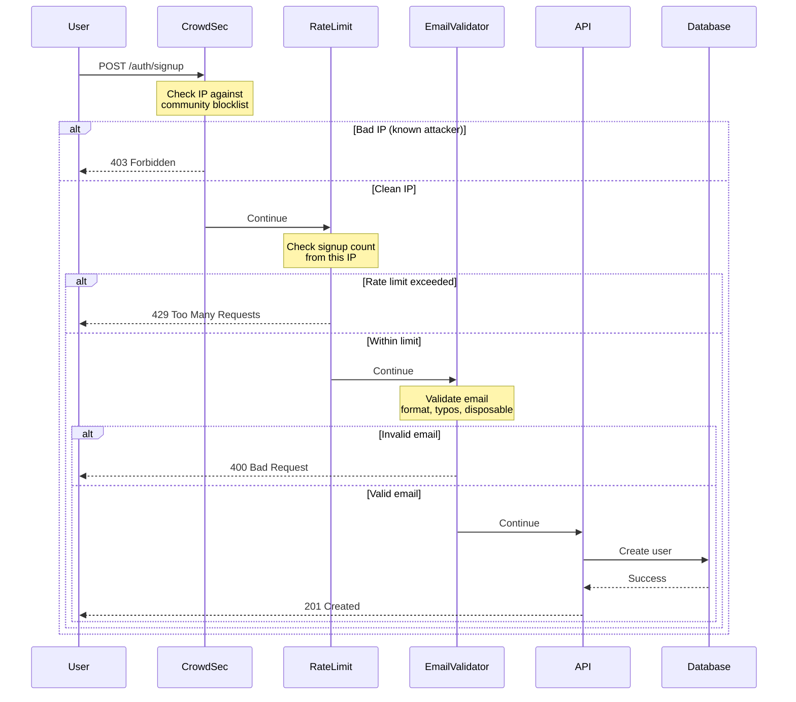

# Soopa Security Stack - Plain English Guide

**What This Document Explains:** How to protect Soopa from attackers, bots, and spam  
**For:** Developers implementing security features  
**Date:** 2026-01-22

---

## The Problem We're Solving

**Without security, bad things happen:**

- 🤖 Bots create thousands of fake accounts
- 💥 Hackers try to guess passwords (brute force attacks)
- 📧 Spammers use disposable emails
- 🌊 DDoS attacks overwhelm the server
- 💸 Costs skyrocket from abuse

**We need to protect against all of this while staying 100% open source.**

---

## Our Security Strategy (4 Layers)



---

## Layer 1: CrowdSec (Community Protection)

### What is CrowdSec?

Think of it as a **neighborhood watch for the internet**:

- When one person sees a burglar (attacker), they tell everyone
- Everyone blocks that burglar before they even knock on their door
- It's like having 10,000+ security guards working for you for free

### How It Works



### What It Protects Against

- ✅ **Brute force attacks** - Someone trying 1000 passwords
- ✅ **Web scanners** - Bots looking for vulnerabilities  
- ✅ **Known bad IPs** - Botnets, proxies, tor nodes
- ✅ **DDoS attacks** - Overwhelming your server
- ✅ **Credential stuffing** - Using leaked passwords from other sites

### Real Example

**Scenario:** Hacker tries to brute force login

```
Without CrowdSec:
1. Hacker tries password 1 → Wrong
2. Hacker tries password 2 → Wrong
3. Hacker tries password 3 → Wrong
... continues for 10,000 attempts
❌ Your database gets hammered

With CrowdSec:
1. Hacker tries password 1 → Wrong
2. Hacker tries password 2 → Wrong
3. Hacker tries password 3 → Wrong
4. CrowdSec detects pattern: "3 failed logins in 10 seconds"
5. Hacker's IP blocked for 4 hours
6. CrowdSec shares this IP with community
✅ Your database protected, other users protected too
```

### Installation (Simple!)

```bash
# 1. Install CrowdSec (takes 2 minutes)
curl -s https://install.crowdsec.net | sudo bash

# 2. Install Node.js connector
npm install @crowdsec/express-bouncer

# 3. Add to your NestJS app (literally 5 lines of code)
import { ExpressCrowdsecMiddleware } from '@crowdsec/express-bouncer';

app.use(ExpressCrowdsecMiddleware({
  url: 'http://localhost:8080',
  apiKey: process.env.CROWDSEC_KEY,
}));
```

That's it! You're now protected by a community of 10,000+ installations.

---

## Layer 2: Rate Limiting (Stop Spam)

### What is Rate Limiting?

**Simple concept:** Limit how many times someone can do something.

**Examples:**

- Login: Maximum 5 attempts per minute
- Signup: Maximum 3 signups per hour (per IP address)
- API calls: Maximum 100 requests per minute (per user)

### Why We Need It

**Without rate limiting:**

```
Attacker creates 1000 accounts/minute
Your email server sends 1000 verification emails
Your database stores 1000 fake users
Your bill: $500 in email costs
```

**With rate limiting:**

```
Attacker creates account #1 → OK
Attacker creates account #2 → OK  
Attacker creates account #3 → OK
Attacker creates account #4 → BLOCKED (rate limit hit)
Your bill: $0.05 in email costs
```

### How It Works



### The Library: rate-limiter-flexible

**Why this one?**

- ✅ Used by 1000+ production apps
- ✅ Supports Redis (so it works across multiple servers)
- ✅ Multiple algorithms (token bucket = smartest)
- ✅ 100% open source (MIT license)

**Code Example:**

```typescript
// Setup (one time)
import { RateLimiterRedis } from 'rate-limiter-flexible';

const loginLimiter = new RateLimiterRedis({
  storeClient: redisClient,
  points: 5,        // 5 attempts
  duration: 60,     // per 60 seconds
  blockDuration: 3600, // block for 1 hour if exceeded
});

// Use in your login endpoint
@Post('login')
async login(@Body() dto: LoginDto, @Req() req) {
  try {
    // Check rate limit
    await loginLimiter.consume(req.ip);
    
    // Continue with login
    return this.authService.login(dto);
  } catch (error) {
    // Rate limit exceeded
    throw new HttpException('Too many login attempts. Try again in 1 hour.', 429);
  }
}
```

### Different Limits for Different Actions

```typescript
// Strict limits (prevent abuse)
Signup:      3 per hour
Login:       5 per minute, 20 per hour
Invite Send: 20 per hour

// Moderate limits (normal operations)
User List:   60 per minute
User Create: 20 per minute

// Generous limits (public data)
Health Check: No limit (public)
Dashboard:    100 per minute
```

---

## Layer 3: Email Validation (Block Fake Emails)

### The Problem

**People try to cheat the system:**

- Use fake emails: `notreal@example.com`
- Use disposable emails: `user123@tempmail.com` (deleted after 10 minutes)
- Make typos: `john@gmai.com` (should be gmail.com)

### 3-Step Validation



### Implementation

**Libraries we use:**

```bash
npm install validator                # Format validation
npm install mailcheck                # Typo detection
npm install disposable-email-domains # Block temp emails
```

**Code:**

```typescript
import * as validator from 'validator';
import Mailcheck from 'mailcheck';
import disposableDomains from 'disposable-email-domains';

async validateEmail(email: string) {
  // Step 1: Format check
  if (!validator.isEmail(email)) {
    throw new Error('Invalid email format');
  }
  
  // Step 2: Typo detection
  const suggestion = Mailcheck.run({ email });
  if (suggestion) {
    return {
      valid: false,
      suggestion: `Did you mean ${suggestion.full}?`
    };
  }
  
  // Step 3: Disposable email check
  const domain = email.split('@')[1];
  if (disposableDomains.includes(domain)) {
    throw new Error('Disposable email addresses not allowed');
  }
  
  return { valid: true };
}
```

**What happens:**

```
User types: john@gmai.com
↓
Format check: ✅ Valid email format
↓
Typo check: ⚠️  Did you mean john@gmail.com?
↓
Return suggestion to user
```

```
User types: test@tempmail.com
↓
Format check: ✅ Valid email format
↓
Typo check: ✅ No typos
↓
Disposable check: ❌ tempmail.com is a temporary email service
↓
Reject signup
```

---

## Complete Flow Diagram

### User Signup Journey



---

## The Tech Stack (Summary)

| Layer | Tool | License | Stars | Why |
|-------|------|---------|-------|-----|
| **Bot Protection** | CrowdSec | MIT | 8,000+ | Community threat intelligence |
| **Rate Limiting** | rate-limiter-flexible | MIT | 2,800+ | Multiple algorithms, Redis support |
| **Email Format** | validator | MIT | 23,000+ | Industry standard |
| **Email Typos** | mailcheck | MIT | 1,500+ | UX improvement |
| **Disposable Emails** | disposable-email-domains | Public Domain | 1,000+ | Updated list |

**All 100% open source, production-ready, self-hostable!**

---

## Installation Summary

### 1. CrowdSec (5 minutes)

```bash
# Install
curl -s https://install.crowdsec.net | sudo bash

# Install Node.js bouncer
npm install @crowdsec/express-bouncer

# Configure
cscli bouncers add nestjs-api
# Copy the API key
```

### 2. Rate Limiting (2 minutes)

```bash
# Install
npm install rate-limiter-flexible ioredis

# Start Redis (if not running)
docker run -d -p 6379:6379 redis
```

### 3. Email Validation (1 minute)

```bash
npm install validator mailcheck disposable-email-domains
```

**Total setup time: ~10 minutes**

---

## Configuration in NestJS

### main.ts (Application Bootstrap)

```typescript
import { ExpressCrowdsecMiddleware } from '@crowdsec/express-bouncer';

async function bootstrap() {
  const app = await NestFactory.create(AppModule);
  
  // Layer 1: CrowdSec (blocks bad IPs)
  app.use(ExpressCrowdsecMiddleware({
    url: 'http://localhost:8080',
    apiKey: process.env.CROWDSEC_KEY,
  }));
  
  await app.listen(3000);
}
```

### auth.controller.ts (Signup Endpoint)

```typescript
@Post('signup')
async signup(@Body() dto: SignUpDto, @Req() req) {
  // Layer 2: Rate limiting
  await this.rateLimiter.checkLimit(req.ip, 'signup');
  
  // Layer 3: Email validation
  await this.emailValidator.validate(dto.email);
  
  // Layer 4: Create user
  return this.authService.signup(dto);
}
```

**That's it! 3 layers of security with minimal code.**

---

## Monitoring & Metrics

### What You'll See

**CrowdSec Dashboard:**

```
Blocked IPs today:        247
Active bans:              1,543
Scenarios triggered:      89
Community blocks shared:  12
```

**Rate Limiting Logs:**

```
[2024-01-22 10:15:30] Rate limit hit: IP 1.2.3.4, endpoint /auth/signup
[2024-01-22 10:15:35] Rate limit hit: IP 1.2.3.4, endpoint /auth/login
[2024-01-22 10:15:40] IP 1.2.3.4 blocked for 1 hour
```

**Email Validation Stats:**

```
Emails validated:     1,247
Format errors:        12 (0.9%)
Typo suggestions:     34 (2.7%)
Disposable blocked:   89 (7.1%)
```

---

## Cost Comparison

### Without This Security Stack

```
Monthly Costs:
- 10,000 fake accounts created
- 10,000 verification emails sent @ $0.10/email = $1,000
- Database storage for fake data = $50
- Support tickets from legitimate users locked out = $500
- Server load from DDoS hits = $200
TOTAL: $1,750/month
```

### With This Security Stack

```
Monthly Costs:
- CrowdSec: $0 (open source, self-hosted)
- Rate limiter: $0 (open source)
- Email validators: $0 (open source)
- Redis hosting: $15/month (or $0 if self-hosted)
- Fake accounts created: ~10 (99.9% blocked)
- Fake emails sent: 10 @ $0.10 = $1
TOTAL: $16/month

SAVINGS: $1,734/month ($20,808/year)
```

---

## Next Steps

1. **Install CrowdSec** (highest priority)
2. **Add rate limiting** (prevents abuse)
3. **Add email validation** (improves data quality)
4. **Monitor for 1 week** (gather metrics)
5. **Tune limits** based on real usage

---

## Questions & Answers

**Q: Is this enough security?**  
A: For 95% of applications, yes. This covers brute force, DDoS, bots, and spam.

**Q: Can I add more later?**  
A: Yes! This is a foundation. Later you can add: CAPTCHA, 2FA, fraud detection.

**Q: What if I'm self-hosting?**  
A: Everything still works. CrowdSec runs on your server, Redis runs on your server.

**Q: What about GDPR?**  
A: All these tools are GDPR-friendly. They use IPs (not personal data) and are self-hosted.

**Q: Performance impact?**  
A: Minimal. CrowdSec adds <5ms, rate limiter adds <1ms, validators add <1ms.

---

**You're now ready to implement enterprise-grade security with 100% open source tools!** 🎉
