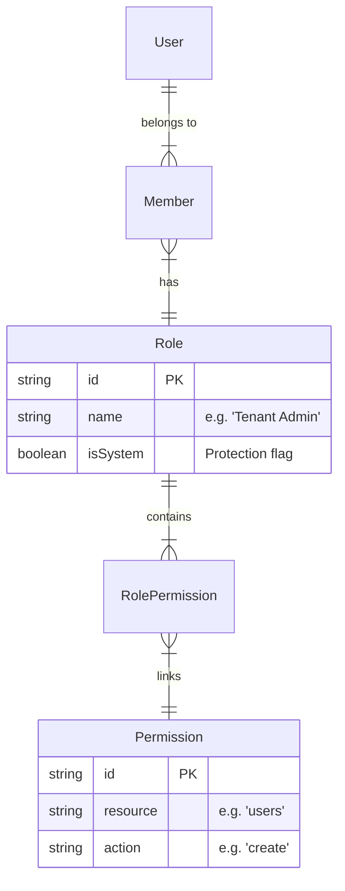

# Identity Access Control Design (PBAC)

**Version:** 1.0  
**Status:** Draft  
**Author:** Staff Architect  

## 1. Executive Summary

We are moving Nexiom from a Role-Based Access Control (RBAC) model to a **Policy-Based Access Control (PBAC)** model.

* **Old Way:** "Is this user an Admin?" (Fragile, hard to change).
* **New Way:** "Can this user `update` the `billing` resource?" (Flexible, scalable).

This document defines the unified contract that ensures consistency between the Backend (API) and Frontend (UI).

---

## 2. Core Architecture (The "check" function)

The entire system relies on a single, consistent question asked at every layer:

```typescript
can(user, action, resource, context?) -> boolean
```

* **User:** The actor performing the operation.
* **Action:** What they want to do (e.g., `create`, `read`, `manage`).
* **Resource:** The object being acted upon (e.g., `users`, `tenants`, `invoices`).
* **Context:** Optional scope, usually the `tenantId`.

---

## 3. Database Schema (Source of Truth)

We utilize a relational schema to construct the permissions graph dynamically.



### Table Definitions

**1. `permissions` (The Atoms)**

* `resource` (string): The domain entity.
* `action` (string): The capability.
* **Constraint:** Unique constraint on `(resource, action)`.

**2. `roles` (The Buckets)**

* `name` (string): Display name.
* `isSystem` (boolean): If `true`, cannot be deleted/edited by users.

**3. `role_permissions` (The Glue)**

* Link table between Roles and Permissions.

---

## 4. Backend Implementation (The Kernel)

The `@nexiom/identity` package explicitly defines the contract.

### Interface

```typescript
// packages/identity/src/interfaces/permission-provider.interface.ts

export interface IPermissionProvider {
  /**
   * The single source of truth for authorization.
   */
  can(
    user: User, 
    action: string, 
    resource: string, 
    tenantId?: string
  ): Promise<boolean>;

  /**
   * Helper to retrieve all capabilities for frontend hydration.
   * Returns generic strings like "users:read", "billing:manage"
   */
  getPermissions(user: User, tenantId?: string): Promise<string[]>;
}
```

### Session Transport

To avoid hitting the DB on every UI interaction, we enrich the User Session with their capabilities.

**Step 1:** On Login / Session Refresh, calling `AuthService.getEnrichedSession`.
**Step 2:** `PermissionProvider.getPermissions(user, tenantId)` is called.
**Step 3:** The returned array (e.g., `['users:read', 'billing:*']`) is attached to `user.permissions`.

---

## 5. Frontend Implementation (The Consumer)

The Frontend does *not* calculate permissions. It only checks against the claim set provided by the backend.

### Refine Integration (`accessControlProvider`)

We map Refine's generic interface to our PBAC model.

```typescript
// apps/web/src/providers/access-control.ts

export const accessControlProvider = {
  can: async ({ resource, action }) => {
    const user = useAuth().user;
    const permissions = user?.permissions || [];

    // 1. Check for Wildcard Root
    if (permissions.includes('*')) return { can: true };

    // 2. Check for Resource Wildcard (e.g., "users:*")
    if (permissions.includes(`${resource}:*`)) return { can: true };

    // 3. Check for Explicit Permission (e.g., "users:create")
    const hasPermission = permissions.includes(`${resource}:${action}`);

    return { can: hasPermission };
  }
}
```

### Reusable Components

**1. `<CanAccess>` Gate**

```tsx
<CanAccess 
  resource="users" 
  action="delete"
  fallback={<span className="text-gray-500">Locked</span>}
>
  <DeleteButton />
</CanAccess>
```

**2. Hook Usage**

```tsx
const { data: canEdit } = useCan({ resource: 'users', action: 'update' });

if (canEdit) {
  // Render Form
} else {
  // Render Read-Only View
}
```

---

## 6. Security Consistency Strategy

| Layer | Mechanism | Implementation |
| :--- | :--- | :--- |
| **Database** | RLS (Future) | Not yet implemented. |
| **API** | Guards | `PermissionGuard` calls `Adapter.can()`. |
| **Service** | Logic Check | `if (!await can(...)) throw Forbidden` |
| **Frontend** | Hiding UI | `<CanAccess>` hides buttons/links. |

**Critical Rule:** Hiding a button in the UI is *UX*, not Security. The API Guard is the only actual Security barrier.

---

## 7. Migration Plan

1. **Schema Update:** Add `role_permissions` join table (if missing) and uniqueness constraints.
2. **Seed Data:** Insert standard permissions (`users:read`, `users:manage`) and roles (`Owner`, `Admin`, `Member`).
3. **Adapter Logic:** Update `DrizzlePermissionAdapter` to resolve the join table.
4. **Refine Provider:** Connect the `accessControlProvider` to the user's permission array.
