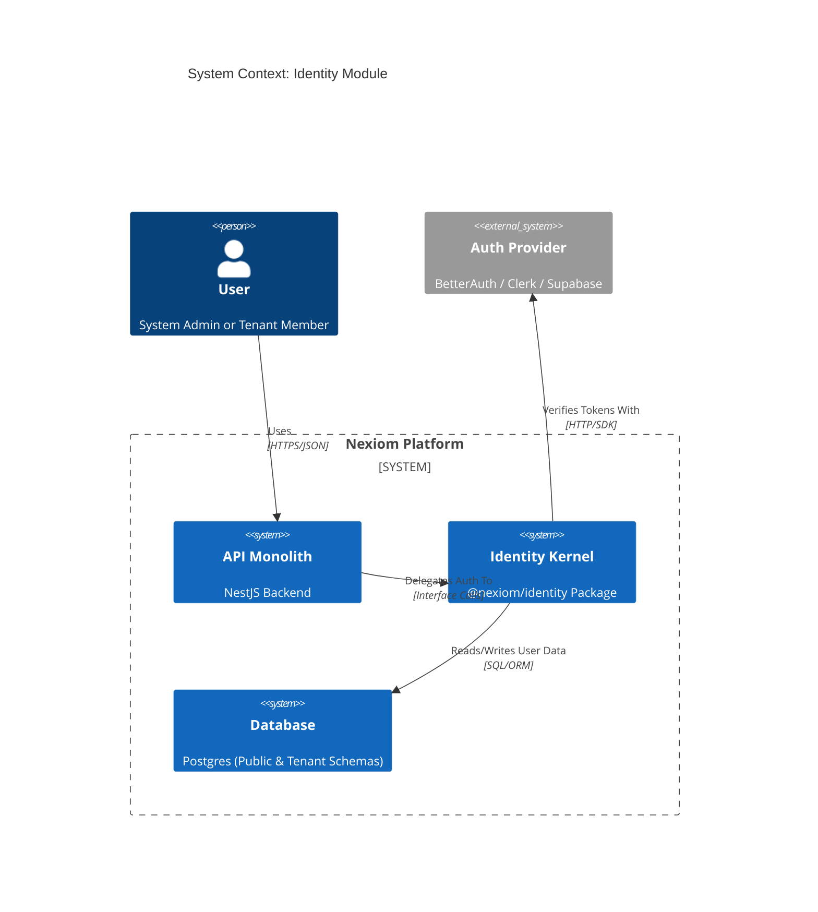
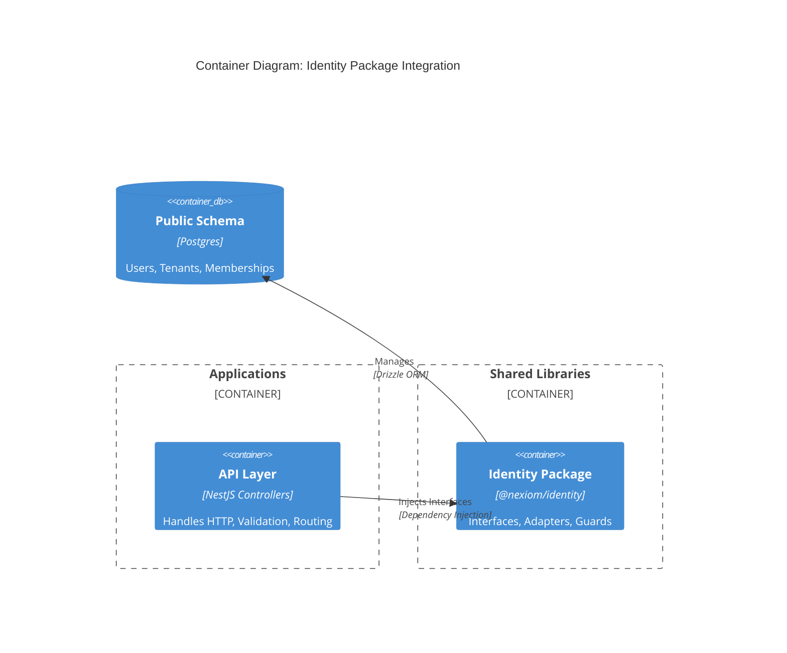
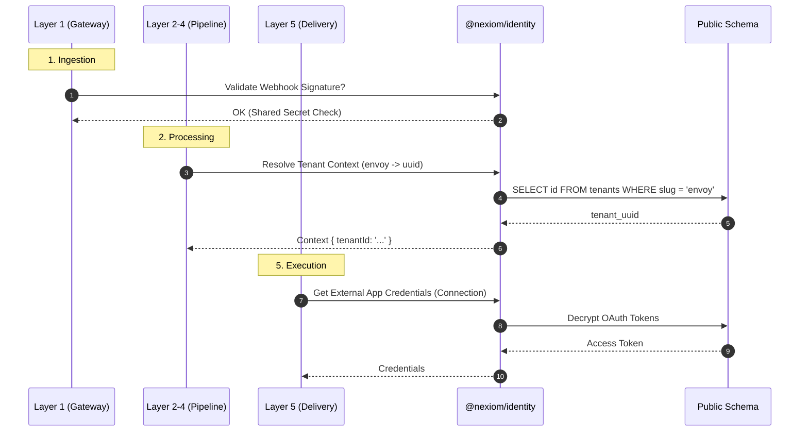
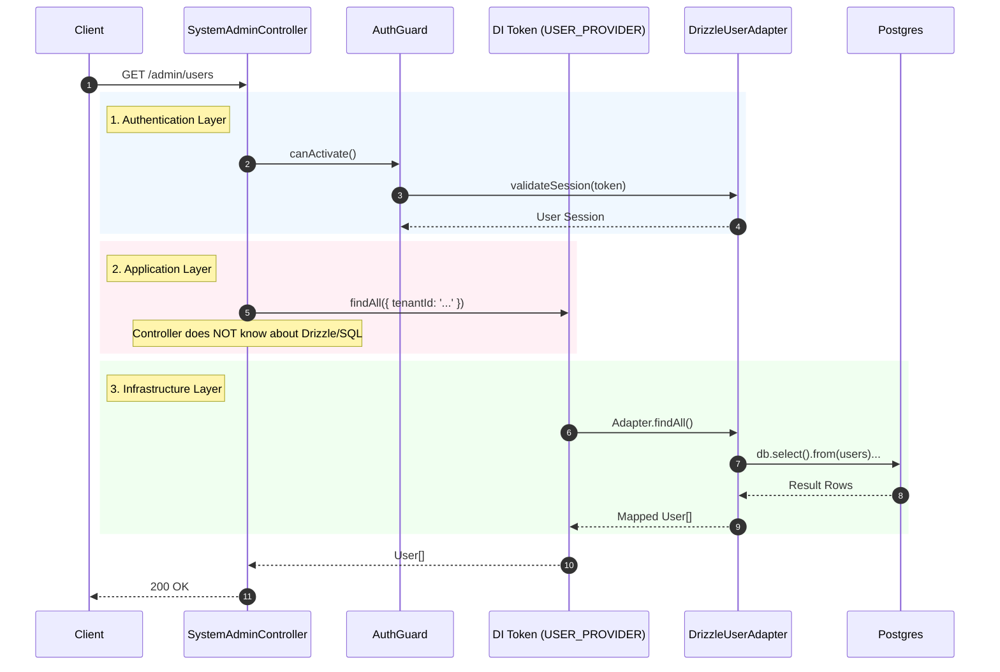

# Identity Module Architecture: The "Guardianship" Kernel

**Status:** RFC (Request for Comments)
**Author:** Staff Architect
**Version:** 2.0 (Aligns with Nexiom Master Architecture)

---

## 1. Architectural Context (C4 Model)

The **Identity Module** (`@nexiom/identity`) is the "Security Kernel" of the Nexiom Platform. It is NOT just a user table; it is the **Authority** for:

1. **Authentication:** Who are you? (Users/Machines)
2. **Multitenancy:** Which data silo do you own? (Tenant Resolution)
3. **Authorization:** What can you click? (CBAC: Capability-Based Access Control)
4. **Credental Management:** How do we talk to external apps? (Layer 5 Support)

### 1.1 System Context Diagram (Level 1)



### 1.2 Container Diagram (Level 2)

Shows how the Identity Package is embedded within the Monolith but logically isolated.



---

## 2. The Identity & The 6-Layer Pipeline

Identity is an **Orthogonal Concern**—it intersects the pipeline layers rather than being a step within them.

### 2.1 Interaction Flow



### 2.2 Layer Responsibilities

| Pipeline Layer | Identity Responsibility | Interface Used |
| :--- | :--- | :--- |
| **L1: Gateway** | **Tenant Resolution** (Subdomain/Path) & **Signature Verification** (HMAC). | `ITenantProvider` |
| **L2: Replica** | **Context Injection** (Setting `AsyncLocalStorage`). | `ITenantProvider` |
| **L3: Norm** | N/A (Pure Logic) | N/A |
| **L4: Outbound**| N/A (Pure Logic) | N/A |
| **L5: Delivery** | **Credential Retrieval** (Decrypting OAuth tokens for destinations). | `ICredentialProvider` (Future) |
| **API (UI)** | **User Auth** (Session) & **RBAC** (Guards). | `IAuthProvider`, `IPermissionProvider` |

---

## 3. Core Design Decisions (ADRs)

### ADR-001: The Adapter Pattern

* **Context:** We want to support "SaaS-in-a-Box" where users can bring their own Auth (Clerk, Auth0) or Database.
* **Decision:** All Identity logic must sit behind **Interfaces**. The API Layer NEVER imports the ORM directly for Identity tables.
* **Consequences:**
  * (+) Zero vendor lock-in.
  * (+) Easy to mock for TDD.
  * (-) Slight boilerplate overhead (Interface + Adapter).

### ADR-002: Capability-Based Access Control (CBAC)

* **Context:** "Roles" (Admin, User) are too rigid for complex B2B apps.
* **Decision:** We perform checks on **Capabilities** (`create:tenant`, `read:report`), not Roles.
* **Consequences:**
  * (+) Granular control.
  * (+) Creating custom roles is just grouping capabilities.

---

## 4. Source Code Structure (The Blueprint)

### 4.1 Directory Map

```text
packages/identity/
├── src/
│   ├── interfaces/           # 👈 THE LAW (Contracts)
│   │   ├── auth.provider.interface.ts
│   │   ├── user.provider.interface.ts
│   │   ├── tenant.provider.interface.ts
│   │   ├── permission.provider.interface.ts
│   │
│   ├── adapters/             # 👈 THE WORKERS (Implementations)
│   │   ├── better-auth.adapter.ts    
│   │   ├── drizzle-user.adapter.ts
│   │   ├── drizzle-tenant.adapter.ts
│   │
│   ├── constants.ts          # Dependency Injection Tokens
│   └── identity.module.ts    # NestJS Dynamic Module
```

### 4.2 Key Interface Definitions

#### `ITenantProvider`

The "Landlord" of the system.

```typescript
export interface ITenantProvider {
  // Discovery
  findBySlug(slug: string): Promise<Tenant | null>;
  findById(id: string): Promise<Tenant | null>;
  
  // Resolution
  resolveContext(request: Request): Promise<TenantContext>; 

  // Lifecycle
  create(userId: string, name: string): Promise<Tenant>;
  provisionTenantForUser(userId: string): Promise<Tenant>; // "Sign up and give me a workspace"
}
```

#### `IPermissionProvider`

The "Bouncer" of the system.

```typescript
export interface IPermissionProvider {
  // The only method you actually need
  can(user: User, action: string, resource: string): Promise<boolean>;
  
  // Example usage:
  // can(user, 'delete', 'production_db')
}
```

---

## 5. Flow Diagram: The "Strict Layer" Request

How a `GET /admin/users` request travels through the refined architecture.


