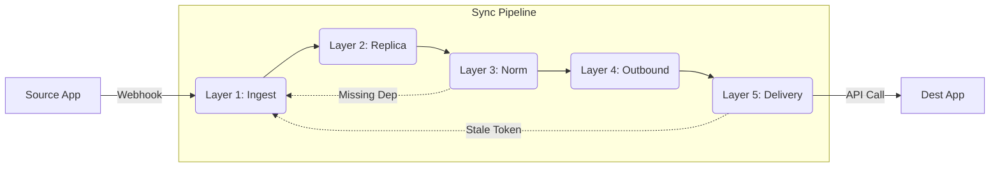

# Pipeline Execution Module: Master Pipeline Execution (v3.4)

## 1. Overview
**Name**: Master Pipeline Execution: Revenova -> Multi-Destination
**Architecture**: Consumer-Centric (Platform fetches data, App defines logic).
**Scenario**: User creates `Account` "Acme Trucking" in Revenova. Syncs to **QuickBooks** (US Division) AND **HubSpot** (Marketing CRM).

## 2. Standard Execution Flow

### Layer 1: Gateway Layer (Ingestion)
**Goal**: Capture raw webhook safely and acknowledge receipt immediately.
- **Endpoint**: `POST https://api.fluxnex.com/webhooks/revenova/envoylogistics`
- **Context**: Resolves Tenant (`envoylogistics`) from URL.
- **Platform Function**: `ingest_webhook`
  - **Action**: Persists raw JSON to `Revenova_Gateway`.
  - **Dispatch**: Pushes to `Inbound_Gateway_Queue`.
- **Failure**: HTTP 500 to Source (Source retries).

**Queue Data (`Inbound_Gateway_Queue`)**:
```json
{ "tenant_id": "envoy", "source_app": "Revenova", "gateway_id": "gw-101" }
```

### Layer 2: Replica Layer (Parsing)
**Goal**: Convert "Raw Payload" -> "Replica Record".
- **Platform Function**: `replica_worker`
  - **Logic**: Loads `integrations/revenova/replica.ts`. executes `UpsertRevenovaObject`.
- **Application Logic**:
  - Parse `xsi:type` (e.g., `sf:Account` -> `sf_account`).
  - Upsert to `Source_Record_Store` via `DynamicReplicaUpsert`.
- **Failure**: DB Lock/Parse Error -> SQS Redrive (Retry).

**Queue Data (`Source_Replica_Queue`)**:
```json
{ "tenant_id": "envoy", "source_app": "Revenova", "entity_type": "sf_account", "record_id": "sf-acc-001" }
```

### Layer 3: Normalized Layer (Mapping)
**Goal**: Map Source Replica -> Canonical Platform Model.
- **Platform Function**: `normalization_worker`
  - **Logic**: Reads `entity_type`. Loads `integrations/revenova/normalization/router.ts`.
  - **Router**: `sf_account` + `Type=Vendor` -> Returns `UpsertTMSVendor`.
  - **Handler**: `UpsertTMSVendor` maps fields to Canonical format (Active Record).
- **Failure**: Missing Dependency (e.g., Load missing for Invoice) -> **Layer 3 Self-Healing** (Fetch Request).

**Queue Data (`Normalised_Queue`)**:
```json
{ "tenant_id": "envoy", "entity_type": "TMS_VENDOR", "record_id": "norm-555" }
```

### Layer 4: Outbound Gateway Layer (Fan-Out & Gatekeeper)
**Goal**: Route Canonical Record -> Destinations + Validate.
- **Platform Function**: `outbound_prep_worker`
  - **Logic**: Query `Integration_Routes`. Found: `QuickBooks` and `HubSpot`.
  - **Loop**: Execute handler for each.
- **Application Logic**:
  - **Validation**: Checks mandatory fields (e.g., `Vendor Name`).
  - **Mapping**: Dynamic Map (Tenant Config).
- **Failure (Business Error)**:
  - Missing Field -> **Notification** (Dashboard/Customer). Sync Stops.

**Queue Data (`Outbound_Queue_QB.fifo`)**:
```json
{ "gateway_id": "gw-qb-100", "target_name": "QB Logistics US" }
```

### Layer 5: Delivery Layer (Execution)
**Goal**: JIT Connection Resolution & Secure Execution.
- **Platform Function**: `delivery_worker`
  - **Logic**: Resolve `target_name` -> `App_Connection` (Encrypted Creds).
  - **Auth**: Decrypt/Refresh Token.
  - **Execute**: HTTP POST to Destination.
  - **Result**: Update `Global_Entity_Map`.
- **Failure**:
  - **Auth Error**: 401 -> Notification (Support).
  - **Technical Error**: 500/429 -> Redrive (Retry).
  - **Stale SyncToken**: -> **Layer 5 Self-Healing** (Fetch + Retry).

## 3. Self-Healing Scenarios

### Missing Dependency (Source)
- **Context**: Syncing Invoice, Parent Load is missing.
- **Layer 3 Action**: Pushes request to `Fetch_Request_Queue`. Pauses Invoice.
- **Fetch Worker**: Calls Source API. Injects result to Layer 1.
- **Recovery**: Load flows down -> Saved -> Invoice unblocked.

### Stale SyncToken (Destination)
- **Context**: QuickBooks rejects update due to old token.
- **Layer 5 Action**: Catch error -> Call `fetchLatestFromDest()` -> Update Map -> Retry.

---

## 4. Pipeline Diagram (Logical Flow)



